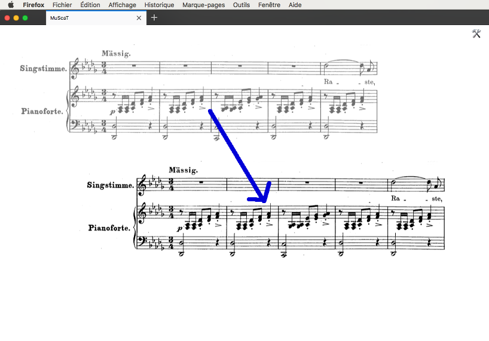

# MusCaT
# Manuel d'utilisation

<!--  
Pour actualiser le fichier PDF:
- se placer dans ce dossier (cd ...)
- supprimer le pdf existant
- jouer : `pandoc Manuel.md --from=markdown --to=latex --output=Manuel.pdf`
-->

* [Aide rapide](#aide_rapide)
* [Synopsis de fabrication](#synopsis_fabrication)

## Aide rapide {#aide_rapide}

Si vous avez déjà consulté ce manuel, vous pouvez trouver une aide rapide ici.

```
  image         `image <source> x=... y=... z=...`
                Exemple : `image monScore.png z=50 x=100 y=100`
                - "z" désigne le zoom en pourcentage
                - l'image doit se trouver dans le dossier 'images'

  accord        `accord <nom> x=... y=...`
                Exemple : `accord Cm7 x=230 y=520`

  harmonie      `harmonie <degré accord et renversement> x=... y=...`
                Exemple : `harmonie II** x=200 y=230`
                Alias : harmony, chiffrage

  cadence       `cadence <degré accord> type=<type cadence> x=... y=... w=...`
                Exemple : `cadence I type=italienne w=200 x=12 y=100`

  ligne         `ligne <type ligne> x=... y=... w=...`
                Exemples : `ligne U w=120 x=100 y=50`
                           `line |---| w=50 x=100 y=50`

  degré         `degre <indice> x=... y=...`
                Exemple : `degre 5 x=100 y=120`

  texte         `texte <contenu> x=... y=... type=...`
                Exemple : `texte Exposition x=100 y=50 type=partie`
```

## Composition d'un tag

Un tag — image de la partition comprise — se compose d'une ligne dans le fichier de données.

Cette ligne a le format général suivant :

```
  <nature>[ <contenu>][ <coordonnées>][ <options, type>]

```

Par exemple, pour une cadence (nature = 'cadence') de « V I » (contenu = 'V_I') qu'on veut placer à 200 pixels depuis le haut (coordonnée y = 200) et 100 pixels de la gauche (coordonnées x = 100), de type « cadence parfaite » (type = 'parfaite'), on insèrera dans son fichier `tags.js`, sous la définition de l'image (« score ») :

```
Tags = `

  score ma_partition.jpg y=100 x=10

  cadence V_I type=parfaite y=200 x=100

`;
```

Détaillons ces éléments.

Dans la ligne, le premier mot qui définit la `<nature>` du tag peut être (note : les deux mots, français et anglais, sont utilisables) :

```
  Français    Anglais     Description                   Exemple
  -----------------------------------------------------------------
  image       score       Pour ajouter l'image d'une      mon.png
                          partition à tagger.
  accord      chord       Le nom d'un accord, placé       Dm7
                          au-dessus de la portée.
  harmonie    harmony     L'accord dans l'harmonie        I**
                          avec son renversement.
  cadence                 Marque la cadence.              I

  degre       degree      Marque le degré dans la gamme   4
                          d'une note.
  ligne       line

  mesure      measure     Pour ajouter un numéro de mesure  12

  texte       texte       Pour écrire un texte quelconque.

```

Le seconde « mot » définit le plus souvent le contenu textuel ou, pour les images, le nom du fichier dans le dossier `images`.

On peut par exemple écrire un texte quelconque à une position quelconque avec la ligne :

```
Tags = `

  texte Et_si_j'étais_un_texte_quelconque x=300 y=400

`;

```

> Remarquez comme les espaces ont été remplacées par des tirets plats (qu'on obtient sur Mac avec la combinaison de touches Maj- — touche majuscule et tiret).

Ce deuxième sert aussi par exemple à définir le type des lignes à obtenir (cf. []()).

Les deux autres informations capitales sont les positions verticale et horizontale du tag à poser (ou de la partition).

NOTE IMPORTANTE : dans votre fichier `tags.js`, ces valeurs peuvent dans un premier temps être approximatives, et seront affinées directement à l'écran.

On définit position verticale avec `y=` et la position horizontale avec `x=`, comme nous l'avons vu dans les exemples précédents. Le nombre est exprimé en pixels.

Pour les lignes et les cadences par exemple, on peut définir aussi la largeur avec la lettre « w » qui signifie « width » (largeur) en anglais : `w=200`. Le nombre correspond là aussi au nombre de pixels.

Ensuite, on peut définir certaines choses comme le « type » du tag. On l'a vu pour la cadence, par exemple. Les autres tags pouvant définir leur type sont le `texte` ou la `ligne` (bien que la `ligne` se définit plutôt par son contenu).

## Synopsis de fabrication d'une partition tagguée {#synopsis_fabrication}

* Choisir la partition.
* Si elle est suffisamment aérée (assez d'espace entre les systèmes), on peut la garder telle qu'elle. Sinon, il faut la découper en systèmes (à l'aide de Gimp par exemple), chaque système étant une image séparée.
* Commencer par définir ce ou ces images dans le fichier `tags.js` (pour le détail : [TODO: Lien vers aide]).
  
* Définir ensuite les éléments graphiques que l'on veut utiliser (marque de parties, accords, chiffrages, numéros de portée, cadences, etc.). Les placer à peu près en fonction des positions des images de la partition.
* Ouvrir le fichier `partition.html` dans un navigateur de type Firefox (le plus sûr pour faire ça).
* Placer les éléments aux bons endroits en les déplaçant à la souris.
  
* Demander le code final et le copier dans le fichier `tags.js` pour le conserver (si vous voulez en garder une trace ou pouvoir le modifier plus tard).
* Imprimer la page HTML du navigateur en choisissant le format PDF (ou utiliser un autre outil permettant de le faire, comme `textutils` sur mac et unix par exemple).
* C'est fait !

### Écrire des textes {#write_texts}

Ce que l'on appelle les « textes », ici, ce sont tous les textes hors des accords, modulations, chiffrage, etc. Ce sont vraiment des textes qu'on peut placer n'importe où. À commencer pour définir les parties de l'ouvrage (« Introduction », « Coda », etc.).

Dans un texte, il est impérative de remplacer toutes les espaces par des traits plats (on les obtient, sur mac, à l'aide de Maj+tiret).

Par exemple, pour écrire sur la partition :

```

      Premier couplet

```

Il faut définir la ligne :

```

    ligne Premier_couplet type=partie y= 50 x=200

```

Note : ici, c'est le type `partie` qui fera que le texte s'écrit de travers, dans une boite.

#### Les types de texte

```

    type      anglais     Description
  ------------------------------------------------------------------
    partie    part        Titre de partie, comme Exposition ou Coda
    mesure    measure     Numéro de mesure, dans un carré.

```


### Dessiner des lignes

Les lignes se définissent par `line` ou `ligne`.

Le premier élément définit le `type` de la ligne. On trouve les types suivants.

```

    U ou |___|      Ligne inféfieure et trait vertical avant/après
    N ou |---|      Ligne supérieure et trait vertical avant/après
    L ou |___       Ligne inférieure et trait vertical avant
    K ou |---       Ligne supérieure et trait vertical avant
    V ou ___|       (Virgule) Trait inférieur et trait vertical après
    ^ ou ---|       (Virgule inversée) Trait supérieur et trait vertical après

```

On peut ensuite définir sa taille et sa position avec les lettres habituelles `x` (position horizontale), `y` (position verticale) et `w` (largeur en pixels).

### Écrire un texte

TODO
