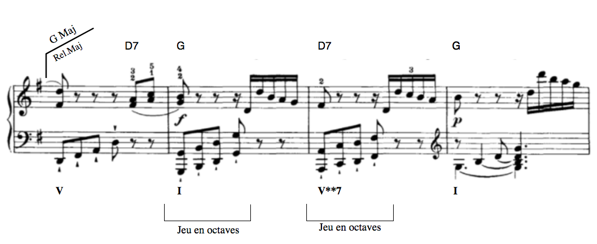
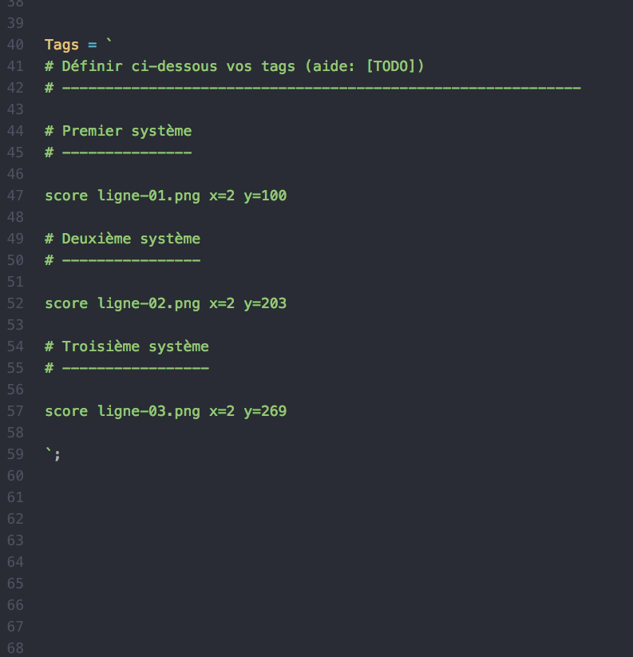
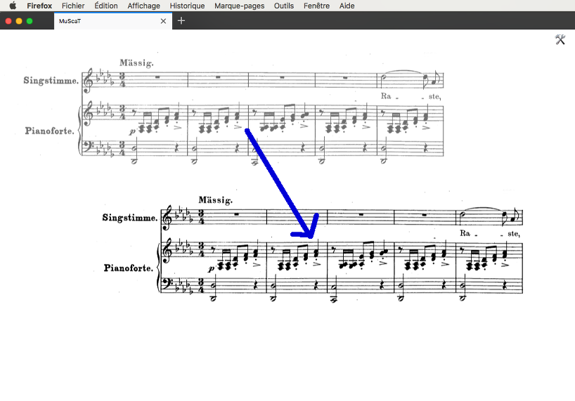
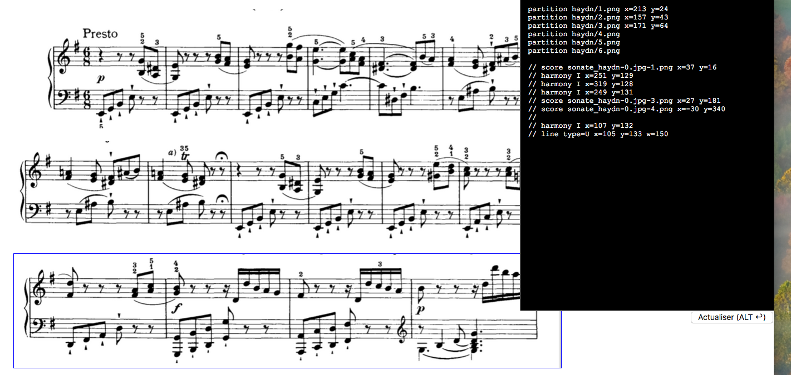

# MuScaT
# Manuel d'utilisation

<!--
Pour actualiser le fichier PDF:
- se placer dans ce dossier (cd ...)
- supprimer le pdf existant
- jouer : `pandoc Manuel.md --from=markdown --to=latex --output=Manuel.pdf;open Manuel.pdf`

Pour trouver précisément où peut se trouver un problème, on peut passer par
le document LaTex et le composer. Pour le produire :

pandoc -s Manuel.md --from=markdown --to=latex --output=Manuel.tex;open Manuel.tex

-->

## Introduction (histoire)

Suite à la diffusion de mon [Initiation à l'analyse musicale](https://www.youtube.com/channel/UCX3XhJw9x1RsVx1s3GNYceA) — et son « succès » que je n'aurais jamais imaginé aussi grand — nombreux ont été les professeurs et autres pédagogues ou musicologues à me demander le logiciel que j'avais utilisé pour en créer l'animation.

C'est malheureusement une application personnelle un peu trop… personnelle (comprendre : indomptable pour qui ne l'a pas créé), une usine à gaz ne fonctionnant qu'à la ligne de code (son créateur ne sait même pas toujours par quel bout la prendre).

Mais pour répondre à ces marques d'intérêts et à mes propres besoin, j'ai voulu concevoir un outil plus simple et plus pratique qui permettrait de réaliser rapidement des analyses de partitions (entendu que c'est toujours un peu fastidieux et que le résultat manque souvent d'homogénéité).

C'est ainsi qu'est née l'idée de **MuScaT** — dont le nom est composé de « Mu » pour « Musique », « Sc » pour « Score » (« partition » en anglais) et « Ta » à l'envers pour « Tag », le sens en français, comme les tags qu'on *taggue* sur les murs.

En bref, **MuScaT** permet de **réaliser rapidement, de façon très propre et très pratique, des analyses de partitions musicales** comme l'extrait ci-dessous.



Elle est semi-graphique, et permet d'ajuster très finement les TAGs — au pixel près — de façon visuelle et agréable.

* [Synopsis général de fabrication](#synopsis_fabrication)
* [Composition d'un tag](#composition_dun_tag)
  * [Verrouillage des tags](#lock_tags)
* [Les Images](#les_images)
  * [Séquence d'images](#sequence_images)
* [Tous les types (natures) d'éléments](#natures_elements)
  * [Les types de textes](#types_de_textes)
* [Les Options](#all_options)
* [Les Utilitaires](#les_utilitaires)


## Synopsis général de l'analyse {#synopsis_fabrication}

Commençons par un aperçu du processus général qui va permettre de produire une analyse musicale à l'aide de **MuScaT**.

1. [Création du dossier de l'analyse](#creation_dossier_analyse),
1. [découpage de la partition en « images-systèmes»](#syn_crop_score),
1. [inscription des images-systèmes dans l'analyse](#syn_inscription_images_systemes),
1. [ajouts des accords, des chiffrages, des cadences, de tous les éléments d'analyse](#syn_def_analysis_elements),
1. [Positionnement des éléments graphiques](#syn_ajustement_elements),
1. [récupération du code final](#syn_recuperation_code_final),
1. [impression en PDF](#syn_print_pdf).

## Synopsis détaillé de l'analyse {#synopsis_detailled}

### Création du dossier de l'analyse {#creation_dossier_analyse}

On commence par **créer un dossier pour son analyse** en copiant-collant le dossier `template` du dossier principal de **MuScaT**. Nous vous conseillons vivement de ne pas toucher à ce modèle.


Appelons ce dossier `monAnalyse` pour illustrer.


### Découpage de la partition en « images-systèmes » {#syn_crop_score}

Si la partition que l'on s'apprête à analyser est suffisamment aéré (espace entre les systèmes), on peut la garder telle qu'elle. Dans le cas contraire (et le plus fréquent), il faut découper cette partition en systèmes, c'est-à-dire faire une image de chaque système.

Dans tous les cas, on place la ou les images dans le dossier `monAnalyse/images`.


### Inscription des images-systèmes {#syn_inscription_images_systemes}

On ouvre ensuite son fichier `monAnalyse/tags.js`. C'est **le fichier principal de l'analyse**, celui qui va définir tous les éléments, les images, les marques de modulations, les accords, les cadences, les parties, tout ce qui constitue l'analyse.



On définit d'abord les images de la partition, en ajoutant des commentaires pour pouvoir se retrouver, plus tard, lorsque le fichier deviendra conséquent.

### Définition de tous les éléments de l'analyse {#syn_def_analysis_elements}

L'élément graphique de base de l'application MuScaT est le « TAG » (comme on en parle sur les murs des villes). Une analyse avec **MuScaT** consiste à « tagguer » une partition (remarquez que les partitions elles-mêmes, ou les images de leurs systèmes, sont aussi des « TAGs »). C'est la raison pour laquelle le fichier qui va les définir s'appelle `tags.js`.

On définit donc maintenant tous les autres éléments graphiques, tous les *tags* (cf. pour le détail de la procédure, voir [Composition d'un tag](#composition_dun_tag)) : marque de parties, accords, chiffrages, numéros de portée, cadences, etc. On s'arrange pour les placer, dans `tags.js`, à peu près en fonction des positions des images de la partition. C'est-à-dire que si une cadence doit se produire sur le troisième système, il vaut mieux la définir après la ligne insérant l'image de ce troisième système (remarquez cependant qu'il n'y a aucune obligation là-dessus).

### Positionnement des éléments graphiques {#syn_ajustement_elements}

On ouvre le fichier `monAnalyse/partition.html` dans un navigateur internet (Firefox est le meilleur choix, pour **MuScaT**).

On placer les éléments aux bons endroits simplement en les déplaçant à la souris, ou avec les flèches de son clavier.



#### Lignes repères

Pour faciliter l'alignement des TAGs — par exemple l'alignement des dernières mesures de fin des systèmes — on peut utiliser des lignes de répère. Pour cela, il suffit d'activer l'option `repères` (ou `reperes` ou `lines of reference`).

Cela ajoute deux lignes à l'écran, une verticale et une horizontale, qu'on peut déplacer à loisir.

### Récupération du code final {#syn_recuperation_code_final}

On demande enfin le code final de l'analyse, que l'on colle dans notre fichier `monAnalyse/tags.js` pour le conserver (si vous voulez en garder une trace ou pouvoir le modifier plus tard).

### Impression de l'analyse en PDF {#syn_print_pdf}

On imprime la page HTML du navigateur en choisissant le format PDF (ou on enregistre la page au format HTML et on utilise un outil de transformation des pages HTML en PDF).

### Et voilà

Et voilà, c'est fait ! Et vous pourrez retoucher à votre analyse à n'importe quel moment grâce au fichier `tags.js` qui contient tout le code et les positions de l'analyse courante.


## Composition d'un tag {#composition_dun_tag}

Un *TAG* — image de la partition comprise — se compose d'une ligne dans le fichier de données.

Cette ligne a le format général suivant :

```
  <nature>[ <contenu>][ <coordonnées>][ <options, type>]

```

Par exemple, pour une cadence (nature = 'cadence') de « V I » (contenu = 'V_I') qu'on veut placer à 200 pixels depuis le haut (coordonnée y = 200) et 100 pixels de la gauche (coordonnées x = 100), de type « cadence parfaite » (type = 'parfaite'), on insèrera dans son fichier `tags.js`, sous la définition de l'image (« score ») :

```javascript

Tags = `

  score ma_partition.jpg y=100 x=10

  cadence V_I type=parfaite y=200 x=100

  modulation G_min x=200 y=100

`;

```

Une « nature » de TAG (le premier mot), peut toujours être exprimé par ses trois premières lettres (exception faite du terme « partition » qui rentrerait en conflit avec « partie »). Ainsi, on peut écrire le code ci-dessu :

```javascript

Tags = `

  sco ma_partition.jpg y=100 x=10

  cad V_I type=parfaite y=200 x=100

  mod G_min x=200 y=100

`;

```

L'intégralité des natures d'éléments [est détaillé ici](#natures).

Vous observerez que tout de suite après la création, un identifiant est ajouté à toutes les lignes, mêmes les lignes vides. Il contient de ne pas y toucher, sous peine de voir son travail réduit à néant.

Ainsi, le code ci-dessous, au final, donnera :

```javascript

  # Contenu intégral du fichier tags.js
  option('code'); // pour voir ce code à côté de la partition

  Tags = `
    sco ma_partition.jpg id=2 y=100 x=10
    #3#
    cad V_I type=parfaite id=4 y=200 x=100
    #5#
    mod G_min id=6 y=100 x=200
  `;

```

### Forme raccourcie d'écriture

Pour la première définition du TAG, on peut utiliser une version raccourcie de définition qui la rend très simple et très rapide. Elle consiste à utiliser :

```javascript

Tags = `
<version 3 lettres|normale> <contenu|source> <valeur x> <valeur y>
`;

```

Par exemple, pour une *modulation* vers la tonalité de SOL mineur (G min.) qui doit se situer à 200 pixels du haut et 450 pixels de la gauche, on pourra écrire :

```javascript

  mod G_min 200 450

```

### Verrouillage des tags {#lock_tags}

On peut « verrouiller » un TAG, c'est-à-dire empêcher totalement ses modifications, aussi bien sa position que son contenu, en ajoutant un astérisque, un rond (ALT #) ou même un 🔒 au tout début de sa ligne (suivi ou non par une espace).

**MuScaT** ajoutera un vrai cadenas (🔒) qui rendra ce verrouillage très visuel.

Une fois verrouillé, le TAG ne peut plus être déplacé à la souris. En revanche, il peut tout à fait être modifiée dans le code (sa position, son contenu, etc) pour un ajustement très précis.

Pour deverrouiller un TAG et le rendre à nouveau mobile, il suffit tout simplement de retirer cette marque de verrouillage dans le code.

## Les Images {#les_images}

Il existe trois mots clés pour indiquer la nature d'une image, mais ils sont identiques en réalité : `image`, `score` ou `partition`. C'est le premier mot à trouver sur la ligne d'une image. Juste après, on doit trouver le nom de cette image, ou son chemin relatif depuis le dossier `image` du dossier de votre analyse.

```
  partition haydn/premier_mouvement.png [...]

```

Ci-dessus, l'image `premier_mouvement.png` doit donc se trouver dans le dossier `./images/haydn/` de votre dossier d'analyse.

### Séquence d'images {#sequence_images}

Bien souvent, une analyse n'est pas constituée d'une seule image pour toute la partition. Il y a trop peu d'espace entre les systèmes. On conseille donc fortement de découper les partitions en autant de systèmes qu'elles en comportent (vous trouverez des indications sur la [procédure de découpage de la partition](#procedure_crop_partition) ci-dessous).

Mais il serait fastidieux d'entrer la ligne de chaque image de système dans notre fichier `tags.js`. Une partition même courte peut très vite comporter de 10 à 15 systèmes et ce serait autant de lignes de partition qu'il faudrait introduire dans le code…

Au lieu de ça, si les images des systèmes ont été nommés en respectant une règle simple (avec des suites de nombres), une seule ligne suffira pour entrer tous les systèmes de la partition. Par exemple :

```

  score haydn/mouvement_1-[1-35].png

```

Le texte ci-dessus indique qu'il y a 35 images de système dans ce mouvement. Le code qui en résultera sera :

```

  score haydn/mouvement_1-1.png
  score haydn/mouvement_1-2.png
  score haydn/mouvement_1-3.png
  score haydn/mouvement_1-4.png
  ...
  ...
  score haydn/mouvement_1-35.png

```

Nous vous invitons vivement à commencer par cette opération avant l'insertion de toute autre marque sur la partition.

Quand **MuScaT** place les images sur la table d'analyse, il les répartit pour obtenir l'aspect initial de la partition. On peut modifier ce comportement en définissant explicitement un espace (vertical) entre chaque système ou chaque image, grâce à l'option `espacement images` :

```javascript

  // Code intégrale du fichier tags.js
  option('code');option('espacement images', 50);
  Tags=`
  sco haydn/mouvement_1-[1-35].png
  `;

```

> Notez la version raccourci de la nature du TAG : `sco` pour `score`.

> Notez également l'usage de l'option `code` qui permet d'afficher le code à côté de la table de l'analyse, pour pouvoir le modifier.

Grâce à l'option `espacement images` défini ci-dessus, chaque image (chaque système) sera séparé de 50 pixels.

Une fois ce code établi, vous pouvez déplacer les images dans la page pour les ajuster à vos besoins. Cela créra automatiquement les `x` et les `y` des coordonnées spatiales de chaque système au bout des lignes de score.

Astuce : si votre écran et assez grand et que vous adoptez [l'option `code beside` (ou `code à côté`)](#option_code_beside), vous pourrez voir en direct votre code s'actualiser.


## Nature des éléments {#natures}

Détaillons ces éléments.

Dans la ligne, le premier mot qui définit la `<nature>` du tag peut être (note : les deux mots, français et anglais, sont utilisables) :

```
  Français    Anglais     Description                   Exemple
  -----------------------------------------------------------------
  image       score       Pour ajouter l'image d'une      mon.png
                          partition à tagger.
  accord      chord       Le nom d'un accord, placé       Dm7
                          au-dessus de la portée.
  harmonie    harmony     L'accord dans l'harmonie        I**
                          avec son renversement.
  cadence                 Marque la cadence.              I

  degre       degree      Marque le degré dans la gamme   4
                          d'une note.
  ligne       line

  mesure      measure     Pour ajouter un numéro de mesure  12

  texte       texte       Pour écrire un texte quelconque.

```

Le seconde « mot » définit le plus souvent le contenu textuel ou, pour les images, le nom du fichier dans le dossier `images`.

On peut par exemple écrire un texte quelconque à une position quelconque avec la ligne :

```
Tags = `

  texte Et_si_j'étais_un_texte_quelconque x=300 y=400

`;

```

> Remarquez comme les espaces ont été remplacées par des tirets plats (qu'on obtient sur Mac avec la combinaison de touches Maj- — touche majuscule et tiret).

Ce deuxième sert aussi par exemple à définir le type des lignes à obtenir (cf. []()).

Les deux autres informations capitales sont les positions verticale et horizontale du tag à poser (ou de la partition).

NOTE IMPORTANTE : dans votre fichier `tags.js`, ces valeurs peuvent dans un premier temps être approximatives, et seront affinées directement à l'écran.

On définit position verticale avec `y=` et la position horizontale avec `x=`, comme nous l'avons vu dans les exemples précédents. Le nombre est exprimé en pixels.

Pour les lignes et les cadences par exemple, on peut définir aussi la largeur avec la lettre « w » qui signifie « width » (largeur) en anglais : `w=200`. Le nombre correspond là aussi au nombre de pixels.

Ensuite, on peut définir certaines choses comme le « type » du tag. On l'a vu pour la cadence, par exemple. Les autres tags pouvant définir leur type sont le `texte` ou la `ligne` (bien que la `ligne` se définit plutôt par son contenu).


### Écrire des textes {#write_texts}

Ce que l'on appelle les « textes », ici, ce sont tous les textes hors des accords, modulations, chiffrage, etc. Ce sont vraiment des textes qu'on peut placer n'importe où. À commencer pour définir les parties de l'ouvrage (« Introduction », « Coda », etc.).

Dans un texte, il est impérative de remplacer toutes les espaces par des traits plats (on les obtient, sur mac, à l'aide de Maj+tiret).

Par exemple, pour écrire sur la partition :

```

      Premier couplet

```

Il faut définir la ligne :

```

    ligne Premier_couplet type=partie y= 50 x=200

```

Note : ici, c'est le type `partie` qui fera que le texte s'écrit de travers, dans une boite.

## Tous les types (natures) d'éléments {#natures_elements}

Si vous avez déjà consulté ce manuel, vous pouvez trouver une aide rapide ici.

```
  partition     `image <source> x=... y=... z=...`
  par           Exemple : `image monScore.png z=50 x=100 y=100`
                - "z" désigne le zoom en pourcentage
                - l'image doit se trouver dans le dossier 'images'
                Alias : score, image
                Note : un astérisque ("*") indique au départ une
                suite d'image (image1, image2, image3 etc.)

  accord        `accord <nom> x=... y=...`
  acc           Exemple : `accord Cm7 x=230 y=520`
                Alias : chord

  harmonie      `harmonie <degré accord et renversement> x=... y=...`
  har           Exemple : `harmonie II** x=200 y=230`
                Alias : harmony, chiffrage

  modulation    `modulation <Ton[/sous-texte]> x=HH y=VV h=HH`
  mod           Exemple : `modulation D_Maj/Sous–dom. x=100 y=100 h=60`
                « h », ici, permet de définir la longueur du trait qui
                rejoint la partition (le trait vertical).

  cadence       `cadence <degré accord> type=<type cadence> x=... y=... w=...`
  cad           Exemple : `cadence I type=italienne w=200 x=12 y=100`

  ligne         `ligne <type ligne> x=... y=... w=...`
  lig           Exemples : `ligne U w=120 x=100 y=50`
                           `line |---| w=50 x=100 y=50`

  degré         `degre <indice> x=... y=...`
  deg           Exemple : `degre 5 x=100 y=120`

  texte         `texte <contenu> x=... y=... type=...`
  tex           Exemple : `texte Exposition x=100 y=50 type=partie`

```


### Les types de textes {#types_de_textes}

* [Les parties](#type_texte_partie)
* [Les modulations](#type_texte_modulation)
* [Les mesures](#type_texte_mesure)

```

    type        anglais     Description
  ------------------------------------------------------------------
    partie      part        Titre de partie, comme Exposition ou Coda
    mesure      measure     Numéro de mesure, dans un carré.
    modulation  (id.)       Marque de modulation, en haut de partition,
                            inclinée.

```

#### Les parties {#type_texte_partie}

Les marques de partie s'indiquent avec le tag `partie` (ou `par` ou `part`). Ce sont des textes dans des boites inclinées qui ont cet aspect :


#### Les mesures {#type_texte_mesure}

Les numéros de mesure, s'il ne sont pas indiqués sur la partition elle-même, peuvent être ajoutés à l'aide du tag `mesure` (ou `measure`, ou `mes`), suivant du numéro de mesure puis des coordonnées.

#### Les modulations {#type_texte_modulation}

On peut mettre un texte au-dessus de la barre inclinée (en général la tonalité vers laquelle on module) et un texte en dessous (en général la fonction de cette tonalité).

Pour séparer les deux textes, on utilise tout simplement la barre inclinée, appelée « balance ». Ainsi, pour obtenir :


… on utilisera simplement :

```
  modulation Sol_min/(sous-dom.) x=200 y=300

  ou

  mod Sol_min/(sous-dom.) 200 300

```

### Dessiner des lignes

Les lignes se définissent par `line` ou `ligne`.

Le premier élément définit le `type` de la ligne. On trouve les types suivants.

```

    U ou |___|      Ligne inféfieure et trait vertical avant/après
    N ou |---|      Ligne supérieure et trait vertical avant/après
    L ou |___       Ligne inférieure et trait vertical avant
    K ou |---       Ligne supérieure et trait vertical avant
    V ou ___|       (Virgule) Trait inférieur et trait vertical après
    ^ ou ---|       (Virgule inversée) Trait supérieur et trait vertical après

```

On peut ensuite définir sa taille et sa position avec les lettres habituelles `x` (position horizontale), `y` (position verticale) et `w` (largeur en pixels).


## Procédure de découpage de la partition {#procedure_crop_partition}

Voyons quelques méthodes de découpage de la partition en « images-systèmes ». Je les présente ici de la meilleure à la moins bonne. Cette qualité a été définie fonction des deux critères suivants :

* rapidité d'exécution,
* précision du découpage.

### Avec capture sélection dans Aperçu (Mac)

Méthode la plus rapide, mais également la moins précise. Ce manque de précision oblige parfois à reprendre des systèmes pour mieux les découper. Cependant, elle est tellement plus rapide que les autres que je la privilégie sans problème.

* Ouvrir la partition PDF dans l'application Aperçu,
* jouer `CMD Maj 4` pour activer la sélection par souris,
* sélectionner la zone de la partition à capturer (un système),
* recommencer l'opération pour tous les systèmes,
* récupérer les captures sur le bureau — sauf si l'astuce ci-dessous (1) a été utilisée — et les mettre dans le dossier `images` de votre analyse,
* modifier les noms des fichiers — sauf si vous avez utilisé l'astuce ci-dessous (1) — en les indiçant de 1 (ou 0) à N pour les insérer plus facilement dans l'analyse.

(1) Astuce : pour aller encore plus vite, vous pouvez :

* utiliser l'[utilitaire Muscat `change_folder_captures`](#utils_change_captures_folder) pour définir le dossier des captures écran ou consulter la [procédure décrite ici](https://www.laptopmag.com/articles/change-macs-default-screenshot-directory). Vos captures iront directement dans ce dossier,
* effectuer les captures,
* utiliser l'[utilitaire Muscat `rename_images`](#utils_renommer_fichiers) pour renommer instantannément vos fichiers.

Note : vous pouvez voir ou revoir la procédure dans les tutoriels consacrés sur [ma chaine YouTube]().

### Avec sélection rectangulaire dans Aperçu (Mac)

Une méthode qui ressemble à la précédente et permet d'être plus précis. Mais cette précision se fait au détriment du temps, notamment pour l'enregistrement des fichiers images.

* ouvrir la partition PDF dans Aperçu,
* choisir la sélection rectangle (p.e. Outils > Sélection rectangulaire),
* sélectionner le système grossièrement,
* ajuster parfaitement la sélection à l'aide des poignées,
* copier la sélection (`CMD C`),
* activer la combinaison `CMD N` pour créer une nouvelle image à partir du presse-papier,
* enregistrer l'image (`CMD S`) avec le nom voulu, dans le dossier voulu, en choisissant le format voulu.

### Avec Aperçu, sélection souris et rectangle (Mac)

On peut bien entendu imaginer une méthode intermédiaire qui reprendrait les deux méthodes précédentes. Lorsque la découpe est facile, on utilise la première, lorsque la découpe demande plus de précision, on privilégie la seconde.

### Avec **MuScaT** et `convert`

C'est une méthode qui souffre parfois d'un manque de qualité de rendu.

On tire déjà les images du PDF à l'aide de la commande à jouer dans le Terminal (adapter la qualité du traitement en fonction du résultat) :

```

  # Se trouver dans le dossier contenant la partition (cd ...)
  convert[ options] partition.pdf partition.jpg # ou .png

```

Autant d'images que de pages sont produites.

On insert la première dans le code du fichier `tags.js`, avec l'option `crop image` :

```

    # Dans tags.js
    option('crop image')
    Tags=`
    partition partition-0.jpg
    `;

```

On ouvre le fichier `partition.html` dans Firefox.

Maintenant, il suffit de sélectionner, à la souris, la zone de l'image à prendre puis de coller le code du presse-papier dans la console du Terminal. Puis de jouer ce code.

Répéter l'opération avec chaque système, puis avec chaque page de la partition.

### Avec Gimp/Photoshop (ou autre logiciel de traitement de l'image)

Si Gimp présente une précision de découpage inégalable, l'application offre en revanche la méthode la plus chronophage, même avec l'habitude du logiciel.

* ouvrir le PDF dans Gimp,
* sélectionner chaque système en le découpant,
* le placer en haut,
* « cropper » l'image à la taille du plus haut système,
* exporter chaque image-système (avec le bon nom).

Ce mode d'emploi n'étant pas destiné à maitriser Gimp, je vous renvoie au manuel d'utilisation de l'application.

## Options {#all_options}

* [Option « code à côté »](#option_code_beside)
* [Option « découpe image »](#option_crop_image)
* [Option « lignes de repère »](#option_line_of_reference)

### Option « code à côté » {#option_code_beside}

Option : `code beside`, `code à côté`

L'option « code à côté » permet d'avoir le fichier contenant le code juste à côté de la partition, ce qui est très pratique pour le modifier sans avoir à changer d'application. On le voit ci-dessous dans la boite noir.



### Option « découpe image » {#option_crop_image}

Option : `crop image`, `découpe image`

Cette option fait passer dans un mode d'utilisation qui va permettre de découper l'image de façon aisée (par simple [copié-]collé).

### Option « lignes de repère » {#option_line_of_reference}

Option : `repères`, `reperes`, `lines of reference`

Ajoute une ligne horizontale et une ligne verticale qu'on peut déplacer et qui peuvent servir de guide, de repère, pour placer les TAGs.


## Utilitaires {#les_utilitaires}

L'application **MuScaT**, comme tout bon vin, est fournie avec quelques utilitaires pour se faciliter la vie, en tout cas sur Mac. En voici la liste avec leur mode d'utilisation.

### Renommage des fichiers images (Mac/Unix) {#utils_renommer_fichiers}

Ce script, qui se trouve dans le dossier `utils` de l'application, permet de renommer les images d'un dossier de façon cohérente et indexée.

Pour utiliser ce script :

* ouvrir l'application Terminal,
* rejoindre (commande `cd`) le dossier de l'application MuScaT (ATTENTION : ça n'est pas le dossier de l'analyse, ici, c'est bien le dossier de l'application),
* se placer dans le dossier utilitaires (`cd utils`)
* taper `./rename_images.rb -h` et la touche Entrée pour tout savoir du script.

### Changement du dossier des captures écran (Mac) {#utils_change_captures_folder}

Par défaut, les captures d'écran sont enregistrés sur le bureau. Ça n'est pas gênant en soit, il suffit de les glisser ensuite dans le dossier `image` de l'analyse. Mais si on veut encore gagner du temps, ce script permet de changer le dossier de destination.

Voici la procédure :

* ouvrir l'application Terminal,
* rejoindre (commande `cd`) le dossier `utils` de l'application MuScaT (ATTENTION : ça n'est pas le dossier de l'analyse, ici, c'est bien le dossier de l'application),
* taper `./change_folder_captures.rb -h` et la touche Entrée pour tout savoir du script.

Pour remettre la valeur par défaut (le bureau), jouer simplement `./utils/change_folder_captures.rb` sans aucun autre argument.
