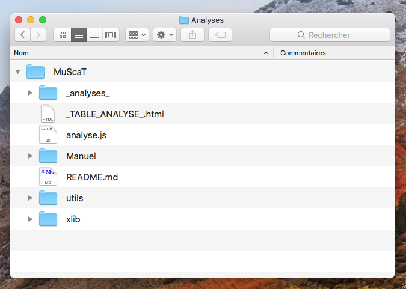
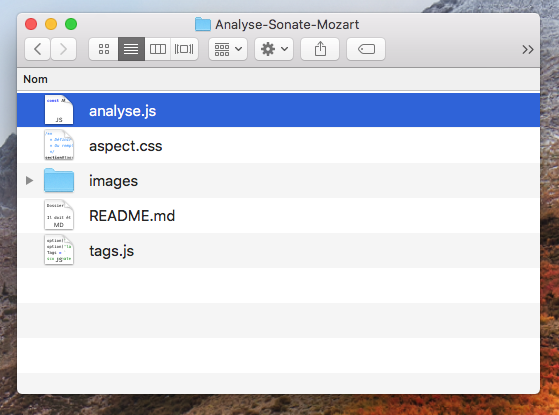

# MuScaT<br>Manuel d'utilisation

<!--
Pour actualiser le PDF

1. Jouer cette commande dans le Terminal

pandoc -s Manuel.md --css="manuel.css" --metadata pagetitle="Manuel" --from=markdown --output=Manuel.html;open Manuel.html;

2. Exporter le fichier en PDF (Safari offre un menu directement dans « Fichier »)
-->

## Introduction (histoire)

Suite à la diffusion de mon [Initiation à l'analyse musicale](https://www.youtube.com/channel/UCX3XhJw9x1RsVx1s3GNYceA) — et son « succès » que je n'aurais jamais imaginé aussi grand — nombreux ont été les professeurs et autres pédagogues ou musicologues à me demander le logiciel que j'avais utilisé pour en créer l'animation.

C'est malheureusement une application personnelle un peu trop… personnelle (comprendre : indomptable pour qui ne l'a pas créé), une usine à gaz ne fonctionnant qu'à la ligne de code (son créateur ne sait même pas toujours par quel bout la prendre).

Mais pour répondre à ces marques d'intérêts et à mes propres besoin, j'ai voulu concevoir un outil plus simple et plus pratique qui permettrait de réaliser rapidement des analyses de partitions (entendu que c'est toujours un peu fastidieux et que le résultat manque souvent d'homogénéité).

C'est ainsi qu'est née l'idée de **MuScaT** — dont le nom est composé de « Mu » pour « Musique », « Sc » pour « Score » (« partition » en anglais) et « Ta » à l'envers pour « Tag », le sens en français, comme les tags qu'on *taggue* sur les murs.

En bref, **MuScaT** permet de **réaliser rapidement, de façon très propre et très pratique, des analyses de partitions musicales** comme l'extrait ci-dessous.


Elle est semi-graphique, et permet d'ajuster très finement les TAGs — au pixel près — de façon visuelle et agréable.

* [Synopsis général de création d'une analyse](#synopsis_fabrication)
* [Synopsis détaillé](#synopsis_detailled)
* [L'interface](#user_interface)
* [Composition d'un tag](#composition_dun_tag)
* [Les Images](#les_images)
  * [Définition de la taille d'une image](#defining_image_size)
  * [Séquence d'images](#sequence_images)
* [Tous les types de tags (natures de tags)](#natures)
  * [Second mot (contenu, accord)](#second_mot)
  * [Autres données de la ligne](#autres_data_ligne)
  * [Les types de textes](#types_de_textes)
* [Opérations sur les tags](#operation_on_tags)
  * [Verrouillage des tags](#lock_tags)
  * [Grouper et dégrouper des tags](#grouper_tags)
  * [Ligne de code du tag](#tag_code_line)
* [Animation d'une analyse](#animation_analyse)
* [Les Options](#all_options)
* [Les Utilitaires](#les_utilitaires)
  * [Changement du dossier des captures écran (Mac)](#utils_change_captures_folder)
  * [Renommage des fichiers images (Mac/Unix)](#utils_renommer_fichiers)
  * [Création d'une nouvelle analyse (Mac)](#create_new_analyse)
  * [Activation d'une analyse (Mac)](#activate_analyse)
  * [Pour aller plus loing](#aller_plus_loin)

## Synopsis général de création d'une analyse {#synopsis_fabrication}

Commençons par un aperçu du processus général qui va permettre de produire une analyse musicale à l'aide de **MuScaT**. Noter que chaque item de cette liste est cliquable et permet de rejoindre la partie détaillée correspondante.

1. [Charger de l'application **MuScaT**](#download_muscat)
1. [Créer du dossier de l'analyse](#creation_dossier_analyse),
1. [Mettre l'analyse en analyse courante](#set_analyse_courante),
1. [Découper la partition en « images-systèmes»](#syn_crop_score),
1. [Inscrire les images-systèmes dans l'analyse](#syn_inscription_images_systemes),
1. [Ajouter les accords, les chiffrages, les cadences, tous les éléments d'analyse](#syn_def_analysis_elements),
1. [Positionner les éléments graphiques](#syn_ajustement_elements),
1. [Les lignes repères](#ligne_reperes)
1. [Récupérer du code final](#syn_recuperation_code_final),
1. [Imprimer en PDF](#syn_print_pdf).

## Synopsis détaillé {#synopsis_detailled}

### Chargement de l'application **MuScaT** {#download_muscat}

La toute première chose à faire, bien sûr, est de charger **MuScaT**. Pour le moment, on peut le faire par le biais de son [repository Github de **MuScaT**](https://github.com/PhilippePerret/MuScaT).

Il suffit de cliquer sur le bouton « Clone or download », de choisir « Download ZIP » et d'attendre la fin du téléchargement (l'application fait plusieurs mégaoctets, donc suivant l'état de votre connexion, l'opération peut être plus ou moins longue).

On se retrouve alors avec le dossier de l'application.



### Création du dossier de l'analyse {#creation_dossier_analyse}

Le plus simple pour créer une nouvelle analyse — et donc son dossier — est d'utiliser le script `create.rb` (ruby doit être installé sur votre ordinateur) qui fait tout le travail pour vous, simplement en lui donnant le nom de l'analyse.

```bash

  > cd /chemin/vers/dossier/MuScaT
  > ./utils/create.rb "Ma première analyse"

```

Sans ce script, la procédure est à peine plus compliquée :

* dupliquer le dossier `Template` qui se trouve dans le dossier `MuScaT/_analyses_` (ce dossier est le dossier qui peut contenir toutes les analyses),


* le renommer du nom de l'analyse, par exemple « Analyse-Sonate-Mozart ».


> Note : il est vivement recommandé de ne pas mettre d'espaces vides dans les noms de dossier ou de fichiers pour une raison qui sera expliquée plus tard. Personnellement, j'aime les remplacer par des traits plats (« Analyse_Sonnate_Mozart »)

Voyons-en rapidement le contenu.


On trouve pour commencer un fichier « aspect.css », que vous ne toucherez pas au départ, et qui permet de rectifier l'aspect des analyses pour obtenir la présentation idéale souhaitée.


On trouve en dessous le dossier « images » qui comme son nom l'indique va rassembler toutes les images utiles à l'analyse, c'est-à-dire les partitions, les *systèmes*.


On trouve le fichier le plus important, le fichier « tags.js » qui va contenir la définition précise de l'analyse.


Nous aurons à y revenir en détail très vite.

On trouve aussi un fichier `analyse.js` qu'il suffit, pour activer cette analyse, de glisser à la racine du dossier **MuScaT** en remplacement du fichier qui s'y trouve déjà.



Dans ce dossier, vous pouvez mettre enfin votre partition en PDF ou en image.


### Mettre l'analyse en analyse courante {#set_analyse_courante}

Pour faire de cette nouvelle analyse l'analyse courante, il y a deux solutions.

Soit on édite le fichier `MuScaT/analyse.js` et on met le nom de notre dossier d'analyse :

```javascript

const ANALYSE = "Analyse-Sonate-Haynd" ;

```

Soit on glisse le fichier `analyse.js` qui se trouve dans notre dossier d'analyse à la racine du dossier de l'application, en remplacement du fichier qui s'y trouve déjà.

À vous de choisir la solution qui vous semble le plus pratique. En tout cas, la seconde est la plus sûr, les erreurs de typo sont impossibles.


### Découper la partition en « images-systèmes » {#syn_crop_score}

Si la partition que l'on s'apprête à analyser est suffisamment aérée (espace entre les systèmes), on peut la garder telle qu'elle. Dans le cas contraire (et le plus fréquent), il faut découper cette partition en systèmes, c'est-à-dire faire une image de chaque système pour les écarter sur la table d'analyse.

Dans tous les cas, on place la ou les images dans le dossier `_analyses_/<Nom analyse>/images/`.


### Inscrire les images-systèmes {#syn_inscription_images_systemes}

On ouvre ensuite son fichier `monAnalyse/analyse/tags.js`. C'est **le fichier principal de l'analyse**, celui qui va définir tous les éléments, les images, les marques de modulations, les accords, les cadences, les parties, tout ce qui constitue l'analyse.


Vous devez ouvrir ce fichier en texte simple, c'est-à-dire ne surtout pas utiliser de traitement de texte, ou alors en s'assurant d'exporter le fichier final au format « SimpleText » (`.txt`).

Dans ce fichier `tags.js` On définit d'abord les images de la partition, en ajoutant des commentaires pour pouvoir se retrouver, plus tard, lorsque le fichier deviendra conséquent. Par exemple :

```javascript

  // Dans tags.js
  option('code');

  Tags = `
  // Premier système, les mesures de 1 à 10
  partition system-1-mes-1-10.png

  // Deuxième système, les mesures de 11 à 16
  partition system-2-mes-11-16.png

  // Troisième système
  // ... etc.

  `;
```

> Note : l'option 'code', en haut du fichier `tags.js`, permet simplement de voir le code à côté de la table d'analyse.


### Définir tous les éléments de l'analyse {#syn_def_analysis_elements}

L'élément graphique de base de l'application **MuScaT** est le « TAG » (comme on en parle sur les murs des villes). Une analyse avec **MuScaT** consiste donc à « tagguer » une partition (remarquez que les partitions elles-mêmes, ou les images de leurs systèmes, sont aussi des « TAGs »). C'est la raison pour laquelle le fichier qui va les définir s'appelle `tags.js`.

On définit tous les autres éléments graphiques, tous les *tags* (cf. pour le détail de la procédure, voir [Composition d'un tag](#composition_dun_tag)) : marque de parties, accords, chiffrages, numéros de portée, degrés de la gamme, cadences, textes divers, etc.

Chacun des éléments, chaque « tag », va être représenter dans le code par une unique ligne.

Une image de système pourra être :

```javascript

Tags = `
// ... d'autres données ici

score systeme-1.png x=50 y=3098

// ... d'autres données là
`;

```

Une modulation pourra être inscrite par :

```javascript

Tags = `
// ... d'autres données ici

mod G_min x=150 y=539

// ... d'autres données là
`;

```

Le mieux est de s'arranger pour définir ces tags à peu près en fonction des positions sur la table d'analyse (i.e. sur l'analyse). Si une cadence doit se produire sur le troisième système, il vaut mieux la définir après la ligne insérant l'image de ce troisième système (remarquez cependant qu'il n'y a aucune obligation là-dessus, vous pouvez aussi, rassembler tous les accords d'un côté, toutes les cadences de l'autre, etc. à votre guise).

### Activer l'analyse

Pour activer cette nouvelle analyse, nous allons donc copier-coller son fichier `analyse.js` à la racine du dossier de l'application **MuScaT**. Vous pouvez par exemple sélectionner le fichier dans le Findre ou sur votre bureau, sélectionner le dossier `MuScaT` et coller. Le bureau vous demandera de confirmer le remplacement (un autre fichier `analyse.js` existe déjà à cet endroit, celui de l'analyse courante).

Pensez en tout cas à faire une duplication du fichier, ne le glissez pas.

Seconde solution, vous pouvez également éditer le fichier `MuScaT/analyse.js` principal et mettre le nom de votre dossier dans la constante `ANALYSE`.

```javascript

  // Dans Le fichier MuScaT/analyse.js principal

  const ANALYSE = "<METTRE_ICI_LE_NOM_DU_DOSSIER_DE_VOTRE_ANALYSE>"


```

> Attention ! Il est capital de ne pas mettre d'espaces dans ce nom, ou ça ne fonctionnera pas. Il en va de même qu'une adresse dans votre navigateur.

Noter que les heureux possesseurs de Mac peuvent utiliser un script permettant d'activer très simplement n'importe quelle analyse. Il suffit de rejoindre, dans l'application Terminal, le dossier de **MuScaT** et de taper `> ./utils/analyse.rb`. Nous y reviendrons en parlant des [utilitaires](#les_utilitaires).


### Positionnement des éléments graphiques {#syn_ajustement_elements}

Une fois l'analyse désignée comme analyse courante, il faut ouvrir le fichier `_TABLE_ANALYSE_.html` dans votre navigateur.


Firefox est vivement recommandé, l'application n'a pas été testée en profondeur dans les autres navigateur.

On peut placer les éléments aux bons endroits simplement en les déplaçant à la souris, ou avec les flèches de son clavier. On peut en ajouter des nouveaux en dupliquant les lignes de code ou les ajoutant explicitement dans le code.


Sans l'option `option('code')` activée, il faut modifier le code directement dans le fichier `tags.js` puis recharger la page dans Firefox pour voir les changements.

#### Lignes repères {#ligne_reperes}

Pour faciliter l'alignement des TAGs — par exemple l'alignement des dernières mesures de fin des systèmes — on peut utiliser des lignes de répère. Pour cela, il suffit d'activer l'option `repères` (ou `reperes` ou `lines of reference`).

Cela ajoute deux lignes à l'écran, une verticale et une horizontale, qu'on peut déplacer à loisir à la souris.

Vous pouvez également définir leur emplacement exact avec les options `position repère vertical` (ou `vertical line offset`) et `position repère horizontal` (ou `horizontal line offset`) :

```javascript

  // Dans le fichier tags.js de l'analyse
  option('code');
   // à 120 pixels du haut et 200 de la gauche
  option('vertical line offset', 120, 'horizontal line offset', 200);

```

### Récupérer le code final {#syn_recuperation_code_final}

Si l'on a travaillé dans le champ de texte à côté de la table d'analyse, on doit copier le code final dans le fichier `tags.js`, au risque de perdre tous les changements. Pour se faire, on clique sur le bouton des outils — en haut à gauche — et on demande à mettre le code complet dans le presse-papier. On colle ce code dans le fichier `tags.js`, en remplaçant l'intégralité de son contenu.

### Imprimer l'analyse en PDF {#syn_print_pdf}

Enfin, on imprime la page HTML du navigateur en choisissant le format PDF. Sur Mac :

* dans Firefox, demander l'impression,
* dans la fenêtre qui s'ouvre, choisir, dans le menu en bas à gauche : « Imprimer au format PDF » ou autre indication similaire.

(sur PC, enregistrer la page au format HTML et utiliser un outil de transformation des pages HTML en PDF)

### Et voilà

Et voilà, c'est fait ! Et vous pourrez retoucher à votre analyse à n'importe quel moment en la remettant en analyse courante.

---

## L'interface {#user_interface}

* [La boite à outils](#toolbox)
* [Le champ de code](#code_field)

Voyons un peu de quoi est constitué l'interface de **MuScaT**, que nous appelons la « table d'analyse ».

Cette table, c'est déjà la surface de la page elle-même.

### La boite à outils {#toolbox}

Sur la gauche en haut de l'écran, on trouve un petit picto qui permet d'ouvrir la boite à outils.


### Le champ de code {#code_field}

Si [l'option `guides`](#option_line_of_reference) est activée, un champ de code est ouvert à droite de la page, contenant le code défini dans votre fichier `tags.js` (seulement celui dans `Tags`, pas le code intégral).


---

## Composition d'un tag {#composition_dun_tag}

Voyons plus en détail comment se compose une ligne du fichier `tags.js`, une ligne définissant un *tag* ou une partition.

Un *TAG* — image de la partition comprise — se compose d'une ligne dans le fichier de données.

Cette ligne a le format général suivant :

```
  <nature>[ <contenu>][ <coordonnées>][ <options, type>]

```

Par exemple, pour une cadence (nature = 'cadence') de « V I » (contenu = 'V_I') qu'on veut placer à 200 pixels depuis le haut (coordonnée y = 200) et 100 pixels de la gauche (coordonnées x = 100), de type « cadence parfaite » (type = 'parfaite'), on insèrera dans son fichier `tags.js`, sous la définition de l'image (« score ») :

```javascript

Tags = `

  score ma_partition.jpg y=100 x=10

  cadence V_I type=parfaite y=200 x=100

  modulation G_min x=200 y=100

`;

```

Une « nature » de TAG (le premier mot), peut toujours être exprimé par ses trois premières lettres (exception faite du terme « partition » qui rentrerait en conflit avec « partie »). Ainsi, on peut écrire le code ci-dessous :

```javascript

Tags = `

  sco ma_partition.jpg y=100 x=10

  cad V_I type=parfaite y=200 x=100

  mod G_min x=200 y=100

`;

```

L'intégralité des natures de TAG [est détaillé ici](#natures).

Vous observerez que tout de suite après la création, un identifiant est ajouté à toutes les lignes, mêmes les lignes vides. Il contient de ne pas y toucher, sous peine de voir son travail réduit à néant.

Ainsi, le code ci-dessous, au final, donnera :

```javascript

  // Contenu intégral du fichier tags.js
  option('code'); // pour voir ce code à côté de la partition

  Tags = `
    sco ma_partition.jpg id=2 y=100 x=10
    #3#
    cad V_I type=parfaite id=4 y=200 x=100
    #5#
    mod G_min id=6 y=100 x=200
  `;

```

### Forme raccourcie d'écriture

Pour la première définition du TAG, on peut utiliser une version raccourcie de définition qui la rend très simple et très rapide. Elle consiste à utiliser :

```javascript

Tags = `
<version 3 lettres|normale> <contenu|source> <valeur x> <valeur y>
`;

```

Par exemple, pour une *modulation* vers la tonalité de SOL mineur (G min.) qui doit se situer à 200 pixels du haut et 450 pixels de la gauche, on pourra écrire simplement :

```javascript

  mod G_min 200 450

```

## Les Images {#les_images}

Il existe trois mots clés pour indiquer la nature d'une image, mais ils sont identiques en réalité : `image`, `score` ou `partition`. C'est le premier mot à trouver sur la ligne d'une image. Juste après, on doit trouver le nom de cette image, ou son chemin relatif depuis le dossier `images` du dossier de l'analyse.

```
  partition premier_mouvement/image-12.png [...]

```

Ci-dessus, l'image `image-12.png` doit donc se trouver dans le dossier `MuScaT/_analyses_/<mon analyse>/images/premier_mouvement/`.

### Définition de la taille d'une image {#defining_image_size}

On peut définir la taille d'une image à l'aide du paramètre `w` (ou `width`, « largeur », en anglais). Sa valeur peut être explicite avec une unité, explicite sans unité ou en pourcentage. Par exemple :

```javascript

  // Dans tags.js
  Tags = `
  sco image-0.png
  sco image-1.png w=200
  sco image-2.png w=10cm
  sco image-3.png w=50%
  `;

```

Avec le code ci-dessus, l'image `0` aura sa taille normale, `image-1` fera 200 pixels de large, `image-2` fera 10 centimètres de large et `image-3` sera mise à 50% de sa largeur.

### Séquence d'images {#sequence_images}

Bien souvent, une analyse n'est pas constituée d'une seule image pour toute la partition. Il y a trop peu d'espace entre les systèmes. On conseille donc fortement de découper les partitions en autant de systèmes qu'elles en comportent (vous trouverez des indications sur la [procédure de découpage de la partition](#procedure_crop_partition) ci-dessous).

Mais il serait fastidieux d'entrer la ligne de chaque image de système dans notre fichier `tags.js`. Une partition même courte peut très vite comporter de 10 à 15 systèmes et ce serait autant de lignes de partition qu'il faudrait introduire dans le code…

Au lieu de ça, si les images des systèmes ont été nommés en respectant une règle simple (avec des suites de nombres), une seule ligne suffira pour entrer tous les systèmes de la partition. Par exemple :

```

  score mouvement_1/image-[1-35].png

```

Le texte ci-dessus indique qu'il y a 35 images de système dans ce mouvement. Le code qui en résultera sera :

```

  score mouvement_1/image-1.png
  score mouvement_1/image-2.png
  score mouvement_1/image-3.png
  score mouvement_1/image-4.png
  ...
  ...
  score mouvement_1/image-35.png

```

Nous vous invitons vivement à commencer par cette opération avant l'insertion de toute autre marque sur la partition.

Quand **MuScaT** place les images sur la table d'analyse, il les répartit pour obtenir l'aspect initial de la partition. On peut modifier ce comportement en définissant explicitement un espace (vertical) entre chaque système ou chaque image, grâce à l'option `espacement images` :

```javascript

  // Code intégrale du fichier tags.js
  option('code');option('espacement images', 50);

  Tags=`
  sco haydn/mouvement_1-[1-35].png
  `;

```

> Notez la version raccourci de la nature du TAG : `sco` pour `score`.

> Notez également l'usage de l'option `code` qui permet d'afficher le code à côté de la table de l'analyse, pour pouvoir le modifier.

Grâce à l'option `espacement images` défini ci-dessus, chaque image (chaque système) sera séparé de 50 pixels.

Une fois ce code établi, vous pouvez déplacer les images dans la page pour les ajuster à vos besoins. Cela créra automatiquement les `x` et les `y` des coordonnées spatiales de chaque système au bout des lignes de score.

Astuce : si votre écran et assez grand et que vous adoptez [l'option `code beside` (ou `code à côté`)](#option_code_beside), vous pourrez voir en direct votre code s'actualiser.

---

## Nature des tags {#natures}

Détaillons toutes les natures de TAGs qu'on peut utiliser.

Dans la ligne, le premier mot définit la `<nature>` du tag.


```
  partition     `image <source> x=... y=... z=...`
                Exemple : `image monScore.png z=50 x=100 y=100`
                - "z" désigne le zoom en pourcentage
                - l'image doit se trouver dans le dossier 'images'
                Alias : 'score', 'image'
                Note : un astérisque ("*") indique au départ une
                suite d'image (image1, image2, image3 etc.)

  mesure       `mesure <nombre> x=... y=...`
  mes           Exemple : `mes 13 x=100 y=234`
                Alias : 'measure'

  accord        `accord <nom> x=... y=...`
  acc           Exemple : `accord Cm7 x=230 y=520`
                Alias : 'chord'

  harmonie      `harmonie <degré accord et renversement> x=... y=...`
  har           Exemple : `harmonie II** x=200 y=230`
                Alias : 'harmony', 'chiffrage'

  modulation    `modulation <Ton[/sous-texte]> x=HH y=VV h=HH`
  mod           Exemple : `modulation D_Maj/Sous–dom. x=100 y=100 h=60`
                « h », ici, permet de définir la longueur du trait qui
                rejoint la partition (le trait vertical).

  cadence       `cadence <degré accord> type=<type cadence> x=... y=... w=...`
  cad           Exemple : `cadence I type=italienne w=200 x=12 y=100`

  ligne         `ligne <type ligne> x=... y=... w=...`
  lig           Exemples : `ligne U w=120 x=100 y=50`
                           `line |---| w=50 x=100 y=50`
                Alias : 'line'

  degré         `degre <indice> x=... y=...`
  deg           Exemple : `degre 5 x=100 y=120`
                Alias : 'degree'

  texte         `texte <contenu> x=... y=... type=...`
  tex           Exemple : `texte Exposition x=100 y=50 type=partie`
                Alias : 'text'

```

### Contenu du tag (second mot) {#second_mot}

Le seconde « mot » définit le plus souvent le contenu textuel ou, pour les images, le nom du fichier dans le dossier `images` de l'analyse. C'est aussi, souvent, un accord ou son chiffrage.

On peut par exemple écrire un texte quelconque à une position quelconque avec la ligne :

```
Tags = `

  texte Et_si_j'étais_un_texte_quelconque x=300 y=400

`;

```

> Remarquez comme les espaces ont été remplacées par des tirets plats (qu'on obtient sur Mac avec la combinaison de touches Maj- — touche majuscule et tiret).

Ce deuxième « mot » de la ligne sert aussi par exemple à définir le type des lignes à obtenir (cf. [Dessiner des lignes](#types_de_lignes)).

### Autres données de la ligne {#autres_data_ligne}

Les deux autres informations capitales sont les positions verticale et horizontale du tag à poser (ou de la partition).

NOTE IMPORTANTE : dans votre fichier `tags.js`, ces valeurs peuvent dans un premier temps être approximatives, et seront affinées directement à l'écran.

On définit la position verticale avec `y=` et la position horizontale avec `x=`, comme nous l'avons vu dans les exemples précédents. Le nombre est exprimé en pixels.

Pour les lignes et les cadences par exemple, on peut définir aussi la largeur avec la lettre « w » qui signifie « width » (largeur) en anglais : `w=200`. Le nombre correspond là aussi au nombre de pixels, mais il peut être exprimé avec une autre unité, notamment le pourcentage — ce qui n'est pas possible avec `x` et `y`.

Ensuite, on peut définir certaines choses comme le « type » du tag. On l'a vu pour la cadence, par exemple. Les autres tags pouvant définir leur type sont le `texte` ou la `ligne` (bien que la `ligne` se définit plutôt par son contenu).


### Écrire des textes {#write_texts}

Ce que l'on appelle les « textes », ici, ce sont tous les textes hors des accords, modulations, chiffrage, etc. Ce sont vraiment des textes qu'on peut placer n'importe où. À commencer par la définition des grandes parties de la pièce (« Introduction », « Coda », etc.).

Dans un texte, il est impératif de remplacer toutes les espaces par des traits plats (on les obtient, sur mac, à l'aide de Maj+tiret).

Par exemple, pour écrire sur la partition :

```

      Premier couplet

```

Il faut impérativement définir la ligne :

```

    texte Premier_couplet y= 50 x=200

```


## Les types de textes {#types_de_textes}

En dehors des textes « normaux » ou simples, on peut utiliser :

* [Les parties](#type_texte_partie)
* [Les modulations](#type_texte_modulation)
* [Les mesures](#type_texte_mesure)

```

    type        anglais     Description
  ------------------------------------------------------------------
    partie      part        Titre de partie, comme Exposition ou Coda
    mesure      measure     Numéro de mesure, dans un carré.
    modulation  (id.)       Marque de modulation, en haut de partition,
                            inclinée.

```

#### Les parties {#type_texte_partie}

Les marques de partie s'indiquent avec le tag `partie` (ou `par` ou `part`). Ce sont des textes dans des boites inclinées qui ont cet aspect :


#### Les mesures {#type_texte_mesure}

Les numéros de mesure, s'il ne sont pas indiqués sur la partition elle-même, peuvent être ajoutés à l'aide du tag `mesure` (ou `measure`, ou `mes`), suivant du numéro de mesure puis des coordonnées.

#### Les modulations {#type_texte_modulation}

On peut mettre un texte au-dessus de la barre inclinée (en général la tonalité vers laquelle on module) et un texte en dessous (en général la fonction de cette tonalité).

Pour séparer les deux textes, on utilise tout simplement la barre inclinée, appelée « balance ». Ainsi, pour obtenir :


… on utilisera simplement :

```
  modulation Sol_min/(sous-dom.) x=200 y=300

  ou

  mod Sol_min/(sous-dom.) 200 300

```

### Dessiner des lignes {#types_de_lignes}

Les lignes se définissent par `line` ou `ligne`.

Le premier élément définit le `type` de la ligne. On trouve les types suivants.

```

    U ou |___|      Ligne inféfieure et trait vertical avant/après
    N ou |---|      Ligne supérieure et trait vertical avant/après
    L ou |___       Ligne inférieure et trait vertical avant
    K ou |---       Ligne supérieure et trait vertical avant
    V ou ___|       (Virgule) Trait inférieur et trait vertical après
    ^ ou ---|       (Virgule inversée) Trait supérieur et trait vertical après

```

On peut ensuite définir sa taille et sa position avec les lettres habituelles `x` (position horizontale), `y` (position verticale) et `w` (largeur en pixels).


---

## Opérations sur les tags {#operation_on_tags}

* [Verrouiller les tags](#lock_tags)
* [Grouper et dégrouper des tags](#grouper_tags)

### Verrouillage des tags {#lock_tags}

On peut « verrouiller » un TAG, c'est-à-dire empêcher totalement ses modifications, aussi bien sa position que son contenu, en ajoutant un astérisque, un rond (ALT #) ou même un  au tout début de sa ligne (suivi ou non par une espace).

**MuScaT** ajoutera un vrai cadenas () qui rendra ce verrouillage très visuel.

Une fois verrouillé, le TAG ne peut plus être déplacé à la souris. En revanche, il peut tout à fait être modifiée dans le code (sa position, son contenu, etc) pour un ajustement très précis.

Pour deverrouiller un TAG et le rendre à nouveau mobile, il suffit tout simplement de retirer cette marque de verrouillage dans le code.

### Grouper et dégrouper des tags {#grouper_tags}

« Grouper » des tags permet de les considérer comme un seul élément. On peut de cette manière les déplacer ensemble ou les supprimer tous ensemble.

Pour grouper :

* sélectionner les TAGs les uns après les autres en maintenant la touche MAJ appuyée,
* activer le bouton « Grouper les x tags sélectionnés » dans [la boite à outils](#toolbox) ou jouez la combinaison clavier CMD G (Ctrl G sur Windows)

Pour dégrouper :

* sélectionner un groupe en sélectionnant un de ses éléments
* activer le bouton « Dégrouper les tags » dans [la boite à outils](#toolbox) ou jouez la combinaison clavier CMD G (Ctrl G sur Windows).

---

## Procédure de découpage de la partition {#procedure_crop_partition}

Voyons quelques méthodes de découpage de la partition en « images-systèmes ». Je les présente ici de la meilleure à la moins bonne. Cette qualité a été définie fonction des deux critères suivants :

* rapidité d'exécution,
* précision du découpage.

### Avec capture sélection dans Aperçu (Mac)

Méthode la plus rapide, mais également la moins précise. Ce manque de précision oblige parfois à reprendre des systèmes pour mieux les découper. Cependant, elle est tellement plus rapide que les autres que je la privilégie sans problème.

* Ouvrir la partition PDF dans l'application Aperçu,
* jouer `CMD Maj 4` pour activer la sélection par souris,
* sélectionner la zone de la partition à capturer (un système),
* recommencer l'opération pour tous les systèmes,
* récupérer les captures sur le bureau — sauf si l'astuce ci-dessous (1) a été utilisée — et les mettre dans le dossier `images` de votre analyse,
* modifier les noms des fichiers — sauf si vous avez utilisé l'astuce ci-dessous (1) — en les indiçant de 1 (ou 0) à N pour les insérer plus facilement dans l'analyse.

(1) Astuce : pour aller encore plus vite, vous pouvez :

* utiliser l'[utilitaire Muscat `change_folder_captures`](#utils_change_captures_folder) pour définir le dossier des captures écran ou consulter la [procédure décrite ici](https://www.laptopmag.com/articles/change-macs-default-screenshot-directory). Vos captures iront directement dans ce dossier,
* effectuer les captures,
* utiliser l'[utilitaire Muscat `rename_images`](#utils_renommer_fichiers) pour renommer instantannément vos fichiers.

Note : vous pouvez voir ou revoir la procédure dans les tutoriels consacrés sur [ma chaine YouTube]().

### Avec sélection rectangulaire dans Aperçu (Mac)

Une méthode qui ressemble à la précédente et permet d'être plus précis. Mais cette précision se fait au détriment du temps, notamment pour l'enregistrement des fichiers images.

* ouvrir la partition PDF dans Aperçu,
* choisir la sélection rectangle (p.e. Outils > Sélection rectangulaire),
* sélectionner le système grossièrement,
* ajuster parfaitement la sélection à l'aide des poignées,
* copier la sélection (`CMD C`),
* activer la combinaison `CMD N` pour créer une nouvelle image à partir du presse-papier,
* enregistrer l'image (`CMD S`) avec le nom voulu, dans le dossier voulu, en choisissant le format voulu.

### Avec Aperçu, sélection souris et rectangle (Mac)

On peut bien entendu imaginer une méthode intermédiaire qui reprendrait les deux méthodes précédentes. Lorsque la découpe est facile, on utilise la première, lorsque la découpe demande plus de précision, on privilégie la seconde.

### Avec **MuScaT** et `convert`

C'est une méthode qui souffre parfois d'un manque de qualité de rendu.

On tire déjà les images du PDF à l'aide de la commande à jouer dans le Terminal (adapter la qualité du traitement en fonction du résultat) :

```

  # Se trouver dans le dossier contenant la partition (cd ...)
  convert[ options] partition.pdf partition.jpg # ou .png

```

Autant d'images que de pages sont produites.

On insert la première dans le code du fichier `tags.js`, avec l'option `crop image` :

```

    # Dans tags.js
    option('crop image')
    Tags=`
    partition partition-0.jpg
    `;

```

On ouvre le fichier `TABLE_ANALYSE.html` dans Firefox.

Maintenant, il suffit de sélectionner, à la souris, la zone de l'image à prendre puis de coller le code du presse-papier dans la console du Terminal. Puis de jouer ce code.

Répéter l'opération avec chaque système, puis avec chaque page de la partition.

### Avec Gimp/Photoshop (ou autre logiciel de traitement de l'image)

Si Gimp présente une précision de découpage inégalable, l'application offre en revanche la méthode la plus chronophage, même avec l'habitude du logiciel.

* ouvrir le PDF dans Gimp,
* sélectionner chaque système en le découpant,
* le placer en haut,
* « cropper » l'image à la taille du plus haut système,
* exporter chaque image-système (avec le bon nom).

Ce mode d'emploi n'étant pas destiné à maitriser Gimp, je vous renvoie au manuel d'utilisation de l'application.

### Ligne de code du tag {#tag_code_line}

On peut obtenir la ligne de code d'un tag ou même de plusieurs tags de cette manière :

* sélectionner sur la table d'analyse le ou les tags dont on veut les codes,
* jouer la combinaison ALT C,
* coller le code mis dans le presse-papier.

---

## Animation d'une analyse {#animation_analyse}

* [Démarrage de l'animaton](#starting_animation)
* [Pause de l'animation](#pause_animation)
* [Réglage de la vitesse de l'animation](#set_animation_speed)

Serait-ce la cerise sur le gâteau de **MuScaT** ?… L'application ne permet pas seulement de faire une analyse statique, elle permet aussi de créer une animation qu'on peut utiliser pour YouTube ou pour donner un cours physique à la manière d'un power-point.

Les fonctionnalités de l'animation sont limitées cependant, puisqu'on ne peut que faire apparaitre les éléments les uns après les autres. On ne peut pas (ou pas encore) les déplacer, les coloriser, etc. Avec un peu d'imagination et en exploitant toutes les possibilités de **MuScaT**, on peut cependant parvenir à des choses assez complexe.

Vous pouvez en trouver des illustrations sur les vidéos de ma chaine : https://www.youtube.com/channel/UCX3XhJw9x1RsVx1s3GNYceA.

### Démarrage de l'animaton {#starting_animation}

Pour lancer une animation, il n'y a rien de plus simple à faire que d'ajouter le commentaire `// START` à l'endroit où l'on veut qu'elle démarre. À partir de ce `START`, tous les groupes de TAGs non espacés seront affichés ensemble et l'animation fera une pause lorsqu'elle rencontrera une ligne vide.

### Pause de l'animation {#pause_animation}

Pour une utilisation « en live », comme un power-point, il peut être intéressant de mettre l'animation en pause, c'est-à-dire de l'arrête jusqu'à ce qu'une touche soit pressée. Pour cela, on utilise tout simplement la ligne `// PAUSE` à l'endroit où l'on veut que ça se fasse.

### Réglage de la vitesse de l'animation {#set_animation_speed}

On peut régler la vitesse de l'animation à l'aide de l'option `vitesse animation` ou `animation speed`. C'est un nombre de 1 à 100. Plus il est élevé et plus l'animation est rapide (i.e. plus les pauses sont courtes).

---

## Options {#all_options}

* [Options de la langue](#choix_langue)
* [Option « code à côté »](#option_code_beside)
* [Option « découpe image »](#option_crop_image)
* [Option « lignes de repère »](#option_line_of_reference)
  * [Position des lignes repères](#position_lignes_reperes)
* [Option « espacement images »](#option_space_between_scores)
* [Option « marge haut »](#option_top_first_score)
* [Option « marge gauche »](#option_left_margin)
* [Vitesse de l'animation](#vitesse_animation)

Comme les tags et les partitions, les options se règle dans le fichier `tags.js`. On utilise tout naturellement la fonction `option` (ou `options`) avec en argument les options à activer.

Ci-dessous, par exemple, on active l'option `guide` qui affiche deux lignes repère déplaçables pour aligner des éléments à la souris (ou par magnétisation).

```javascript

  // Dans tags.js
  option('guide');
  Tags=`
    ...
  `;  

```

Dans la méthode `option`, on peut passer toutes les options les unes à la place des autres, ou utiliser plusieurs fois la méthode `option`. Les deux formulations suivantes sont équivalentes :

```javascript

  // Dans tags.js
  option('guide', 'code', 'marge haut', 100);

```

… équivaut à :

```javascript

  // Dans tags.js
  option('guide');option('code');option('marge haut', 100);

```

> Note : les points virgules sont optionnels.

Vous noterez qu'il existe deux types d'options. Les options dites « booléenne » qu'on active simplement en indiquant leur nom en argument (par exemple `guide` ou `code`) et il y a les options non booléennes qui attendent une valeur précise (par exemple `marge haut` attend la valeur de cette marge haut).

Dans les arguments de la méthode `option`, la valeur des options non booléennes doit suivre immédiatement le nombre de l'option :

```javascript

  // Dans tags.js
  option('marge haut', 100);

```

### Option « langue » {#choix_langue}

Option : `lang`, `langue`

Type : les deux lettres de la langue, par exemple `fr` (français) ou `en` (anglais).

Pour définir la langue parlée par l'application. Pour le moment, l'application ne sait que parler français et anglais, mais nous espérons rapidement voir d'autres langues se développer. Avis aux amateurs traducteurs même inexpérimentés !

### Option « code à côté » {#option_code_beside}

Option : `code beside`, `code à côté`

Type : booléen

L'option « code à côté » permet d'avoir le fichier contenant le code juste à côté de la partition, ce qui est très pratique pour le modifier sans avoir à changer d'application. On le voit ci-dessous dans la boite noir.


### Option « découpe image » {#option_crop_image}

Option : `crop image`, `découpe image`

Type : booléen

Cette option fait passer dans un mode d'utilisation qui va permettre de découper l'image de façon aisée (par simple [copié-]collé).

### Option « lignes de repère » {#option_line_of_reference}

Option : `repères`, `reperes`, `lines of reference`, `guides`

Type : booléen

Ajoute une ligne horizontale et une ligne verticale qu'on peut déplacer et qui peuvent servir de guide, de repère, pour placer les TAGs.

### Position des lignes repères (#position_lignes_reperes)

Pour la position de la ligne verticale :

Option : `position repère vertical`, `vertical line offset`

Type : nombre de pixels

Pour la position de la ligne horizontale :

Option : `position repère horizontal`, `horizontal line offset`

Exemple :

```javascript

  // Dans le fichier tags.js de l'analyse
   // à 120 pixels du haut et 200 de la gauche
  option('vertical line offset', 120, 'horizontal line offset', 200);

```


### Option « Espacement entre images » {#option_space_between_scores}

Option : `espacement images`, `space between scores`

Type : non booléen, la valeur est le nombre de pixels

Permet de régler l'espacement en pixels entre deux images lorsque l'[écriture séquentielle des images](#sequence_images) a été adoptée.

```javascript

  // Dans tags.js
  option('espacement images', 100);
  Tags=`
    ...
  `;  

```

Avec le code ci-dessus, l'espace entre les différents systèmes sera de 100 pixels.

### Option « marge haut » {#option_top_first_score}

Option : `marge haut`, `top first score`

Type : non booléen, la valeur est le nombre de pixels

Lors de l'[écriture séquentielle des images](#sequence_images), cette valeur permet de déterminer à quelle hauteur doit être placée la première image (le premier système ou la partition).

```javascript

  // Dans tags.js
  option('marge haut', 200);
  Tags=`
    ...
  `;  

```

Avec le code ci-dessus, la première image de partition sera placée à 200 pixels du haut.

### Option « marge gauche » {#option_left_margin}

Option : `marge gauche`, `left margin`

Type : non booléen, la valeur est le nombre de pixels

Lors de l'[écriture séquentielle des images](#sequence_images), cette valeur détermine la marge gauche où placer l'image (son `x`).

```javascript

  // Dans tags.js
  option('marge gauche', 50);
  Tags=`
    ...
  `;  

```

Avec le code ci-dessus, toutes les images de la séquence seront placées à 50 pixels de la gauche.

### Vitesse de l'animation {#vitesse_animation}

Option : `vitesse animation`, `animation speed`

Type : un nombre de 1 à 100.

`1` correspond au plus lent, `100` au plus rapide.

Pour le détail, cf. [animation d'une analyse](#animation_analyse)

---

## Utilitaires {#les_utilitaires}

L'application **MuScaT**, comme tout bon vin, est fournie avec quelques utilitaires pour se faciliter la vie, en tout cas sur Mac. En voici la liste avec leur mode d'utilisation.

### Renommage des fichiers images (Mac/Unix) {#utils_renommer_fichiers}

Ce script, qui se trouve dans le dossier `utils` de l'application, permet de renommer les images d'un dossier de façon cohérente et indexée.

Pour utiliser ce script :

* ouvrir l'application Terminal,
* rejoindre (commande `cd`) le dossier de l'application MuScaT,
* se placer dans le dossier utilitaires (`cd utils`)
* taper `./rename_images.rb -h` et la touche Entrée pour tout savoir du script.

> Noter que l'option `-h` ou `--help` permet toujours d'obtenir l'aide.

### Changement du dossier des captures écran (Mac) {#utils_change_captures_folder}

Par défaut, les captures d'écran sont enregistrés sur le bureau. Ça n'est pas gênant en soit, il suffit de les glisser ensuite dans le dossier `images` de l'analyse. Mais si on veut encore gagner du temps, ce script permet de changer le dossier de destination.

Voici la procédure :

* ouvrir l'application Terminal,
* rejoindre (commande `cd`) le dossier `utils` de l'application MuScaT,
* taper `./change_folder_captures.rb -h` et la touche Entrée pour tout savoir du script.

Pour remettre la valeur par défaut (le bureau), jouer simplement `./utils/change_folder_captures.rb` sans aucun autre argument.


### Création d'une nouvelle analyse (Mac) {#create_new_analyse}

Le script `create.rb` permet de créer une nouvelle analyse dans le dossier `_analyses_` de **MuScaT**.

* ouvrir l'application Terminal,
* rejoindre (commande `cd`) le dossier `utils` de l'application MuScaT,
* puis, au choix :
  * taper `./create.rb -h` et la touche Entrée pour tout savoir du script,
  * taper `./create.rb "Ma nouvelle analyses" -o` pour créer l'analyse et l'ouvrir dans le finder.

Notez que pour l'activer, il faut l'ouvrir dans le navigateur avec le script `./analyse.rb`.

### Activation d'une analyse (Mac) {#activate_analyse}

Le script `analyse.rb` permet d'activer une analyse se trouvant dans le dossier `_analyses_` de **MuScaT**.

* ouvrir l'application Terminal,
* rejoindre (commande `cd`) le dossier `utils` de l'application MuScaT,
* puis, au choix :
  * taper `./analyse.rb -h` et la touche Entrée pour tout savoir du script.
  * taper `./analyse.rb` pour obtenir la liste des analyses et en choisir une,
  * taper `./analyse.rb "Mon_analyse"` pour ouvrir l'analyse qui commence par ce titre.


### Pour aller plus loing {#aller_plus_loin}

Pour aller plus loin, si vous êtes sur Mac et que vous vous sentez à l'aise avec le Terminal, vous pouvez créer un alias dans votre `profil bash` pour ne pas avoir à rejoindre chaque fois le dossier de l'application et même utiliser les commandes plus simplement.

Grâce à cet alias, vous pouvez jouer tous les scripts ci-dessus sans autre forme de procès. Par exemple, si vous utilisez l'alias `mus`, alors il suffit d'ouvrir une nouvelle fenêtre de Terminal et de taper :

```bash

> mus analyse "Ma_Dernière_analyse"

```

… pour ouvrir cette analyse.

L'autre avantage de l'utilisation de cet alias, c'est qu'on peut utiliser les termes de différentes langues. Voir les [correspondances linguistiques](#corresp_linguistiques).

#### Création de l'alias {#creation_alias_mus}

Pour créer cet alias, il suffit d'éditer le fichier de profil bash et d'ajouter la ligne `alias mus="/path/to/dossier/MuScat/utils"` en remplaçant "mus" par le mot que vous voudrez et "/path/to_dossier" par le chemin d'accès réel à votre dossier MuScaT.

Chez moi, cela revient à faire :

```
  vim ~/.bash_profile

```

… pour éditer mon bash profile avec [Vim](https://fr.wikipedia.org/wiki/Vim).

Dans ce fichier `.bash_profile`, j'ajoute la ligne :

```bash

alias mus="/Users/philippeperret/Programmation/MuScaT/utils/run.rb"

```

> Note : pour obtenir facilement la ligne ci-dessus sans aucune erreur, il suffit par exemple de glisser le fichier ou le dossier dans une fenêtre de Terminal. Le chemin d'accès s'y inscrit aussitôt.

J'enregistre le fichier avec la combinaison traditionnelle `:wq` et j'ouvre une nouvelle fenêtre de Terminal (ouvrir une nouvelle fenêtre de Terminal est indispensable pour prendre en compte les changements du profil bash).

Et maintenant, je peux, sans me trouver dans le dossier **MuScaT**, taper :

```
mus analyse "Analyse Sonate Haydn"

```

… pour ouvrir l'analyse « Analyse Sonate Haydn».

#### correspondances linguistiques {#corresp_linguistiques}

Quand on utilise l'alias ci-dessus, on peut utiliser des termes dans sa langue.

+------------------------+-------------------------+
| Anglais                | Français                |
+------------------------+-------------------------+
| create                 | créer                   |
| open                   | ouvrir                  |
| rename_images          | renommer_images         |
| change_folder_captures | change_dossier_captures |
+------------------------+-------------------------+

+---------------+--------------+----------------+
| Espagnol      | Allemand     | Mandarin       |
+---------------+--------------+----------------+
|               |              |                |
|               |              |                |
+---------------+--------------+----------------+
