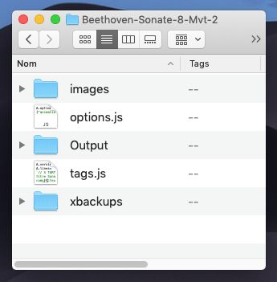
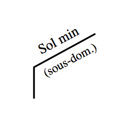
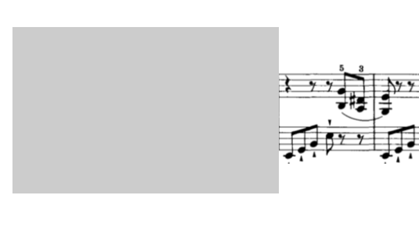

# MuScaT<br>Manuel d'utilisation

[Github de MuScaT]: https://github.com/PhilippePerret/MuScaT


## Rappel rapide

Si vous avez installé [la commande `muscat`](#commandemuscat) pour la console ou le Terminal, toutes les opérations sont simplifiées :

**Création de l'analyse**

~~~sh
> muscat create "Nom de l'analyse" # les espaces ne gênes pas
~~~

**Activation de l’analyse** (mise en courante)

~~~sh
> muscat analyse "Nom de l'analyse"
~~~

**Réglage des options**

~~~sh
> muscat option <mon-option>="<valeur>"
~~~

**Obtenir de l'aide**

~~~sh
> muscat aide
~~~

**Liste des commandes**

~~~sh
> mus commandes
~~~

**Obtenir de l’aide sur une commande**

~~~sh
> mus <commande> -h # ou --help
~~~


## Un peu d'histoire

Suite à la diffusion de mon [Initiation à l'analyse musicale](https://www.youtube.com/channel/UCX3XhJw9x1RsVx1s3GNYceA) des professeurs et autres pédagogues/musicologues m'ont sollicité pour me demander le logiciel utilisé pour créer l'animation de cette initiation. C'est malheureusement une application personnelle un peu trop… personnelle, une usine à gaz ne fonctionnant qu'à la ligne de code.

Pour répondre à ces marques d'intérêts ainsi qu'à mes propres besoins, j'ai voulu concevoir un outil plus simple et plus pratique qui permettrait de réaliser rapidement des analyses de partitions de qualité.

C'est ainsi qu'est née l'idée de **MuScaT** — dont le nom se compose de « Mu » pour « Musique », « Sc » pour « Score » (« partition » en anglais) et « Ta » à l'envers pour *TAG*, le sens en français, comme les *TAGs* qu'on *tague* sur les murs.

En bref, **MuScaT** permet de **réaliser rapidement, de façon propre et pratique, des analyses de partitions musicales** de qualité, comme on peut le voir dans l'extrait ci-dessous.


Elle est semi-graphique, et permet d'ajuster très finement les *TAGs* — au pixel près — de façon visuelle et confortable.

* [Synopsis général de création d'une analyse](#synopsis_fabrication)
* [Synopsis détaillé](#synopsis_detailled)
  * [Charger l'application **MuScaT**](#download_muscat)
  * [Créer du dossier de l'analyse](#creation_dossier_analyse)
  * [Mettre l'analyse en analyse courante](#set_analyse_courante)
  * [Découper la partition en « images-systèmes»](#syn_crop_score)
  * [Inscrire les images-systèmes dans l'analyse](#syn_inscription_images_systemes)
  * [Préparer l'impression](#prepare_print)
    * [Ajout du titre, compositeur, etc.](#titre_et_auteur)
  * [Créer les *TAGs* (accords, les chiffrages, les cadences et autres éléments d'analyse)](#syn_def_analysis_elements)
  * [Positionner les éléments graphiques](#syn_ajustement_elements)
    * [Les lignes repères](#ligne_reperes)
    * [Note sur les coordonnées et dimensions](#note_coors_dims)
  * [Versions de l'analyse](#versions_de_analyse)
  * [Imprimer en PDF](#syn_print_pdf)
* [L'interface](#user_interface)
  * [La Table d'analyse](#la_table_danalyse)
  * [La boite à outils](#toolbox)
  * [Le champ de code](#code_field)
* [Composition détaillé d'un *TAG*](#composition_dun_tag)
  * [Note sur le contenu du *TAG* (texte)](#note_contenu_tag)
  * [Note sur les couleurs](#note_couleurs)
* [Liste complète de tous les *TAGs*](#complete_list_tags)
  * [Les Images](#les_images)
    * [Définition de la taille d'une image](#defining_image_size)
    * [Séquence d'images](#sequence_images)
  * [Les Accords](#les_accords)
  * [Les Chiffrages (Harmonie)](#les_harmonies)
  * [Les Cadences](#les_cadences)
  * [Les Modulations](#les_modulations)
  * [Autres types de textes](#les_textes)
    * [Les Parties](#les_parties)
    * [Les Mesures](#les_mesures)
    * [Les Degrés](#les_degres)
    * [Les marques musicales diverses](#marques_musicales)
  * [Autres éléments graphiques](#autres_elements_graphiques)
    * [Les Lignes](#les_lignes)
    * [Les Boites](#les_boites)
* [Opérations sur les *TAGs*](#operation_on_tags)
  * [Verrouillage des *TAGs*](#lock_tags)
  * [Grouper et dégrouper des *TAGs*](#grouper_tags)
  * [Ligne de code du *TAG*](#tag_code_line)
* [Automation d'une analyse](#animation_analyse)
* [Les Options](#all_options)
* [Les Utilitaires](#les_utilitaires)
  * [Changement du dossier des captures écran (Mac)](#utils_change_captures_folder)
  * [Renommage des fichiers images (Mac/Unix)](#utils_renommer_fichiers)
  * [Création d'une nouvelle analyse](#create_new_analyse)
  * [Activation d'une analyse](#activate_analyse)
  * [Commande Shell `muscat`](#commandemuscat)
* [Annexe](#annexes)
  * [Application « Terminal »](#application_terminal)
  * [Raccourcis clavier](#keyboard_shortcuts)


## Remerciements

Mes remerciements vont :

* à Marion MICHEL pour la relecture attentive et patiente de ce manuel, et ses nombreuses corrections.


## Synopsis général de création d'une analyse

Commençons par un aperçu du processus général qui va permettre de produire une analyse musicale à l'aide de **MuScaT**. Noter que chaque item de cette liste est cliquable et permet de rejoindre la partie détaillée correspondante.

* [Chargement de l'application **MuScaT**](#download_muscat)
* [Création du dossier de l'analyse](#creation_dossier_analyse),
* [Mise de l'analyse en analyse courante](#set_analyse_courante),
* [Découpage de la partition en « images-systèmes»](#syn_crop_score),
* [Inscription des images-systèmes sur la table d'analyse](#syn_inscription_images_systemes),
* [Préparation de l'impression](#prepare_print)
  * [Positionnement en fonction de l'aperçu d'impression](#dim_et_pos_against_overview)
  * [Ajout des informations (titre, compositeur…)](#titre_et_auteur)
* [Ajout de tous les éléments d'analyse](#syn_def_analysis_elements),
* [Positionnement les éléments graphiques](#syn_ajustement_elements),
  * [Les lignes repères](#ligne_reperes)
* [Récupération du code final](#syn_recuperation_code_final),
* [Impression en PDF](#syn_print_pdf).

## Synopsis détaillé

Après ce bref aperçu des étapes de la fabrication d'une analyse, abordons-en tous les aspects et tous les détails.


### Prérequis au fonctionnement de l'application

Pour fonctionner, l’application a besoin :

* que ruby soit installé sur votre machine,
* qu’un serveur local soit en route,
* qu’un dossier `Sites` soit réglé pour recevoir l’application.


### Chargement de l'application **MuScaT**

La toute première chose à faire, bien sûr, est de charger **MuScaT**. Pour le moment, on peut le faire par le biais de son [repository Github de **MuScaT**][Github de MuScaT].

Il suffit de cliquer sur le bouton « Clone or download »…


… de choisir « Download ZIP »…


… et d'attendre la fin du téléchargement (l'application fait plusieurs mégaoctets, donc suivant la qualité de votre connexion, l'opération peut être plus ou moins longue).

Déplacez-le dossier dans votre dossier serveur (`~/Sites/` sur Mac)


### Créer le dossier de l'analyse

#### Création en ligne de commande

Pour créer une nouvelle application, on joue la commande suivant dans son Terminal (Mac/Unix) ou sa Console (Windows)

~~~sh
> mus create "Mon analyse"
~~~

#### Création par le Finder

Si vous utilisiez l’ancienne formule de Muscat, en créant l’analyse par le Finder, elle n’est plus d’usage aujourd’hui.

#### Contenu d'un dossier d'analyse

Voyons rapidement le contenu du dossier d'analyse. Notez qu’à présent il n’est plus utile que pour le dossier `images` dans lequel on place les partitions et les images de l'analyse. On trouve :

* le dossier « images » qui comme son nom l'indique va rassembler toutes les images utiles à l'analyse, c'est-à-dire les partitions, les *systèmes*,
* le fichier `tags.js` qui va contenir la définition précise de l'analyse,
* le fichier `options.js` définissant les options.
* le dossier `Output` pour les sorties,
* le dossier `xbackups` pour les derniers backups de l’analyse.




> Dans ce dossier, vous pouvez mettre aussi en racine la partition de base de l’œuvre à analyser.

### Mettre l'analyse en analyse courante

~~~sh
> muscat analyse "Nom de l'analyse"
~~~


Vous pouvez aussi régler cette analyse comme « analyse cible » (de toutes les commandes) et donc simplement jouer `mus analyse` ensuite, même les sessions ou les jours suivants.

~~~sh
> mus use "Nom analyse"
> mus analyse
~~~

Pour choisir l’analyse parmi toutes celles présentes, on peut faire :

~~~sh
> mus analyse --list # ou -l
~~~

**Muscat** affiche alors la liste de toutes les analyses, pour en choisir une.

Noter aussi que vous pouvez ne donner que le début du nom, **Muscat** fait le reste en cherchant l’analyse correspondante.


### Découpage de la partition en « images-systèmes »

Très souvent, on part d'un fichier PDF contenant une partition ou les systèmes sont trop rapprochés pour être « tagués » de façon lisible. Même s'il est tout à fait possible d'utiliser un tel fichier PDF avec **MuScaT**, il est infiniment plus pratique de travailler avec de « vraies » images et des systèmes séparés (donc une image par système).

La première opération consiste donc à transformer le fichier PDF en images-systèmes. Pour ce faire, vous pouvez passer par [Gimp](https://www.gimp.org), Photoshop ou tout autre logiciel de traitement de l'image. Je vous renvoie à leur manuel pour la procédure à adopter.

Mais vous avez plus simple, beaucoup plus pratique et extrêmement plus rapide : les fonctions de capture d'écran. Si vous êtes sur Mac, vous pouvez utiliser l'application [Aperçu](https://support.apple.com/fr-fr/guide/preview/welcome/mac). Si vous êtes sur PC/Windows, ce sera plutôt [LightShot](https://app.prntscr.com/en/index.html) par exemple.

Pour une version détaillée et illustrée de la procédure, je vous renvoie à [ma chaine YouTube](https://www.youtube.com/channel/UCX3XhJw9x1RsVx1s3GNYceA) et plus précisément le [Découpage de la partition](https://www.youtube.com/watch?v=kVebmZgl4o8). Je l'explique rapidement seulement ici.

* Sur Mac, vous pouvez modifier le dossier de capture (le dossier où seront automatiquement enregistrées les captures d'écran) en utilisant la commande `change_folder_captures` de **MuScaT**. Dans le [Terminal](#application_terminal), taper :

    ```

    > muscat change_folder_captures "/dossier/des/catpures/"

    ```

    > Note : pour ne pas avoir à remplir les chemins à la main, il vous suffit de glisser les éléments (fichier ou dossier) depuis le Finder jusque sur la fenêtre de Terminal. Le chemin de l'élément est aussitôt inscrit.

    Ajouter l’option `-m/—make` pour créer le dossier, s’il n’existe pas.

* ouvrir le PDF dans Aperçu,

* activer la combinaison de touches `⌘⇧4`,

* sélectionner le système (ou la portion de partition à isoler) (note : prendre un peu « large », il sera possible d’affiner ensuite),

* recommencer ces opérations pour chaque système (ou chaque portion de partition).

Pour revenir au dossier par défaut, il suffit de jouer la commande sans argument :

~~~sh
> muscat change-folder-captures
~~~

> Noter que les commandes peuvent être données indifféremment avec des tirets ('-') ou des traits plats ('_').

Pour renommer automatiquement toutes les captures produites — qui possèdent pour le moment des noms quelque peu ésotériques… — vous pouvez utiliser :

~~~sh
> muscat rename_images "path/to/dossier" "prefixe-nom"
~~~

Pour obtenir de l’aide sur cette commande :

~~~sh
> muscat rename_images -h # pour obtenir l'aide sur la commande
~~~


#### Affiner des systèmes mal découpés

Noter que si vous avez mal découpé certains systèmes, il est extrêmement simple de les affiner dans un second temps :

* ouvrez cette fois l'image dans Aperçu (pas le PDF de la partition, mais bien l'image à retoucher),
* dessiner un rectangle à la souris,
* régler les « poignées » de la sélection dessinée pour obtenir exactement la découpe voulue,
* jouer la combinaison `⌘ K`,
* enregistrer l'image.

Quelle que soit la méthode adoptée pour découper la partition en systèmes, on place obligatoirement toutes les images dans le dossier `images` de l’analyse qu’on peut voir en jouant :

~~~sh
> mus open folder "Mon Analyse"

# ou simplement (si l'analyse est la courante)

> mus open folder
~~~

> Si vous ne connaissez pas le nom de l’analyse, ajoutez l’option `-l` (ou `—list`) pour obtenir la liste de toutes les analyses présentes.


### Inscrire les images-systèmes

Maintenant que nos images sont prêtes, nous devons les « inscrire » dans l'analyse pour qu'elles apparaissent sur notre table d'analyse.

Pour se faire, on lance l’analyse si nécessaire avec :

~~~sh
> muscat analyse[ "mon analyse"]
~~~

Et dans la fenêtre de code, on écrit :

~~~terminal
//Premier système
sco sonate-haydn-0.png x=50 y=100 w=16cm

// Deuxième système
sco sonate-haydn-1.png x=50 y=140 w=16cm

// Troisième système
sco sonate-haydn-2.png x=50 y=180 w=16cm
~~~


ou sous forme de séquence :


Noter le `[0-2]` ci-dessus qui indique qu’il faut prendre l’image `0` à l’image `2`. Dès qu’il sera « interprété », ce code deviendra :


 


### Préparer l'impression

#### Dimensionner et positionner en fonction de l'aperçu d'impression

Avant de placer quelconque marque d'analyse sur la partition, nous vous invitons vivement à regarder ce que l'agencement des systèmes produit au niveau de l'impression ou de la sortie du PDF. Lorsque tous les *TAGs* seront placés, il sera extrêmement difficile et pénible de devoir les repositionner pour qu'ils soient correctement placés sur la page ou le PDF.

> N'hésitez pas à [ajouter les titre, compositeur, etc.](#titre_et_auteur) avant de procéder à l'opération ci-dessus.

Pour ce faire :

* ouvrir l'analyse dans Chrome,
* disposer les systèmes en les déplaçant à la souris,
* demander l'impression (`⌘/⌃ P`),
* faire les réglages nécessaires (taille du papier, marges, etc. — sur Chrome, l'idéal est d'utiliser le format « Portrait », des marges « minimum », un grossissement de 100 % et pas d'entête ni de pied de page),
* noter les systèmes qui « débordent », qui passent d'une page à l'autre,
* fermer l'aperçu et ajuster la position des systèmes,
* recommencer ces dernières opérations jusqu'à un résultat satisfaisant.


#### Ajout du titre, compositeur, etc.

Vous pouvez placer les titre, compositeur, date, opus, etc. aux endroits voulus grâce aux *TAGs* `titre`, `compositeur`, `analyste`, `date_composition`, `opus`, `date_analyse`, etc.

C'est-à-dire que vous pouvez placer, en haut de votre définition de `Tags` dans votre fichier `_tags_.js`, les informations suivantes :


Ce qui donnera à l’écran (peu ou prou) :


> Dans la nouvelle version de **Muscat**, les tags ne sont plus entourés d’un cadre gris.


Notez que pour ces *TAGs* il est inutile de préciser les positions. C'est le thème qui s'en charge (le thème par défaut est le thème « Muscat », évidemment). Mais vous pouvez tout à fait les déplacer pour les ajuster à votre guise ou [choisir un autre thème](#option_theme).


### Créer les *TAGs*

L'élément graphique de base de l'application **MuScaT** est le « *TAG* » (comme on en trouve sur les murs des villes). Une analyse avec **MuScaT** consiste à « taguer » une partition (remarquez que les partitions elles-mêmes, ou les images de leurs systèmes, sont elles aussi des *TAGs*).

Plusieurs moyens permettent de créer un nouveau *TAG* dans l’éditeur de tags à droite de la fenêtre (partie noire) :

* soit : utiliser le bouton « + »,
* soit : sélectionner une ligne de code et jouer `⌘ ↩︎`.


#### En faisant des copies d'éléments existants

Un moyen très rapide — et donc très efficace — de créer de nouveaux éléments est de les copier depuis la table d'analyse.

Cela consiste à déplacer l’élément graphique — le nom de l’accord par exemple — **en tenant la touche ALT pressée** puis de relâcher l'élément (la copie) à l'endroit voulu.

Une copie est alors créée, qui peut être réglée comme n'importe quel *TAG*.


#### Aperçu de la composition d'un *TAG*

Chaque *TAG* est représenté dans le code par une unique ligne.

Une image de système (`score`) peut être :

~~~tags
score systeme-1.png x=50 y=3000
~~~

Une modulation peut être inscrite par :

```tags
mod G_min x=150 y=539
```


#### Déplacement rapide des lignes de code

On peut déplacer rapidement les lignes de code à l’aide du raccourci-clavier `⌘⌃↑/↓`. Il suffit de placer le curseur dans la ligne de code et d’utiliser `⌘⌃↑` pour faire remonter la ligne et `⌘⌃↓` pour la faire redescendre.


#### Pour aller plus loin…

* [Composition détaillé d'un *TAG*](#composition_dun_tag),
* [Liste complète des *TAGs*](#complete_list_tags).


### Modifier le *TAG*


#### Modifier la position du *TAG*

On peut placer les éléments aux bons endroits de plusieurs manières :

* en les déplaçant à la souris,
    
* en utilisant les flèches de son clavier,
* en jouant sur les touches `x` / `y` (pour descendre ou aller à droite) et  `⇧ x` / `⇧ y` (pour monter et aller à gauche,
* en modifiant leur coordonnées dans le champ de code.

Pour le détail, cf. [Positionnement des *TAGs*](#modify_position_tag).


#### Modifier la taille du *TAG*

On peut modifier les tailles des éléments de plusieurs manières aussi :

* en modifiant leur code,
* en jouant sur les touches `w` / `h` (pour augmenter les tailles) et  `⇧ w` / `⇧ h` (pour diminuer les tailles),

Pour le détail, cf. [Dimensionnement des *TAGs*](#dimensionner_les_tags).

On peut en ajouter de nouveaux en dupliquant les lignes de code.

À tout moment on peut annuler une opération pour revenir en arrière en jouant `⌘ Z` (sur Mac) ou `Ctrl Z` (sur Windows).


#### Lignes repères

Pour faciliter l'alignement des *TAGs* — par exemple l'alignement des dernières mesures de fin des systèmes — on peut utiliser des lignes repères. Pour cela, il suffit d'activer l'option `repères` (ou `reperes` ou `lines-of-reference`).

~~~sh
> mus option reperes=true
~~~


Cela ajoute deux lignes à l'écran, une verticale et une horizontale, qu'on peut déplacer à loisir à la souris.


Vous pouvez également définir leur emplacement exact avec les options `position-repère-vertical` (ou `vertical-line-offset`) et `position-repère-horizontal` (ou `horizontal-line-offset`) :

~~~sh
> mus option reperes=true vertical-line-offset=120 horizontal-line-offset=200
~~~


### Positionnement et dimensionnement des *TAGs*

Les positions `x` (horizontale) et `y` (verticale) s'indiquent toujours sans unité, en pixels :

```bash

  x=13 y=200

```

Toutes les autres propriétés de dimension et de position peuvent s'indiquer sans ou avec unité ou pourcentage.

```javascript
    ... w=200
    ... w=20%
    ... h=23mm
    ... fs=12pt
```


#### Obtenir des coordonnées

Pour obtenir les x/y d'une position quelconque, il suffit de cliquer à l'endroit de cette position sur la table d'analyse. Cela affiche les coordonnées en bas de l'écran, mais plus encore, ça colle un `y=134 x=145` correspondant dans le presse-papier, valeur qu'il suffit ensuite de coller dans le code de la ligne du *TAG* (`⌘ V` sur Mac ou `Ctrl V` avec Windows).

Ce qui fait que la procédure naturelle de création d’un tag consiste à :

* cliquer sur la table d’analyse à l’endroit où l’on veut que le tag s’inscrive,
* créer une nouvelle ligne de code (par exemple avec le bouton « + »),
* mlettre le type et la valeur en début de ligne (par exemple `acc D` pour un accord de Ré majeur ),
* jouer `⌘ v` pour coller les coordonnées x et y au bout de la ligne.


### Imprimer l'analyse en PDF

Enfin, on imprime la page HTML du navigateur en choisissant le format PDF :

* dans Chrome, demander l'impression (`⌘/Ctrl P`),
* dans la fenêtre qui s'ouvre, choisir, dans le menu en bas à gauche : « Imprimer au format PDF » ou autre indication similaire.


### Et voilà !

Et voilà, c'est fait ! Et vous pourrez retoucher votre analyse à n'importe quel moment en la remettant en analyse courante.

~~~sh
> mus use "Mon analyse"
~~~


---

## L'interface

Faisons un tour rapide de l'interface, qui reste volontairement relativement simple, se concentrant sur les éléments essentiels.

* [La Table d'analyse](#la_table_danalyse)
* [La boite à outils](#toolbox)
* [Le champ de code](#code_field)


### La Table d'analyse

Cette table, c'est la surface de la page elle-même, la surface principale de la fenêtre de votre navigateur. Elle se présente en blanc sur une surface à peine grisée qui permet de repérer les dimensions de la page d'impression. Le mieux est de jouer sur la largeur des images (paramètre `w`, modifiable avec la touche `w`) pour toujours se trouver à l'intérieur de cette surface.

**Si vous dépassez la surface délimitée, l'impression en sera affectée de façon très aléatoire (au moins en apparence).**


### La boite à outils

Sur la gauche en haut de l'écran, on trouve un petit picto qui permet d'ouvrir la boite à outils.


Cette boite à outils contient des outils pour regrouper ou dégrouper des *TAGs*, pour les aligner, pour copier le code, etc.


### Le champ de code

Un champ de code est ouvert à droite de la page, contenant la définition successive de tous les tags d’analyse. L’ordre est indifférent pour une analyse « statique » mais il est déterminant pour une [animation de l’analyse](#animation_analyse).

En modifiant ce code, vous pouvez construire votre analyse.

| Action                        | Description                                              |
| ----------------------------- | -------------------------------------------------------- |
| `⌘ Entrée`<br>ou bouton « + » | Créer une nouvelle ligne/un nouveau *TAG*.               |
| Bouton « - »                  | Destruction du *TAG* courant                             |
| `flèche haut`                 | Passer au *TAG* au-dessus                                |
| `flèche bas`                  | Passer au *TAG* en dessous                               |
| `⌘ ⌃ ↑`                       | Remonter le *TAG* courant                                |
| `⌘ ⌃ ↓`                       | Descendre le *TAG* courant                               |
| `⇥`                           | Se place dans le code du *TAG* sélectionné sur la table. |


> Note : la touche `⌘`, sur PC/Windows, doit être remplacée par la touche `⌃` (Ctrl).


Notez que dès que vous sélectionnez un *TAG* dans le code, le *TAG* est aussitôt sélectionné sur la table d'analyse (la table est « scrollée » pour toujours rendre visible ce *TAG*). L'opération inverse est vraie : toute sélection de *TAG* sur la table d'analyse est aussitôt sélectionné et affiché dans le code.

---


## Composition détaillé d'un *TAG* {#composition_dun_tag}

Le *code* de l'analyse est constitué simplement de *lignes*, les unes au-dessus des autres, qui déterminent les images et les *TAGs*. Chaque ligne est une image ou un *TAG* (exception faite des lignes vides et des lignes de commentaire — précédées de `//`).

```{.center .exergue}
1 ligne = 1 TAG
```

Chaque ligne de *TAG* est composée d'un nombre de propriétés souvent définies par le signe égal — exception faite des deux premiers « mots » qui déterminent le plus souvent la *nature* et le *contenu* du *TAG*.

Voyons plus en détail comment se compose le code d’un *TAG*.

Cette ligne a le format général suivant :

`nature`[ `contenu`][ `propriétés`][ `option/type`]

`nature`
: C'est la *nature* du *TAG*, ce qui détermine ce qu'il est, cadence, modulation, boite ou image, etc.

`contenu`
: C'est le *contenu* du *TAG*, parfois son *type* (pour les lignes par exemple). Pour un *TAG* de texte, c'est le texte, pour une modulation, c'est la tonalité vers laquelle on module.
: Cf. [Note sur le contenu du *TAG*](#note_contenu_tag)

`propriétés`
: Les propriétés du *TAG*, à commencer par ses coordonnées `x` (position horizontale) et `y` (position verticale) ainsi que les dimensions h (hauteur) et w (largeur) du *TAG*.
: Ces coordonnées et ces dimensions se notent simplement en donnant les valeurs à l'aide d'un signe égal (`=`) **sans espace** : `x=12`, `y=20`, `w=12%`, `h=12mm`, etc.
: Cf. aussi [Note sur les coordonnées et dimensions](#note_coors_dims)
: On peut également trouver les propriétés de couleur. Cf. [Note sur les couleurs](#note_couleurs)

`option/type`
: Des options ou des types en fonction de la nature du *TAG*. Nous y reviendrons.

Noter qu'à part les deux premiers éléments, tous les autres peuvent être donnés dans l'ordre qu'on veut, sans importance.

Voici quelques définitions de *TAGs* :

```javascript
  score ma_partition.jpg y=100 x=10

  // => L'image 'images/ma_partition.jpg' placée à 10 pixels de
  //    la marge-gauche et 100 pixels du haut.

  cadence I type=parfaite y=200 x=100 w=100

  // => Une cadence de type parfaite, avec un trait de
  //    100 pixels de large (`w`).

  modulation G_min x=200 y=100

  // => Une modulation vers Sol mineur.

```

> Noter les lignes commençant par `//` qui permettent de laisser un commentaire. C'est très utile lorsque l'on veut s'y retrouver lorsque l'analyse devient conséquente.

Noter qu'une *nature* de *TAG* (le premier mot), peut toujours être exprimée par ses trois premières lettres (exception faite du terme « partition » qui rentrerait en conflit avec « partie »). Ainsi, on peut écrire le code ci-dessous :

```javascript
  sco ma_partition.jpg y=100 x=10

  // sco => score (partition)

  cad V_I type=parfaite y=200 x=100

  // cad => cadence

  mod G_min x=200 y=100

  // mod => modulation
```

L'intégralité des *natures* de *TAG* (et leur diminutif) [est détaillée ici](#complete_list_tags).


### Forme raccourcie d'écriture

Pour la première définition du *TAG*, on peut utiliser une version raccourcie de définition qui la rend très simple et très rapide. Elle consiste à utiliser :

```javascript
<nature>[ <contenu>] <valeur y seule> <valeur x seule>
```

Par exemple, pour une *modulation* vers la tonalité de SOL mineur (G min.) qui doit se situer à 200 pixels du haut et 450 pixels de la gauche, on pourra écrire simplement :

```javascript
  mod G_min 200 450
```

Il suffit de se souvenir que le premier nombre concerne la *hauteur*.


### Note sur le contenu du *TAG* (texte)

Le *contenu* du *TAG*, c'est-à-dire son deuxième *mot*, peut être de type très différent. Mais en règle générale, il s'agit d'un texte, d'un accord ou d'un chiffrage.

Il est important de noter immédiatement ce point :

`Aucune espace ne doit se trouver dans ce contenu.`

On doit obligatoirement remplacer les espaces par des traits plats (MAJ tiret sur Mac).

Ainsi, si l'on veut écrire « Second couplet », on doit écrire :

```javascript
  partie Second_couplet x=123 y=456
```

Si l'on veut écrire la tonalité « Sol mineur », on doit impérativement écrire :

```javascript
  modulation Sol_mineur x=23 y=344
```

En revanche, tous les autres caractères sont possibles, à l'exception des balances (`/`) dans les modulations, car elles indiquent le texte qui devra apparaitre sous le trait biaisé :

```javascript
  // Une modulation vers la sous-dominante
  mod Sol_min/(sous-dom.) x=23 y=344
```



### Note sur les couleurs {#note_couleurs}

Tous les *TAGs* à part les images peuvent avoir une couleur d'écriture et une couleur de fond.

Ces couleurs sont définies par les propriétés suivantes au choix, suivant votre convenance. La première (`c` pour la *couleur* et `bgc` pour la *couleur de fond* sont les moins difficiles pour *MuScaT* puisque ce sont celles qu'il utilise dans sa langue naturelle) :

| Couleur             | c                |
| ------------------- | ---------------- |
|                     | couleur          |
|                     | color            |
| **Couleur de fond** | bgc              |
|                     | fond             |
|                     | background-color |
|                     |                  |

Pour la valeur, on peut utiliser soit la forme littérale en anglais (`red`, `yellowgreen`, etc.) soit la forme hexadécimale (`12FF67`, `#12FF67`) soit la forme RVB (`rgb(100,23,45)`).

`Dans la forme RVB/RGB, attention de ne laisser aucune espace !`{.warning}

---


## Liste complète de tous les *TAGs* {#complete_list_tags}

Trouvez ci-dessous la liste complète de tous les *TAGs*.

| TAG                           | Description                                                  |
| ----------------------------- | ------------------------------------------------------------ |
| partition<br />score<br />sco | Écriture d’une image, à commencer par celle de la partition ou du système à analyse. |
| image                         | image <source> x=... y=... z=...                             |
| Exemple                       | sco sonate_haydn-2.png x=24 y=200 w=12.5cm                   |
|                               |                                |
| Note                          | L'image doit se trouver dans le dossier `images` du dossier de l'analyse. |
| Détail                        | [Les Images](#les_images)                                    |


| TAG                        | Description                                     |
| -------------------------- | ----------------------------------------------- |
| accord<br />chord<br />acc | Écritude d’un accord au-dessus de la partition. |
| Usage                      | `accord <nom> x=... y=…`                        |
| Exemple                    | `acc E_min x=100 y=200`                         |
|                            |                 |
| Note                       |                                                 |
| Détail                     | [Les Accords](#les_accords)                     |
|                            |                                                 |


| TAG                            | Description                                                  |
| ------------------------------ | ------------------------------------------------------------ |
| harmonie<br />harmony<br />har | Écriture d'un chiffrage sous la partition. C’est en général un chiffre romain indiquant le renversement de l'accord. |
| Usage                          | `har[mony] <chiffrage> x=... y=...`                          |
| Exemple                        | `har VII*** x=540 y=325`                                     |
|                                |                           |
| Note                           |                                                              |
| Détail                         | [Les Harmonies](#les_harmonies)                              |


| TAG                 | Description                                            |
| ------------------- | ------------------------------------------------------ |
| modulation<br />mod | Marque de modulation à placer en haut de la partition. |
| Usage               | `mod[ulation] <tonalité> x=... y=...`                  |
| Exemple             | `mod G_Maj/Relatif_maj. x=83 y=77 h=70px`              |
|                     |               |
| Note                |                                                        |
| Détail              | [Les Modulations](#les_modulations)                    |


| TAG              | Description                                                  |
| ---------------- | ------------------------------------------------------------ |
| cadence<br />cad | Marque de cadence à placer sous la partition.                |
| Usage            | `cad[ence] <acc> type=<type cad> x=. y=. w=...`              |
| Exemple          | `cad V type=demi x=23 y=3456 w=80`                           |
|                  |                           |
| Note             | Noter ci-dessus l'emploi 1) d'un *type* (type de la cadence) et 2) d'une largeur *w* (longueur du trait). |
| Détail           | [Les Cadences](#les_cadences)                                |


| TAG                          | Description                                  |
| ---------------------------- | -------------------------------------------- |
| mesure<br />measure<br />mes | Marque de mesure à placer à l'endroit voulu. |
| Usage                        | `mes[ure] <numéro> x=... y=...`              |
| Exemple                      | `measure 15 x=434 y=171`                     |
|                              |             |
| Note                         | Noter que le style dépend du thème choisi.   |
| Détail                       | [Les Mesures](#les_mesures)                  |


| TAG                        | Description                                                  |
| -------------------------- | ------------------------------------------------------------ |
| degree<br />degre<br />deg | Marque du degré de la note dans la gamme, à placer à l'endroit voulu. |
| Usage                      | `degre <degré> x=... y=...`                                  |
| Exemple                    | `degre 4# x=23 y=1200`                                       |
|                            |                                  |
| Note                       |                                                              |
| Détail                     | [Les Degrés](#les_degres)                                    |


| TAG                      | Description                                                  |
| ------------------------ | ------------------------------------------------------------ |
| ligne<br />line<br />lig | Marque une ligne, par exemple pour indiquer la poursuite d'un chiffrage sur plusieurs temps. |
| Usage                    | `ligne <type> x=... y=... w=...`                             |
| Exemple                  | `line |___| x=242 y=323 h=15 w=110`                          |
|                          |                               |
| Note                     |                                                              |
| Détail                   | [Les Lignes](#les_lignes)                                    |


| TAG                     | Description                                                  |
| ----------------------- | ------------------------------------------------------------ |
| box<br />boite<br />boi | Dessine une boite à l'écran. Ces boites permettent de masquer des éléments de la partition. Bien que ces boites apparaissent en gris sur la table d'analyse, elles seront invisibles dans le document PDF final ou à l'impression. |
| Usage                   | `box x=... y=... w=<largeur> h=<hauteur>`                    |
| Exemple                 | `boite x=45 y=152 h=180 w=295`                               |
|                         |                               |
| Note                    | La hauteur (`h`) et la largeur (`w`) sont ici très importantes. Noter également que cette boite est visible sur la table d'analyse, mais elle sera invisible dans le document imprimé. |
| Détail                  | [Les Boites](#les_boites)                                    |


| TAG                      | Description                                                  |
| ------------------------ | ------------------------------------------------------------ |
| texte<br />text<br />tex | Pour marquer un texte quelconque à l'écran.                  |
| Usage                    | `tex[te] <le_texte> x=... y=...[ type=<type>]`               |
| Exemple                  | `tex Opposition_marquée x=296 y=138 w=73`                    |
|                          |                                |
| Note                     | * Mettre des traits plats à la place des espaces dans le code. Ils seront remplacés par de vraies espaces lors de l'inscription du texte sur la table d'analyse.<br />* Grâce à la définition de la largeur (w), on met le texte sur deux lignes. |
| Détail                   | [Les Textes](#les_textes)                                    |


## Les Images

Il existe trois mots clés pour indiquer la nature d'une image, mais ils produisent en réalité la même sorte de *TAG* : `image`, `score` ou `partition`. C'est le premier mot à trouver sur la ligne d'une image. Juste après, on doit trouver le nom de cette image, ou son chemin relatif depuis le dossier `images` du dossier de l'analyse.

```
  partition premier_mouvement/image-12.png [...]
```

Ci-dessus, l'image `image-12.png` doit donc se trouver dans le dossier `_analyses_/monAnalyse/images/premier_mouvement/`.


### Définition de la taille d'une image

On peut définir la taille d'une image à l'aide du paramètre `w` (ou `width`, « largeur », en anglais). Sa valeur peut être explicite avec une unité, explicite sans unité ou en pourcentage. Par exemple :

```javascript
sco image-0.png
sco image-1.png w=200
sco image-2.png w=10cm
sco image-3.png w=50%
```

Avec le code ci-dessus, l'image 0 aura sa taille normale, `image-1.png` fera 200 pixels de large, `image-2.png` fera 10 centimètres de large et `image-3.png` sera mise à 50 % de sa largeur.

Pour voir en détail toutes les façons de modifier la taille ou la position d'une image, cf. [Dimensionnement des *TAGs*](#dimensionner_les_tags) et [Positionnement des *TAGs*](#modify_position_tag).


### Séquence d'images {#sequence_images}

Très souvent, une analyse n'est pas constituée d'une seule image pour toute la partition. Il y a trop peu d'espace entre les systèmes. On conseille donc fortement de découper les partitions en autant de systèmes qu'elles en comportent (vous trouverez des indications sur la [procédure de découpage de la partition](#procedure_crop_partition) ci-dessous).

Mais il serait fastidieux d'entrer la ligne de chaque image de système dans notre code des tags. Une partition même courte peut très vite comporter de 20 à 30 systèmes et ce serait autant de lignes de partition qu'il faudrait introduire dans le code…

Au lieu de ça, si les images des systèmes ont été nommées en respectant une règle simple (avec des suites de nombres), une seule ligne suffira pour entrer tous les systèmes de la partition. Par exemple :

```

  score mouvement_1/image-[1-35].png

```

Le texte ci-dessus indique qu'il y a 35 images de système dans ce mouvement. Le code qui en résultera sera :

```

  score mouvement_1/image-1.png
  score mouvement_1/image-2.png
  score mouvement_1/image-3.png
  score mouvement_1/image-4.png
  ...
  ...
  score mouvement_1/image-35.png

```

Si vous indiquez une taille — ce qui est mieux pour être sûr de tenir dans la page — cette taille sera appliquée à toutes les images.

```sh
score mouvement_1/image-[1-35].png w=17.5cm
```

Nous vous invitons vivement à commencer par cette opération — l'inscription des systèmes par séquence — avant l'insertion de toute autre marque sur la partition. Comme [nous l'expliquons plus haut déjà](#dim_et_pos_against_overview), il est recommandé, pour s'éviter ensuite un travail fastidieux de repositionnement, de placer en tout premier lieu les systèmes correctement sur chaque feuille, de façon définitive, en se servant de l'aperçu d'impression.

Noter que lorsque **MuScaT** place les images sur la table d'analyse, il les répartit pour obtenir l'aspect original de la partition. On peut modifier ce comportement en définissant explicitement un espace (vertical) entre chaque système ou chaque image, grâce à l'option `espacement-images` :

~~~sh
# À jouer dans le Terminal/Console
> mus option espacement-images=50
~~~

Dans le code de l’analyse :

```sh
sco haydn/mouvement_1-[1-35].png
```

> Noter la version raccourcie de la nature du *TAG* : `sco` pour `score`.

> Noter également l'usage de l'option `code` qui permet d'afficher le code à côté de la table de l'analyse, pour pouvoir le modifier dans le navigateur lui-même.

Grâce à l'option `espacement-images` définie ci-dessus, chaque image (chaque système) sera séparée de 50 pixels.

Une fois ce code établi, vous pouvez déplacer les images dans la page pour les ajuster à vos besoins. Cela créera automatiquement les `x` et les `y` des coordonnées spatiales de chaque système au bout des lignes de score.

Astuce : si votre écran et assez grand et que vous adoptez [l'option `code beside` (ou `code à côté`)](#option_code_beside), vous pourrez voir en direct votre code s'actualiser.


### Les Accords

Les accords, placés en général au-dessus de la portée, se définissent par les natures `accord`, `chord` ou `acc` en version raccourcie.

On peut les indiquer en version anglosaxonne (`A`, `B`, …) ou en version italienne (`Do`, `Ré`, …), peu importe. L'important est de comprendre que comme tout texte **MuScaT** impose de remplacer les espaces par des traits plats. Ainsi, pour indiquer un accord de Si bémol 7e diminuée, on pourra utiliser dans les deux systèmes de langue :

```javascript
chord SIb_min_7edim
acc Bb_min_7edim
```

Le code ci-dessus produira :


La taille du texte peut se régler de façon générale avec l'option `chord-size` ou, pour un accord particulier, avec la propriété `fs`.

Cf. [Options de taille pour les textes](#options_size_for_texts), pour des renseignements complets sur les options de tailles.


### Les Chiffrages (Harmonie)

On indique un chiffrage d'accord, sous la partition, à l'aide de la *nature* `harmonie`, `harmony`, `chiffrage` ou `har`.

Les recommandations sont les mêmes que pour les accords : aucune espace.

La taille du texte peut se régler de façon générale avec l'option `harmony-size` ou, pour un chiffrage particulier, avec la propriété `fs`.

Cf. [Options de taille pour les textes](#options_size_for_texts), pour des renseignements complets sur les options de tailles.


### Les Cadences

On indique une cadence, sous la partition, à l'aide de la *nature* `cadence` ou `cad`.

```javascript
cadence I type=parfaite x=100 y=200 w=150
```

> Remarquer que deux nouvelles propriétés apparaissent ici : le `type`, qui définit comme son nom l’indique le type de cadence (cf. la liste ci-dessous) et `w`, la largeur, qui détermine ici la longueur du trait.

On peut faire varier la longueur du trait en jouant sur la touche `w` (pour augmenter la longueur du trait) et `⌥ w` (pour la diminuer). Les touches `⇧` et `⌃` servent respectivement à augmenter le pas ou à le diminuer (action plus précise).

La taille du texte peut se régler de façon générale avec l'option `cadence-size` ou, pour une cadence particulière, avec la propriété `fs`.

Cf. [Options de taille pour les textes](#options_size_for_texts), pour des renseignements complets sur les options de tailles.


##### Types de cadence {#les_types_de_cadences}

Les types de cadence qu'on peut utiliser comme argument de la propriété `type` sont :

* parfaite
* imparfaite
* demi
* italienne
* rompue
* plagale
* faureenne (pour la cadence Fauréenne)
* baroque

Exemple :

```javascript
har I x=110 y=264
har IV x=155 y=262
cad V* type=demi x=77 y=263 w=147px
```


### Les modulations

On peut mettre un texte au-dessus de la barre inclinée (en général la tonalité vers laquelle on module) et un texte en dessous (en général la fonction de cette tonalité).

Pour séparer les deux textes, on utilise tout simplement la barre inclinée, appelée « balance ». Ainsi, pour obtenir :


… on utilisera simplement :

```sh
modulation Sol_min/(sous-dom.) x=200 y=300

// ou

mod Sol_min/(sous-dom.) 200 300

```

On peut modifier la hauteur du trait vertical qui rejoint la partition en modifiant la propriété `h`. On peut donc la modifier en pressant la touche `h` (augmente la longueur du trait) ou les touches `⌥ h` (diminue la longueur du trait).

La taille du texte peut se régler de façon générale avec l'option `modulation-size` ou, pour une modulation particulière, avec la propriété `fs`.

Cf. [Options de taille pour les textes](#options_size_for_texts), pour des renseignements complets sur les options de tailles.


### Les autres types de textes

Ce que l'on appelle spécifiquement les « textes », ici, ce sont tous les textes hors des accords, modulations, chiffrages, etc. Ce sont vraiment des textes qu'on peut placer n'importe où. À commencer par la définition des grandes parties de la pièce (« Introduction », « Coda », etc.).

Dans un texte, il est impératif de remplacer toutes les espaces par des traits plats (on les obtient, sur mac, à l'aide de Maj+tiret).

Par exemple, pour écrire sur la partition :

```

      Premier couplet

```

Il faut impérativement définir la ligne :

```

    texte Premier_couplet y= 50 x=200

```

En dehors des textes « normaux » ou simples, on peut utiliser :

* [Les parties](#les_parties)
* [Les mesures](#type_texte_mesure)
* [Les degrés](#les_degres)


### Les parties

Les marques de partie s'indiquent avec le *TAG* `partie` (ou `par` ou `part`). Ce sont des textes dans des boites inclinées qui ont cet aspect :


La taille du texte peut se régler de façon générale avec l'option `part-size` ou, pour une partie en particulier, avec la propriété `fs`.

Cf. [Options de taille pour les textes](#options_size_for_texts), pour des renseignements complets sur les options de tailles.


### Les mesures

Les numéros de mesure, s'ils ne sont pas indiqués sur la partition elle-même, peuvent être ajoutés à l'aide du *TAG* `mesure` (ou `measure`, ou `mes`), suivi du numéro de mesure puis des coordonnées.


La taille du texte peut se régler de façon générale avec l'option `mesure-size` ou, pour un numéro de mesure en particulier, avec la propriété `fs`.

Cf. [Options de taille pour les textes](#options_size_for_texts), pour des renseignements complets sur les options de tailles.


### Les degrés

Parfois il est intéressant de marquer les degrés des notes dans la gamme. On peut le faire grâce à la *nature* `degre`, `degree` ou le diminutif `deg`.

```sh
degree 4 # x=123 y=678
```


La taille du texte peut se régler de façon générale avec l'option `degre-size` ou, pour un degré en particulier, avec la propriété `fs`.

Cf. [Options de taille pour les textes](#options_size_for_texts), pour des renseignements complets sur les options de tailles.


#### Les marques musicales diverses

Plusieurs marques musicales seront introduites dans les versions suivantes.

---


### Autres éléments graphiques

#### Les Lignes {#les_lignes}

Les lignes se définissent par `line` ou `ligne`.

Le premier élément définit le `type` de la ligne. Bien noter que le `type` dont on parle ici ne se définit pas avec la propriété `type` — comme c'est le cas avec [les cadences](#les_cadences) par exemple —, mais simplement en second mot. Dans le code suivant :

```javascript
Tags = `
  line |___| x=100 y=120 w=230
`;
```

… `|___|` est le *type* de la ligne. On peut aussi le désigner par une lettre, comme le montre la table ci-dessous.

Les *types* sont les suivants :

| Nature lettre | Nature aspect | Description                                     |
| ------------- | ------------- | ----------------------------------------------- |
| U             | `|___|`       | Ligne inférieure, trait vertical avant et après |
| N             | `|---|`       | Ligne supérieure, trait vertical avant et après |
| L             | `|___`        | Ligne inférieure, trait vertical avant          |
| K             | `|---`        | Ligne supérieure, trait vertical avant          |
| V             | `___|`        | Ligne inférieure, trait vertical après          |
| ^             | `---|`        | Ligne supérieure, trait vertical après          |


On peut ensuite définir sa taille et sa position avec les lettres habituelles `x` (position horizontale), `y` (position verticale) et `w` (largeur en pixels).

#### Les Boites {#les_boites}

Les boites permettent aussi bien d'entourer un élément que de le masquer. Elles se définissent avec les propriétés `x`, `y`, `w` pour la largeur, `h` pour la hauteur et `bgc` pour la couleur de fond (cf. [Note sur les couleurs](#note_couleurs)).

Noter qu'une boite sans couleur, sur la table d'analyse, apparaitra toujours grisée — pour être visible et manipulable —, mais qu'elle sera invisible à l'impression ou dans le PDF.

Noter également qu'on peut utiliser de la transparence pour les boites. Il suffit pour cela de leur donner une valeur de `bgc` (background-color) à l'aide de `rgba` (où « a » final signifie « alpha », la transparence). Par exemple :

```sh
box x=100 y=233 w=50 h=400 bgc=rgba(0,255,0,0.3)
```


> Rappelez-vous bien qu'il ne doit y avoir aucune espace dans la définition de `bgc` (comme dans la définition de toute valeur).

---


<a name="operation_on_tags"></a>

## Opérations sur les *TAGs*

* [Verrouiller les *TAGs*](#lock_tags)
* [Grouper et dégrouper des *TAGs*](#grouper_tags)
* [Ligne de code du *TAG*](#tag_code_line)

<a name="lock_tags"></a>

### Verrouillage des *TAGs*

On peut « verrouiller » un *TAG*, c'est-à-dire empêcher totalement ses modifications, aussi bien sa position que son contenu. Il suffit de le sélectionner et de cliquer sur le bouton  sous le code. Pour le déverrouiller, cliquer à nouveau sur ce bouton.

**MuScaT** ajoutera un cadenas () en début de ligne de code, ce qui rendra ce verrouillage très visuel.

Une fois verrouillé, le *TAG* ne peut plus être déplacé à la souris. En revanche, il peut tout à fait être modifié dans le code (sa position, son contenu, etc.) pour un ajustement très précis.


### Grouper et dégrouper des *TAGs*

« Grouper » des *TAGs* permet de les considérer comme un seul élément. On peut de cette manière les déplacer ensemble ou les supprimer tous ensemble.

Pour grouper :

* sélectionner les *TAGs* les uns après les autres en maintenant la touche MAJ appuyée,
* activer le bouton « Grouper » dans [la boite à outils](#toolbox) ou jouer la combinaison clavier `⌘ G` (`Ctrl G` sur Windows).

Pour dégrouper :

* sélectionner un groupe en sélectionnant l'un de ses éléments,
* activer le bouton « Dégrouper les *TAGs* » dans [la boite à outils](#toolbox) ou jouer la combinaison clavier `⌘ G` (`Ctrl G` sur Windows).

---


## Procédure de découpage de la partition

Voyons quelques méthodes de découpage de la partition en « images-systèmes ». Je les présente ici de la meilleure à la moins bonne. Cette qualité a été définie en fonction des deux critères suivants :

* rapidité d'exécution,
* précision du découpage.


### Avec capture sélection dans Aperçu (Mac)

Méthode la plus rapide, mais également la moins précise. Ce manque de précision oblige parfois à reprendre des systèmes pour mieux les découper. Cependant, elle est tellement plus rapide que les autres que je la privilégie sans problème, d'autant que le redécoupage est aussi simple.

* Ouvrir la partition PDF dans l'application Aperçu,
* jouer `⌘ ⇧ 4` pour activer la sélection par souris,
* sélectionner la zone de la partition à capturer — un système — (ne pas avoir peur de « prendre large », il est facile d'affiner ensuite),
* recommencer l'opération pour tous les systèmes,
* récupérer les captures sur le bureau — sauf si l'astuce ci-dessous (1) a été utilisée — et les mettre dans le dossier `images` de votre analyse,
* modifier les noms des fichiers — sauf si vous avez utilisé l'astuce ci-dessous (1) — en les indiçant de 1 (ou 0) à N pour les insérer plus facilement dans l'analyse.

Pour affiner le découpage :

* ouvrir l'image dans Aperçu,
* choisir si nécessaire la sélection rectangle (p.e. Outils > Sélection rectangulaire),
* sélectionner la partie à conserver,
* affiner à l'aide des poignées,
* jouer `⌘ K` pour « cropper » l'image,
* l'enregistrer.

(1) Astuce : pour aller encore plus vite, vous pouvez :

* utiliser la [commande Muscat `change_folder_captures`](#utils_change_captures_folder) pour définir le dossier des captures écran ou consulter la [procédure décrite ici](https://www.laptopmag.com/articles/change-macs-default-screenshot-directory). Vos captures iront directement dans ce dossier,
* effectuer les captures,
* utiliser la [commande Muscat `rename_images`](#utils_renommer_fichiers) pour renommer instantanément vos fichiers.

Note : vous pouvez voir ou revoir la procédure dans les tutoriels consacrés sur [ma chaine YouTube](). (attention : c’est une ancienne version qui est utilisée là, sans commande)


### Avec sélection rectangulaire dans Aperçu (Mac)

La méthode suivante ressemble à la précédente mais permet d'être plus précis. Mais cette précision se fait au détriment du temps, notamment pour l'enregistrement des fichiers images.

* Ouvrir la partition PDF dans Aperçu,
* choisir la sélection rectangle (p.e. Outils > Sélection rectangulaire),
* sélectionner le système grossièrement,
* ajuster parfaitement la sélection à l'aide des poignées,
* copier la sélection (`⌘ C`),
* activer la combinaison `⌘ N` pour créer une nouvelle image à partir du presse-papier,
* enregistrer l'image (`⌘ S`) avec le nom voulu, dans le dossier voulu, en choisissant le format voulu.


### Avec Aperçu, sélection souris et rectangle (Mac)

On peut bien entendu imaginer une méthode intermédiaire qui reprendrait les deux méthodes précédentes. Lorsque la découpe est facile, on utilise la première, lorsque la découpe demande plus de précision, on privilégie la seconde.


### Avec **MuScaT** et `convert`

C'est une méthode qui souffre parfois d'un manque de qualité de rendu.

On tire déjà les images du PDF à l'aide de la commande à jouer dans le Terminal (adapter la qualité du traitement en fonction du résultat) :

```{.normal}
  # Se trouver dans le dossier contenant la partition (cd ...)
  convert[ options] partition.pdf partition.jpg # ou .png
```

Autant d'images que de pages sont produites.

On insert la première dans le code du fichier `_tags_.js`, avec l'option `crop-image` :

Dans le code : 

~~~sh
partition partition-0.jpg
~~~

En console, on joue :

~~~sh
> mus option crop-image=true
~~~


Et on ouvre l’analyse dans Chrome.

~~~sh
> mus analyse "Mon analyse"
~~~


Maintenant, il suffit de sélectionner, à la souris, la zone de l'image à prendre puis de coller le code du presse-papier dans la console du Terminal. Puis de jouer ce code.

Répéter l'opération avec chaque système, puis avec chaque page de la partition.


### Avec Gimp/Photoshop (ou autre logiciel de traitement de l'image)

Si un logiciel de traitement d'images présente une précision de découpage inégalable, il offre en revanche la méthode la plus chronophage, même avec l'habitude du logiciel.

* Ouvrir le PDF dans Gimp,
* sélectionner chaque système en le découpant,
* le placer en haut,
* « cropper » l'image à la taille du plus haut système,
* exporter chaque image-système (avec le bon nom).

Ce mode d'emploi n'étant pas destiné à maitriser Gimp, Photoshop ou autre, je vous renvoie au manuel d'utilisation de ces applications.


### Ligne de code du *TAG*

On peut obtenir la ligne de code d'un *TAG* ou même de plusieurs *TAGs* de cette manière :

* sélectionner sur la table d'analyse le ou les *TAGs* dont on veut les codes,
* jouer la combinaison `ALT C`,
* coller le code mis dans le presse-papier.

---


<a name="animation_analyse"></a>

## Automation d'une analyse

* [Démarrage de l'animaton](#starting_animation)
* [Boutons de l'animation](#boutons_animation)
* [Réglage de l'animation](#set_animation)

Serait-ce la cerise sur le gâteau de **MuScaT** ?… L'application ne permet pas seulement de faire une analyse statique, elle permet aussi de créer une animation qu'on peut utiliser pour YouTube ou pour donner un cours physique à la manière d'un power-point.

Les fonctionnalités de l'animation sont limitées cependant, puisqu'on ne peut que faire apparaitre les éléments les uns après les autres. On ne peut pas (ou pas encore) les déplacer, les coloriser, etc. Avec un peu d'imagination et en exploitant toutes les possibilités de **MuScaT**, on peut cependant parvenir à des choses assez complexes.

Vous pouvez en trouver des illustrations sur les vidéos de ma chaine : https://www.youtube.com/channel/UCX3XhJw9x1RsVx1s3GNYceA.


<a name="starting_animation"></a>

### Démarrage de l'animation

Pour définir le début de l'animation, il n'y a rien de plus simple à faire que d'ajouter le commentaire `// START` à l'endroit où l'on veut qu'elle démarre.

À partir de ce `START`, tous les groupes de *TAGs* non espacés seront affichés ensemble et l'animation fera une pause lorsqu'elle rencontrera une ligne vide.

Tout ce qui précède ce commentaire `// START` sera affiché d'un seul coup.

Ensuite, chaque « groupe de *TAGs* » est affiché en laissant une pause entre chacun d'eux. Un « groupe de TAGs » est une suite de *TAGs* qui ne sont séparés d'aucune ligne vide. Par exemple, ci-dessous, on trouve deux groupes de *TAGs*, qui s'afficheront donc en deux temps lors de l'animation :

```javascript
  // ...

  // START

  // Premier groupe de TAGs
  acc C x=100 y=23
  cad I x=100 y=233
  sco mon-systeme-d.png x=3 y=200

  // Second groupe de TAGs
  mod G/(sous-dom) x=34 y=340
  sco mon-systeme-e.jpg x=5 y=400

  // ... suite...
```

On peut [régler la vitesse générale de l'animation](#set_animation_speed) en option mais on peut également définir des temps plus ou moins longs entre l'affichage des différents *TAGs*, par exemple pour aménager un temps plus long d'explication entre deux *TAGs*. Pour ce faire, on joue simplement sur le nombre de lignes vides entre ces *TAGs*.

Par exemple, ci-dessous, il y aura deux fois plus de temps entre la ligne `acc D x=100 y=200` et la ligne `acc E x=120 y=200` qu'entre la ligne `acc E x=120 y=200` et la ligne `acc F x=140 y=200`.

```sh

 1| // ...
 2|
 3| // START
 4|
 5| acc D x=100 y=200
 6|
 7|
 8|
 9| acc E x=120 y=200
10|
11| acc F x=140 y=200
12|
```
<a name="boutons_animation"></a>

### Boutons de l'animation

Des boutons permettent d'interagir sur l'animation pour la mettre en pause, remonter les pas ou l'arrêter et la reprendre grâce à des boutons « Retour en arrière », « Stop » et « Jouer/Pause ».


Comme vous pouvez le voir sur l'image ci-dessus, si le code de l'animation est activé, les boutons se trouve en dessous du code.


### Réglage de l'animation

Plusieurs options permettent de régler les paramètres de l'animation.

* [Réglage de la vitesse](#set_animation_speed)


#### Réglage de la vitesse de l'animation

On peut régler la vitesse de l'animation à l'aide de l'option `animation-speed` ou `animation-speed`. C'est un nombre de 1 à 100. Plus il est élevé et plus l'animation est rapide (i.e. plus les pauses sont courtes). Par exemple :

~~~sh
> muscat option vitesse_animation=80

ou

> muscat option animation_speed=68
~~~


---

<a name="lesoptions"></a>

## Options

* [Options de la langue](#choix_langue)
* [Option « code-sans-options »](#option_code_sans_options)
* [Option « lignes de repère »](#option_line_of_reference)
  * [Position des lignes repères](#position_lignes_reperes)
* [Option « Rectangle de sélection »](#option_rectangle_selection)
* [Options de taille pour les textes](#options_size_for_texts)
* [Option « espacement-images »](#option_space_between_scores)
* [Option « marge-haut »](#option_top_first_score)
* [Option « marge-gauche »](#option_left_margin)
* [Thème](#option_theme)
* [Option « découpe-image »](#option_crop_image)
* [Vitesse de l'animation](#vitesse_animation)
* [Option « Viseur de position »](#position_visor)


#### Définition des options de l'analyse

Les options de l’analyse se définissent avec la commande `option` :

~~~sh
> muscat option "<nom analyse>" <option>=<value>

ou

> muscat use "<mon analyse>"
> muscat option <option>=<value>
~~~

Par exemple :

~~~sh
> muscat option "Ma première analyse" animation_speed=100
~~~

… qui définit la vitesse de l’animation.

Pour les options « simple » (i.e. sans valeur), on met `true’ en valeur :

~~~sh
> muscat option guide=true
~~~

Vous noterez qu'il existe deux types d'options. Les options dites « booléenne »  ou « simple »  (par exemple `guide`) et il y a les options non booléennes qui attendent une valeur précise (par exemple `marge-haut` attend la valeur de cette marge-haut).

Voyons à présent la liste de toutes les options.


### Option « langue »

| Option      | `lang`, `langue`                                  |      |
| ----------- | ------------------------------------------------- | ---- |
| Description | Définit la langue de l’interface et de l’analyse. |      |
| Type        | String, les deux lettres de la langue.            |      |
| Exemple     | `fr` (français), `en` (anglais)                   |      |

Pour définir la langue parlée par l'application. Pour le moment, l'application ne sait que parler français et anglais, mais nous espérons rapidement voir d'autres langues se développer. Avis aux amateurs traducteurs même inexpérimentés !

~~~sh
> muscat use "Mon analyse courante"
> muscat option lang=fr
~~~


### Option « découpe-image »

| Option      | `crop-image`, `découpe-image`  |
| ----------- | ---- |
| Description | Cette option fait passer dans un mode d'utilisation qui va permettre de découper l'image de façon aisée (par simple copié-collé). |
| Type        |   booléen   |
| Exemple     |      |


### Option « lignes de repère »

| Option      | `repères`, `reperes`, `lines-of-reference`, `guides`         |
| ----------- | ------------------------------------------------------------ |
| Description | Ajoute une ligne horizontale et une ligne verticale qu'on peut déplacer et qui peuvent servir de guide, de repère, pour placer les *TAGs*. |
| Type        | booléen                                                      |
| Exemple     |                                                              |


### Position des lignes repères {#position_lignes_reperes}


| Option      | `position-repère-vertical`, `vertical-line-offset` |
| ----------- | -------------------------------------------------- |
| Description | Pour la position de la ligne verticale.            |
| Type        | nombre de pixels                                   |
| Exemple     |                                                    |


| Option      | `position-repère-horizontal`, `horizontal-line-offset`       |
| ----------- | ------------------------------------------------------------ |
| Description | Pour la position de la ligne horizontale.                    |
| Type        | nombre de pixels                                             |
| Exemple     | option('vertical-line-offset', 120, 'horizontal-line-offset', 200); |


<a name="option_rectangle_selection"></a>

### Option « Rectangle de sélection »


| Option      | `rectangle-selection`                                        |
| ----------- | ------------------------------------------------------------ |
| Description | Le « rectangle de sélection » permet de sélectionner plusieurs éléments à la fois en les incluant dans un rectangle dessiné à la souris<br />Mais si cette fonctionnalité est tout à fait opérante dans la plupart des applications que nous connaissons, elle est très loin d'être pleinement satisfaisante dans les navigateurs (pour ceux qui connaissent : même avec `DragSelect`).<br />Aussi a-t-elle été mise en option dans **MuScaT**.<br />Si vous l'utilisez, pensez également que vous devez attendre une seconde avec la souris pressée avant qu'elle se mette en route. |
| Type        | booléenne                                                    |
| Exemple     |                                                              |

> Astuce : si le rectangle vert de sélection reste actif après avoir relâché la souris, il vous suffit de cliquer n'importe où sauf sur lui pour le faire disparaitre.


### Options de taille pour les textes


| Option      | `<type>-size`                                                |
| ----------- | ------------------------------------------------------------ |
| Description | Grâce aux options, on peut définir la taille par défaut de tous les types de texte de l'analyse (accords, cadences, etc.). |
| Type        | Nombre de pixels                                             |
| Exemple     |                                                              |


Par exemple :

```sh
> mus option text-size="23pt"
```

Voici la table de toutes les options et ce qu'elles affectent.


| L'option…                 | affecte…              |
|---------------------------|-----------------------|
| `chord-size`       | Les accords           |
| `harmony-size`     | Les chiffrages        |
| `harmonie-size`    | idem                  |
| `cadence-size`     | Les cadences          |
| `modulation-size`  | Les modulations       |
| `measure-size`     | Les numéros de mesures|
| `mesure-size`      | idem                  |
| `degre-size`       | Les degrés de gamme   |
| `degree-size`      | idem                  |
| `part-size`        | Les noms de parties   |
| `text-size`        | Tous les autres textes      |


Noter que même si une taille est définie par les options, on peut fixer individuellement la taille des *TAGs* à l'aide de la propriété `fs` (ou `font-size`) dans la ligne de code du *TAG*.


### Option « Espacement entre images »


| Option      | `espacement-images`                         |
| ----------- | ------------------------------------------- |
| Valeur      | Nombre de pixels                            |
| Description | Espacement entre deux images séquentielles. |

Permet de régler l'espacement en pixels entre deux images lorsque l'[écriture séquentielle des images](#sequence_images) a été adoptée.


### Option « marge-haut »


| Option      | `marge-haut`<br />`top-first-score`|
| ----------- | ------ |
| Type        | Nombre de pixels |
| Description | Marge entre le haut de la page et la première image d’une image séquentielle |

Lors de l'[écriture séquentielle des images](#sequence_images), cette valeur permet de déterminer à quelle hauteur doit être placée la première image (le premier système ou la partition).


> Penser à laisser de la place pour le titre.


### Option « marge-gauche »


|                     |   |
|---|---|
| Option              | `marge-gauche`, `left-margin`       |
| Type                | nombre de pixels |

Lors de l'[écriture séquentielle des images](#sequence_images), cette valeur détermine la marge-gauche où placer l'image (son `x`).


<a name="option_theme"></a>

### Thème

| Option      |  `theme`    |
| ----------- | ---- |
| Description | permet de choisir le thème, c'est-à-dire l'apparence générale de la partition.   |
| Type        |  String   |
| Exemple     |      |


Le thème par défaut est le thème `MuScaT`. On peut trouver les autres thèmes dans le dossier `/xlib/css/themes/`. Il suffit de retirer `.css` à leur nom pour obtenir le nom du thème.

```
muscat.css => thème 'muscat'
```

#### Liste des thèmes

Voici une liste complète des thèmes, mais ceux-ci devraient rapidement s'étoffer :

* muscat
* fantasy
* serioso


<a name="vitesse_animation"></a>

### Vitesse de l'animation


| Option              | `animation-speed`, `animation-speed` |
|---------------------|---|
| Description | Réglage de la vitesse de l'animation. |
| Type                | nombre de `1` (très lent) à `99` (très rapide) |

Pour le détail, cf. [animation d'une analyse](#animation_analyse).


### Option « Viseur de position » {#position_visor}

| Option      | `visor`, `viseur`                                            |
| ----------- | ------------------------------------------------------------ |
| Description | C'est plutôt un outil de développement (pour implémenter l'application), qui affiche un rectangle orange à l'endroit du clic (un peu plus en haut et à gauche).<br />Mais il peut être utile parfois pour signaler un problème : lorsque vous cliquez à un endroit de la table d'analyse et que ce « viseur » se positionne trop loin de la position cliquée, c'est qu'il y a un problème de positionnement. Si le problème persiste, vous pouvez soumettre une « issue » (un problème, une erreur) sur le [Github de MuScaT][]. |
| Type        | Booléen                                                      |
| Exemple     |                                                              |


---


### Commande muscat


<a name="commandemuscat"></a>

Pour aller plus loin, si vous êtes sur Mac et que vous vous sentez à l'aise avec le Terminal, vous pouvez créer un alias dans votre `profil bash` pour ne pas avoir à rejoindre chaque fois le dossier de l'application et même utiliser les commandes plus simplement.

Grâce à cet alias, vous pouvez jouer tous les scripts ci-dessus sans autre forme de procès. Par exemple, si vous utilisez l'alias `mus` ou`muscat`, alors il suffit d'ouvrir une nouvelle fenêtre de Terminal et de taper :

```bash

> muscat analyse "Ma_Dernière_analyse"

```

… pour ouvrir cette analyse.

Il suffit de taper :

```bash
> muscat rename_images "MonAnalyse" "systeme"

```

… pour renommer toutes les images du dossier `images` de « MonAnalyse ».

L'autre avantage de l'utilisation de cet alias, c'est qu'on peut utiliser les termes de différentes langues. Voir les [correspondances linguistiques](#corresp_linguistiques).

#### Création de l'alias {#creation_alias_mus}

Pour créer cet alias, il suffit d'éditer le fichier de profil bash et d'ajouter la ligne `alias muscat="$HOME/Sites/Muscat/utils/run.rb"`en remplaçant "muscat" par le mot que vous voudrez.

Chez moi, cela revient à faire :

```
  vim ~/.bash_profile

```

… pour éditer mon profil bash avec [Vim](https://fr.wikipedia.org/wiki/Vim).

Dans ce fichier `.bash_profile`, j'ajoute la ligne :

```bash

alias mus="$HOME/Sites/Muscat/utils/run.rb"

```

J'enregistre le fichier avec la combinaison traditionnelle `:wq` et j'ouvre une nouvelle fenêtre de Terminal (ouvrir une nouvelle fenêtre de Terminal est indispensable pour prendre en compte les changements du profil bash).

Et maintenant, je peux, sans me trouver dans le dossier **MuScaT**, taper :

```
mus analyse "Analyse Sonate Haydn"

```

… pour ouvrir l'analyse « Analyse Sonate Haydn » qui se trouve dans le dossier `_analyses_/Analyse_Sonate_Haydn` (noter que les espaces sont automatiquement remplacées).


<a name="corresp_linguistiques"></a>

#### Correspondances linguistiques

Quand on utilise l'alias ci-dessus, on peut utiliser ces termes :


| Anglais                | Français                |
|------------------------|-------------------------|
| create                 | créer                   |
| open                   | ouvrir                  |
| rename_images          | renommer_images         |
| change_folder_captures | change_dossier_captures |


| Espagnol      | Allemand     | Mandarin       |
|---------------|--------------|----------------|
| à venir…      | à venir…     | à venir…       |


## Annexe

### Application « Terminal »

Le Terminal est une application des plus puissantes, sur Mac, qui permet de travailler directement avec le noyau unix du Mac. En d'autres termes, elle permet de tout faire — attention : le pire comme le meilleur.

Cette application se trouve dans le dossier `/Applications/Utilitaires` mais vous pouvez l'utiliser plus facilement en passant par Spotlight. Jouer `⌘ ESPACE`, puis taper les premières lettres « Term ».


### Raccourcis clavier


| Général               |                                         |
|-----------------------|-----------------------------------------|
| ![TAB][K_tab]         | Passer de la table d'analyse au champ   |
|                       | de code s'il est ouvert.                |

| Sur la sélection |                                         |
|-----------------------|-----------------------------------------|
| ![->][K_Fd]           | Déplacement à droite, à gauche, vers le |
| ![<-][K_Fg]           | bas, vers le haut                       |
| ![v][K_Fb]            |                                         |
| ![haut][K_Fh]         |                                         |
|            \+ ⇧     |         \+ fortement    |
|            \+ ⌥     |         \+ finement     |
| w                     | Augmente la largeur     |
|            \+ ⇧     |         \+ fortement    |
|            \+ ⌃    |         \+ finement     |
| ⌥ w                 | Diminue la taille       |
|            \+ ⇧     |         \+ fortement    |
|            \+ ⌃    |         \+ finement     |
| h                     | Augmente la hauteur     |
|            \+ ⇧     |         \+ fortement    |
|            \+ ⌃    |         \+ finement     |
| ⌥ h                 | Diminue la hauteur      |
|            \+ ⇧     |         \+ fortement    |
|            \+ ⌃    |         \+ finement     |
| x                     | Augmente la position H  |
|            \+ ⇧     |         \+ fortement    |
|            \+ ⌃    |         \+ finement     |
| ⌥ x                 | Diminue la position H   |
|            \+ ⇧     |         \+ fortement    |
|            \+ ⌃    |         \+ finement     |
| y                     | Augmente la position V  |
|            \+ ⇧     |         \+ fortement    |
|            \+ ⌃    |         \+ finement     |
| ⌥ y                 | Diminue la position V   |
|            \+ ⇧     |         \+ fortement    |
|            \+ ⌃    |         \+ finement     |

`Document rédigé par Phil (Philippe Perret <philippe.perret@yahoo.fr>)
et corrigé par Marion MICHEL.`

[K_Fb]: img/clavier/K_FlecheB.png
[K_Fd]: img/clavier/K_FlecheD.png
[K_Fg]: img/clavier/K_FlecheG.png
[K_Fh]: img/clavier/K_FlecheH.png
[K_tab]: img/clavier/K_Tab.png
