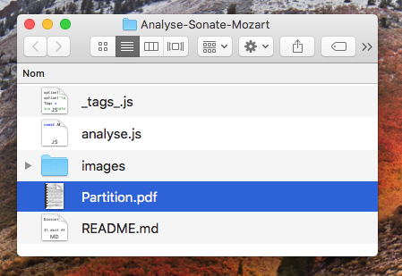
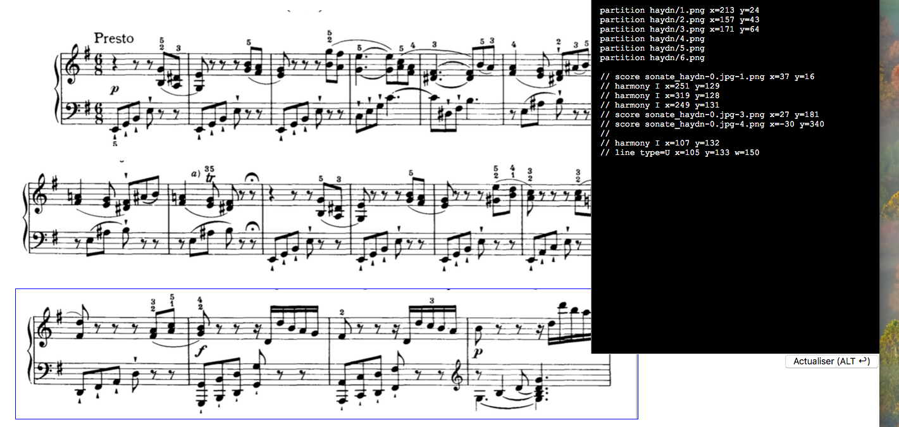

# MuScaT<br>Manuel d'utilisation

<!--
Pour actualiser le PDF

1. Jouer cette commande dans le Terminal

pandoc -s Manuel.md --css="manuel.css" --metadata pagetitle="Manuel" --from=markdown --output=Manuel.html;open Manuel.html;

2. Exporter le fichier en PDF (Safari offre un menu directement dans « Fichier »)
-->

## Introduction (histoire)

Suite à la diffusion de mon [Initiation à l'analyse musicale](https://www.youtube.com/channel/UCX3XhJw9x1RsVx1s3GNYceA) — et son « succès » que je n'aurais jamais imaginé aussi grand — nombreux ont été les professeurs et autres pédagogues ou musicologues à me demander le logiciel que j'avais utilisé pour en créer l'animation.

C'est malheureusement une application personnelle un peu trop… personnelle (comprendre : indomptable pour qui ne l'a pas créé), une usine à gaz ne fonctionnant qu'à la ligne de code (son créateur ne sait même pas toujours par quel bout la prendre).

Mais pour répondre à ces marques d'intérêts et à mes propres besoin, j'ai voulu concevoir un outil plus simple et plus pratique qui permettrait de réaliser rapidement des analyses de partitions (entendu que c'est toujours un peu fastidieux et que le résultat manque souvent d'homogénéité).

C'est ainsi qu'est née l'idée de **MuScaT** — dont le nom est composé de « Mu » pour « Musique », « Sc » pour « Score » (« partition » en anglais) et « Ta » à l'envers pour « Tag », le sens en français, comme les tags qu'on *taggue* sur les murs.

En bref, **MuScaT** permet de **réaliser rapidement, de façon très propre et très pratique, des analyses de partitions musicales** comme l'extrait ci-dessous.


Elle est semi-graphique, et permet d'ajuster très finement les TAGs — au pixel près — de façon visuelle et agréable.

* [Synopsis général de création d'une analyse](#synopsis_fabrication)
* [Synopsis détaillé](#synopsis_detailled)
  * [Charger de l'application **MuScaT**](#download_muscat)
  * [Créer du dossier de l'analyse](#creation_dossier_analyse),
  * [Mettre l'analyse en analyse courante](#set_analyse_courante),
  * [Découper la partition en « images-systèmes»](#syn_crop_score),
  * [Inscrire les images-systèmes dans l'analyse](#syn_inscription_images_systemes),
  * [Préparer l'impression](#prepare_print)
    * [Ajout du titre, compositeur, etc.](#titre_et_auteur)
  * [Ajouter les accords, les chiffrages, les cadences, tous les éléments d'analyse](#syn_def_analysis_elements),
  * [Positionner les éléments graphiques](#syn_ajustement_elements),
    * [Les lignes repères](#ligne_reperes)
    * [Note sur les coordonnées et dimensions](#note_coors_dims)
  * [Récupérer le code final](#syn_recuperation_code_final),
  * [Imprimer en PDF](#syn_print_pdf).
* [L'interface](#user_interface)
  * [La Table d'analyse](#la_table_danalyse)
  * [La boite à outils](#toolbox)
  * [Le champ de code](#code_field)
* [Composition d'un tag](#composition_dun_tag)
  * [Note sur le contenu du TAG (texte)](#note_contenu_tag)
* [Liste complète de tous les TAGs](#complete_list_tags)
  * [Les Images](#les_images)
    * [Définition de la taille d'une image](#defining_image_size)
    * [Séquence d'images](#sequence_images)
  * [Les Accords](#les_accords)
  * [Les Chiffrages (Harmonie)](#les_harmonies)
  * [Les Cadences](#les_cadences)
  * [Les Modulations](#les_modulations)
  * [Autres types de textes](#les_textes)
    * [Les Parties](#les_parties)
    * [Les Mesures](#les_mesures)
    * [Les Degrés](#les_degres)
* [Nature du TAG](#natures)
  * [Contenu du TAG](#second_mot)
  * [Autres données de la ligne](#autres_data_ligne)
  * [Les types de textes](#types_de_textes)
* [Opérations sur les tags](#operation_on_tags)
  * [Verrouillage des tags](#lock_tags)
  * [Grouper et dégrouper des tags](#grouper_tags)
  * [Ligne de code du tag](#tag_code_line)
* [Animation d'une analyse](#animation_analyse)
* [Les Options](#all_options)
* [Les Utilitaires](#les_utilitaires)
  * [Changement du dossier des captures écran (Mac)](#utils_change_captures_folder)
  * [Renommage des fichiers images (Mac/Unix)](#utils_renommer_fichiers)
  * [Création d'une nouvelle analyse (Mac)](#create_new_analyse)
  * [Activation d'une analyse (Mac)](#activate_analyse)
  * [Pour aller plus loin](#aller_plus_loin)
* [Annexe](#annexes)
  * [Application « Terminal »](#application_terminal)
  * [Raccourcis clavier](#keyboard_shortcuts)

## Synopsis général de création d'une analyse {#synopsis_fabrication}

Commençons par un aperçu du processus général qui va permettre de produire une analyse musicale à l'aide de **MuScaT**. Noter que chaque item de cette liste est cliquable et permet de rejoindre la partie détaillée correspondante.

* [Chargement de l'application **MuScaT**](#download_muscat)
* [Création du dossier de l'analyse](#creation_dossier_analyse),
* [Mise de l'analyse en analyse courante](#set_analyse_courante),
* [Découpage de la partition en « images-systèmes»](#syn_crop_score),
* [Inscription des images-systèmes sur la table d'analyse](#syn_inscription_images_systemes),
* [Préparation de l'impression](#prepare_print)
  * [Positionnement en fonction de l'aperçu d'impression](#dim_et_pos_against_overview)
  * [Ajout des informations (titre, compositeur…)](#titre_et_auteur)
* [Ajout de tous les éléments d'analyse](#syn_def_analysis_elements),
* [Positionnement les éléments graphiques](#syn_ajustement_elements),
  * [Les lignes repères](#ligne_reperes)
* [Récupération du code final](#syn_recuperation_code_final),
* [Impression en PDF](#syn_print_pdf).

## Synopsis détaillé {#synopsis_detailled}

Après ce bref aperçu des étapes de la fabrication d'une analyse, abordons-en tous les aspects et tous les détails.

### Chargement de l'application **MuScaT** {#download_muscat}

La toute première chose à faire, bien sûr, est de charger **MuScaT**. Pour le moment, on peut le faire par le biais de son [repository Github de **MuScaT**](https://github.com/PhilippePerret/MuScaT).

Il suffit de cliquer sur le bouton « Clone or download »,


… de choisir « Download ZIP »


… et d'attendre la fin du téléchargement (l'application fait plusieurs mégaoctets, donc suivant la qualité de votre connexion, l'opération peut être plus ou moins longue).

On se retrouve alors avec le dossier de l'application.


### Créer le dossier de l'analyse {#creation_dossier_analyse}

#### Création en ligne de commande

Si vous êtes à l'aise avec votre [Terminal](#application_terminal) sur Mac, votre console sur Unix, le plus simple est d'exécuter l'opération en ligne de commande.

Pour cela, vous utilisez le script `/utils/create.rb`. Notez que comme l'extension le suggère, le langage Ruby doit être installé sur votre machine.

```bash

  > cd /chemin/vers/dossier/MuScaT
  > ./utils/create.rb "Ma première analyse"

```

L'avantage de cette procédure en ligne de commande, c'est notamment qu'elle enregistre la version de **MuScaT** utilisée, ce qui sera très pratique pour les actualisations.

#### Création par le Finder

La procédure est à peine plus compliquée par le Finder, « à la main » :

* dupliquer le dossier `Template` qui se trouve dans le dossier `MuScaT/_analyses_` (ce dossier est le dossier qui peut contenir toutes les analyses),

    

* le renommer du nom de l'analyse, par exemple « Analyse-Sonate-Mozart ».

    

    > Note : il est vivement recommandé de ne pas mettre d'espaces vides dans les noms de dossier ou de fichiers pour une raison qui sera expliquée plus tard. Personnellement, j'aime les remplacer par des traits plats (« Analyse_Sonate_Mozart »)

* Éditer le fichier `analyse.js` (celui du dossier d'analyse que vous venez de créer) en texte simple, renseigner le nom de l'analyse (`ANALYSE`) :

    ```javascript
    const ANALYSE = "Analyse_Sonate_Mozart";
    ```

    … et enregistrer ce fichier toujours en texte simple.

#### Contenu d'un dossier d'analyse

Voyons rapidement le contenu du dossier d'analyse. On trouve :

* le dossier « images » qui comme son nom l'indique va rassembler toutes les images utiles à l'analyse, c'est-à-dire les partitions, les *systèmes*,
* le fichier le plus important, le fichier « _tags_.js » qui va contenir la définition précise de l'analyse.
* un fichier `analyse.js` qu'il suffit, pour activer cette analyse, de glisser à la racine du dossier **MuScaT** en remplacement du fichier qui s'y trouve déjà (mais seulement si vous l'avez bien préparé comme indiqué ci-dessus).

Dans ce dossier, vous pouvez mettre enfin votre partition en PDF ou en image.



### Mettre l'analyse en analyse courante {#set_analyse_courante}

Pour faire de cette nouvelle analyse l'analyse courante, il y a plusieurs solutions, présentées ci-dessous de la plus pratique à la moins pratique (mais votre classement personnel sera peut-être différent).

Avec la commande `mus`
: Si [vous avez installé la commande `mus`](#aller_plus_loin), alors il vous suffit de jouer, dans une fenêtre de [Terminal](#application_terminal) : `mus analyse "Début_nom"`.

Avec le script `analyse.rb`
: Dans le [Terminal](#application_terminal), rejoindre la dossier de **MuScaT** et taper `./utils/analyse.rb "Début_du_nom"`.

En dupliquant le fichier `analyse.js` de l'analyse
: Vous pouvez aussi détruire le fichier `MuScaT/analyse.js` et le remplacer par celui qui se trouve dans le dossier de votre analyse (`MuScaT/_analyses_/MonAnalyse/analyse.js`).
: Note : ça ne fonctionne que si vous avez [préparé correctement votre dossier d'analyse](#creation_dossier_analyse).

En éditant le fichier `analyse.js` principal
: Vous pouvez enfin éditer le fichier `MuScaT/analyse.js` et renseigner la valeur de la constante `ANALYSE` avec le nom de votre analyse (nom de son dossier).

```javascript

const ANALYSE = "Analyse-Sonate-Mozart" ;

```

À vous de choisir la solution qui vous semble le plus pratique.


### Découper la partition en « images-systèmes » {#syn_crop_score}

Très souvent, on part d'un fichier PDF contenant une partition ou les systèmes sont trop rapprochés pour être « taggués » de façon lisible. Même s'il est tout à fait possible d'utiliser un tel fichier PDF avec **MuScaT**, il est infiniment plus pratique de travailler avec de « vraies » images et des systèmes séparés (donc une image par système).

La première opération consiste donc à transformer le fichier PDF en images-systèmes. Pour ce faire, vous pouvez passer par [Gimp](https://www.gimp.org), Photoshop ou tout autre logiciel de traitement de l'image. Je vous renvoie à leur manuel pour la procédure à adopter.

Mais si vous êtes sur Mac, vous avez beaucoup plus simple, plus pratique et beaucoup plus rapide : utiliser l'application Aperçu et la capture d'image par portion avec la combinaison de touches ` CMD MAJ 4 `.

Pour une version détaillée et illustrée de la procédure, je vous renvoie à [ma chaine YouTube](https://www.youtube.com/channel/UCX3XhJw9x1RsVx1s3GNYceA) [[TODO: Mettre adresse de la vidéo]]. Je l'explique rapidement seulement ici.

* modifier le dossier de capture (le dossier où seront enregistrées les captures d'écran) en passant par le [Terminal](#application_terminal) :

    ```

    > cd /chemin/vers/application/MuScaT
    > ./utils/change_folder_captures.rb /dossier/des/captures/

    ```

    > Note : pour ne pas avoir à remplir les chemins à la main, il vous suffit de glisser les éléments (fichier ou dossier) depuis le Finder jusque sur la fenêtre de Terminal. Le chemin de l'élément est aussitôt inscrit ! Donc, ici, par exemple, pour la première ligne, taper seulement `cd ` (sans oublier l'espace) puis glisser le dossier **MuScaT** sur la fenêtre de Terminal. Ensuite, taper `./utils/chan[TAG] ` (sans oublier l'espace) puis faire glisser le dossier où mettre les images sur la fenêtre de Terminal.

* ouvrir le PDF dans Aperçu,
* activer la combinaison de touches ` CMD MAJ 4 `,
* sélectionner le système,
* recommencer ces opérations pour chaque système.
* Pour renommer automatiquement toutes les captures produites, vous pouvez utiliser [l'utilitaire `/utils/rename_images.rb`](#utils_renommer_fichiers)

Noter qu'il est extrêmement simple d'affiner ensuite très précisément le découpage d'une image :

* ouvrir l'image dans Aperçu,
* dessiner un rectangle à la souris,
* régler les "poignées" de la sélection dessinée pour obtenir exactement la découpe voulue,
* jouer la combinaison ` CMD K `,
* enregistrer l'image.

Quelle que soit la méthode adoptée, on place obligatoirement la ou les images dans le dossier `_analyses_/<Nom analyse>/images/`.


### Inscrire les images-systèmes {#syn_inscription_images_systemes}

On ouvre ensuite son fichier `monAnalyse/_tags_.js`. C'est **le fichier principal de l'analyse**, celui qui va définir tous les éléments, les images, les marques de modulations, les accords, les cadences, les parties, tout ce qui constitue l'analyse.


Vous devez ouvrir ce fichier en texte simple, c'est-à-dire ne surtout pas utiliser de traitement de texte, ou alors en s'assurant d'exporter le fichier final au format « SimpleText » (`.txt`).

Dans ce fichier `_tags_.js` On définit d'abord les images de la partition, en ajoutant des commentaires pour pouvoir se retrouver, plus tard, lorsque le fichier deviendra conséquent.

Le contenu d'un fichier `_tags_.js`, au départ, peut ressembler à :

```javascript

  // Dans _tags_.js
  option('code');

  Tags = `
  // Premier système, les mesures de 1 à 10
  partition system-1-mes-1-10.png

  // Deuxième système, les mesures de 11 à 16
  partition system-2-mes-11-16.png

  // Troisième système
  // ... etc.

  `;
```

> Note : l'option 'code', en haut du fichier `_tags_.js`, permet simplement de voir le code à côté de la table d'analyse.


### Préparer l'impression {#prepare_print}

#### Dimensionner et positionner en fonction de l'aperçu d'impression {#dim_et_pos_against_overview}

Avant de placer quelconque marque d'analyse, nous vous invitons vivement à regarder ce que votre agencement des systèmes produit au niveau de l'impression ou de la sortie du PDF. Lorsque tous les TAGs seront placés sur la partition, il sera extrêmement difficile et pénible de devoir les re-positionner pour qu'ils soient correctement placés sur la page ou le PDF.

Donc, après avoir disposé les systèmes sur la table d'analyse, demandez l'impression, faites les réglages nécessaires (taille du papier, marges, etc.) et ajustez la position des systèmes en fonction des sauts de page que vous voyez dans l'aperçu de l'impression (pour ce faire, Google Chrome est idéal — choisissez le format « Portrait », avec aucune marge et 100%).

#### Ajout du titre, compositeur, etc. {#titre_et_auteur}

Vous pouvez même placer dès à présent les titres et compositeur aux endroits voulus grâce aux TAGs `titre`, `compositeur`, `analyste`, `date_composition`, `opus`, `date_analyse`, etc.

C'est-à-dire que vous pouvez placer, en haut de votre définition de `Tags` dans votre fichier `_tags_.js`, les informations suivantes :

```javascript
  // Dans _tags_.js
  option('code', 'guides');

  Tags=`
  titre Sonate_n°34_en_Mi_mineur
  compositeur Joseph_Haydn
  opus Hob_XVI_34
  analyste Philippe_Perret
  date_analyse 27_janvier_2019
  ...
  `;

```

Notez que pour ces « TAGs » il est inutile de préciser les positions. C'est le thème qui s'en charge (le thème par défaut est le thème « Muscat», évidemment). Mais vous pouvez tout à fait les déplacer pour les ajuster à votre guise, ou [choisir un autre thème](#option_theme).


### Définir tous les éléments de l'analyse {#syn_def_analysis_elements}

L'élément graphique de base de l'application **MuScaT** est le « TAG » (comme on en parle sur les murs des villes). Une analyse avec **MuScaT** consiste donc à « tagguer » une partition (remarquez que les partitions elles-mêmes, ou les images de leurs systèmes, sont aussi des « TAGs »). C'est la raison pour laquelle le fichier qui va les définir s'appelle `_tags_.js`.

On définit tous les autres éléments graphiques, tous les *tags* (pour le détail de la procédure, voir [Composition d'un tag](#composition_dun_tag), voir aussi : [la liste complète des tags](#complete_list_tags)) : marque de parties, accords, chiffrages, numéros de portée, degrés de la gamme, cadences, textes divers, etc.

Chacun des éléments, chaque « tag », va être représenté dans le code par une unique ligne.

Une image de système (`score`) pourra être :

```javascript

Tags = `
// ... d'autres données ici

score systeme-1.png x=50 y=3098

// ... d'autres données là
`;

```

Une modulation pourra être inscrite par :

```javascript

Tags = `
// ... d'autres données ici

mod G_min x=150 y=539

// ... d'autres données là
`;

```

Le mieux est de s'arranger pour définir ces tags à peu près en fonction des positions sur la table d'analyse (i.e. sur l'analyse). Si une cadence doit se produire sur le troisième système, il vaut mieux la définir après la ligne insérant l'image de ce troisième système (remarquez cependant qu'il n'y a aucune obligation là-dessus, vous pouvez aussi rassembler tous les accords d'un côté, toutes les cadences de l'autre, etc. à votre guise).

### Positionnement  et dimensionnement des éléments graphiques {#syn_ajustement_elements}

Une fois l'analyse désignée comme analyse courante, on ouvre le fichier `_TABLE_ANALYSE_.html` dans Chrome (ou un autre navigateur, mais pas Firefox, qui ne sait pas imprimer plusieurs pages avec des éléments en position absolue…).


On peut placer les éléments aux bons endroits simplement de plusieurs manières :

* en les déplaçant à la souris,
* en utilisant les flèches de son clavier,
* en jouant sur les touches `x` et `y`,
* en modifiant leur coordonnées dans le champ de code.

Pour le détail, cf. [Positionnement des tags](#modify_position_tag).

On peut modifier les tailles des éléments de plusieurs manières aussi :

* en modifiant leur code,
* en jouant sur les touches `w` et `h`.

Pour le détail, cf. [Dimensionnement des tags](#dimensionner_les_tags).

On peut en ajouter des nouveaux en dupliquant les lignes de code ou les ajoutant explicitement dans le code.


À tout moment on peut annuler une opération pour revenir en arrière en jouant `CMD Z` (sur Mac) ou `Ctrl Z` (sur Windows).

Sans l'option `option('code')` activée, il faut modifier le code directement dans le fichier `_tags_.js` puis recharger la page dans Chrome pour voir les changements.

#### Lignes repères {#ligne_reperes}

Pour faciliter l'alignement des TAGs — par exemple l'alignement des dernières mesures de fin des systèmes — on peut utiliser des lignes de répère. Pour cela, il suffit d'activer l'option `repères` (ou `reperes` ou `lines of reference`).


Cela ajoute deux lignes à l'écran (on en voit une seule ci-dessus), une verticale et une horizontale, qu'on peut déplacer à loisir à la souris.

Vous pouvez également définir leur emplacement exact avec les options `position repère vertical` (ou `vertical line offset`) et `position repère horizontal` (ou `horizontal line offset`) :

```javascript

  // Dans le fichier _tags_.js de l'analyse
  option('code');
   // à 120 pixels du haut et 200 de la gauche
  option('vertical line offset', 120, 'horizontal line offset', 200);

```

### Positionnement et dimensionnement des tags {#note_coors_dims}

Les positions `x` (horizontale) et `y` (verticale) s'indiquent toujours sans unité, en pixels :

```

  x=13 y=200

```

Toutes les autres propriétés de dimension et de position peuvent s'indiquer sans ou avec unité ou pourcentage.

```javascript
  Tags = `
    ... w=200
    ... w=20%
    ... h=23mm
    ... z=2pt
    `;
```

#### Obtenir des coordonnées

Pour obtenir les x/y d'une position quelconque, il suffit de cliquer à l'endroit voulu. Cela affiche les coordonnées en bas de l'écran, mais plus encore, ça colle un `y=134 x=145` correspondant dans le presse-papier, valeur qu'il suffit ensuite de coller dans le code sur la ligne de TAG correspondante.

#### Positionnement des tags {#modify_position_tag}

Pour **modifier la position d'un tag** (image, modulation, texte quelconque, etc.), on a plusieurs solutions :

* soit on les règle de façon explicite dans leur ligne de code (si l'option `guides` a été activée), en définissant les valeurs de `x` (position horizontale) et/ou `y` (position verticale),
* soit on les sélectionne et on joue sur les flèches dans les quatre sens,
* soit on les sélectionne et on presse les touches `x` ou `y` pour modifier respectivement la position horizontal et vertical du tag.
    Avec la touche `ALT` (`ALT x`, `ALT y`), on inverse le déplacement. Avec la touche `MAJ` (`MAJ x`, `MAJ y`, `ALT MAJ x`, `ALT MAJ y`), on augmente le pas de déplacement, avec la touche `CTRL`, on peut régler la position pixel par pixel.

#### [Dimensionnement des tags]{#dimensionner_les_tags}

Pour **modifier les dimensions d'un tag** (comme une ligne, une cadence, une boite, une image), on a plusieurs solutions :

* soit on les règle de façon explicite dans leur ligne de code (si l'option `guides` a été activée), en définissant les valeurs de `w` (largeur) et/ou `h` (hauteur),
* soit on sélectionne l'élément et on prese la touche `w` pour augmenter la largeur, `ALT w` pour diminuer la largeur, `h` (comme "hauteur") pour augmenter la hauteur, `ALT h` pour diminuer la hauteur.
    Tout comme pour les `x` et `y`, avec la touche `ALT` (`ALT x`, `ALT y`), on inverse le déplacement. Avec la touche `MAJ` (`MAJ x`, `MAJ y`, `ALT MAJ x`, `ALT MAJ y`), on augmente le pas de déplacement, avec la touche `CTRL`, on peut régler la position pixel par pixel.


### Récupérer le code final {#syn_recuperation_code_final}

Si l'on a travaillé dans le champ de texte à côté de la table d'analyse, on doit copier le code final dans le fichier `_tags_.js`, au risque de perdre tous les changements. Pour se faire, on clique sur le bouton des outils — en haut à gauche — et on demande à mettre le code complet dans le presse-papier. On colle ce code dans le fichier `_tags_.js`, en remplaçant l'intégralité de son contenu.

### Imprimer l'analyse en PDF {#syn_print_pdf}

Enfin, on imprime la page HTML du navigateur en choisissant le format PDF :

* dans Chrome, demander l'impression (`CMD/Ctrl P`),
* dans la fenêtre qui s'ouvre, choisir, dans le menu en bas à gauche : « Imprimer au format PDF » ou autre indication similaire.

### Et voilà !

Et voilà, c'est fait ! Et vous pourrez retoucher votre analyse à n'importe quel moment en la remettant en analyse courante.

---

## L'interface {#user_interface}

Faisons un tour rapide de l'interface, qui reste volontairement relativement simple, se concentrant sur les éléments essentiels.

* [La Table d'analyse](#la_table_danalyse)
* [La boite à outils](#toolbox)
* [Le champ de code](#code_field)

### La Table d'analyse {#la_table_danalyse}

Cette table, c'est la surface de la page elle-même, la surface principal de la fenêtre de votre navigateur. Elle se présente en blanc sur une surface à peine grisée qui permet de repérer les dimensions de la page d'impression. Le mieux est de jouer sur la largeur des images (paramètre `w`, modifiable avec la touche `w`) pour toujours se trouver à l'intérieur de cette surface.

**Si vous dépassez la surface délimitée, l'impression en sera affectée de façon très aléatoire (au moins en apparence).**

### La boite à outils {#toolbox}

Sur la gauche en haut de l'écran, on trouve un petit picto qui permet d'ouvrir la boite à outils.


Cette boite à outils contient des outils pour regrouper ou dégrouper des tags, pour les aligner, pour copier le code, etc.

### Le champ de code {#code_field}

Si [l'option `guides`](#option_line_of_reference) est activée, un champ de code est ouvert à droite de la page, contenant le code défini dans votre fichier `_tags_.js` (seulement celui dans `Tags`, pas le code intégral).

En modifiant ce code, vous pouvez construire votre analyse (n'oubliez pas, ensuite, d'en copier le code intégralement).


---


## Composition d'un tag {#composition_dun_tag}

Le *code* de l'analyse est constitué simplement de *lignes*, les unes au-dessus des autres, qui déterminent les images et les tags. Chaque ligne est une image ou un tag (exception faite des lignes vides et des lignes de commentaire).

```{.center .exergue}
1 ligne = 1 TAG
```

Voyons plus en détail comment se compose une ligne du fichier `_tags_.js`, une ligne définissant un *tag* ou une partition.

Cette ligne a le format général suivant :

```
  <nat.>[ <cont.>][ <id>][ <coor./dim.>][ <opt., type>]

```

`<nat.>`
: C'est la *nature* du TAG, ce qui détermine ce qu'il est, cadence, modulation, boite ou image, etc.

`<cont.>`
: C'est le *contenu* du TAG, parfois son *type* (pour les lignes par exemple). Pour un TAG de texte, c'est le texte, pour une modulation, c'est la tonalité vers laquelle on module.
: Cf. [Note sur le contenu du TAG](#note_contenu_tag)

`<id>`
: L'identifiant du TAG. C'est une valeur que **MuScaT** ajoute d'elle-même, pour reconnaitre le TAG, et qui ne doit pas être modifié.

`<coor./dim.>`
: Les coordonnées `x` (position horizontale) et `y` (position verticale) ainsi que les dimensions h (hauteur) et w (largeur) du TAG.
: Ces coordonnées et ces dimensions se notent simplement en donnant les valeurs à l'aide d'un signe égal (`=`) **sans espace** : `x=12`, `y=20`, `w=12%`, `h=12mm` etc.
: Cf. aussi [Note sur les coordonnées et dimensions](#note_coors_dims)

`<opt./type>`
: Des options ou des types, en fonction de la nature du TAG. Nous y reviendrons.

Noter qu'à part les deux premiers éléments, tous les autres peuvent être donnés dans l'ordre qu'on veut, sans importance.

Voici quelques définitions de TAGs :

```javascript

Tags = `

  score ma_partition.jpg y=100 x=10
  // => L'image 'images/ma_partition.jpg' placé à 10 pixels de
  //    la marge gauche et 100 pixels du haut.

  cadence I type=parfaite y=200 x=100 w=100
  // => Une cadence de type parfaite, avec un trait de
  //    100 pixels de large (`w`).

  modulation G_min x=200 y=100
  // => Une modulation vers Sol mineur.

`;

```

> Noter les lignes commençant par `//` qui permettent de laisser un commentaire. C'est très utile lorsque l'on veut s'y retrouver lorsque l'analyse devient conséquente.

Noter qu'une *nature* de TAG (le premier mot), peut toujours être exprimé par ses trois premières lettres (exception faite du terme « partition » qui rentrerait en conflit avec « partie »). Ainsi, on peut écrire le code ci-dessous :

```javascript

Tags = `

  sco ma_partition.jpg y=100 x=10
  // sco => score (partition)

  cad V_I type=parfaite y=200 x=100
  // cad => cadence

  mod G_min x=200 y=100
  // mod => modulation

`;

```

L'intégralité des *natures* de TAG (et leur diminutif) [est détaillé ici](#complete_list_tags).

### Forme raccourcie d'écriture

Pour la première définition du TAG, on peut utiliser une version raccourcie de définition qui la rend très simple et très rapide. Elle consiste à utiliser :

```javascript

Tags = `
<nature>[ <contenu>] <valeur x seule> <valeur y seule>
`;

```

Par exemple, pour une *modulation* vers la tonalité de SOL mineur (G min.) qui doit se situer à 200 pixels du haut et 450 pixels de la gauche, on pourra écrire simplement :

```javascript

  mod G_min 200 450

```

Il suffit de se souvenir que le premier nombre concerne la *hauteur*.

### Note sur le contenu du TAG (texte) {#note_contenu_tag}

Le *contenu* du TAG, c'est-à-dire son deuxième *mot*, peut être de type très différent. Mais en règle générale, il s'agit d'un texte, d'un accord ou d'un chiffrage.

Il est important de noter immédiatement ce point :

```{.center .exergue}
Aucune espace ne doit se trouver dans ce contenu.
```

On doit obligatoirement remplacer les espaces par des traits plats (MAJ tiret sur Mac).

Ainsi, si l'on veut écrire « Second couplet », on doit écrire :

```javascript

  partie Second_couplet x=123 y=456

```

Si l'on veut écrire la tonalité « Sol mineur », on doit impérativement écrire :

```javascript

  modulation Sol_mineur x=23 y=344

```

En revanche, tous les autres caractères sont possibles, à l'exception des balances (`/`) dans les modulations, car elles indiquent le texte qui devra apparaitre sous le trait biaisé :

```javascript

  // Une modulation vers la Sous-dominante
  mod Sol_min/(sous-dom.) x=23 y=344

```


---

## Liste complète de tous les TAGs {#complete_list_tags}

Trouvez ci-dessous la liste complète de tous les tags.


+-----------------+---------------------------------------------------+
| *Tag*           | *Description*                                     |
+-----------------+---------------------------------------------------+
| partition<br>   | Écriture d'une image, à commencer par celle de la |
| score<br>       | partition ou du système à analyser.               |
| sco<br>         |                                                   |
| image           | ```{.usage}                                       |
|                 | image <source> x=... y=... z=...                  |
|                 | ```                                               |
|                 |                                                   |
|                 | Exemple                                           |
|                 | : ```{.exemple} |
|                 |sco system-5.src x=2 y=2 w=17cm |
|                 |``` |
|                 |                                                   |
|                 | Note                                              |
|                 | : L'image doit se trouver dans le dossier         |
|                 | "images" du dossier de l'analyse.                 |
|                 |                                                   |
|                 | Détail |
|                 | : [Les Images](#les_images) |
+-----------------+---------------------------------------------------+
| accord<br>      | Écriture d'un accord au-dessus de la partition.   |
| chord<br>       |                                                   |
| acc             | ```{.usage} |
|                 | accord <nom> x=... y=...|
|                 | ``` |
|                 | Exemple |
|                 | : ```{.exemple} |
|                 | acc E_min x=100 y=200 |
|                 | ``` |
| | |
|                 | Détail |
|                 | : [Les Accords](#les_accords) |
+-----------------+---------------------------------------------------+
| harmonie<br>    | Écriture d'un chiffrage sous la partition. C'est  |
| harmony<br>     | en général un chiffre romain indiquant le         |
| chiffrage<br>   | renversement de l'accord.                         |
| har             |                                                   |
|                 |  ```{.usage} |
|                 | har[mony] <chiffrage> x=... y=... |
|                 | ``` |
|                 | Exemple |
|                 | : ```{.exemple} |
|                 | harmony I*** x=23 y=289 |
|                 | ``` |
| | |
|                 | Détail |
|                 | : [Les Harmonies](#les_harmonies) |
+-----------------+---------------------------------------------------+
| modulation<br>  | Marque de modulation à placer en haut de la       |
| mod             | partition.                                        |
|                 |                                                   |
|                 |  ```{.usage} |
|                 | mod[ulation] <tonalité> x=... y=... |
|                 | ``` |
|                 | Exemple |
|                 | : ```{.exemple} |
|                 | mod B_min x=200 y=300 |
|                 | ``` |
| | |
|                 | Détail |
|                 | : [Les Modulations](#les_modulations) |
+-----------------+---------------------------------------------------+
| cadence<br>     | Marque de cadence à placer sous la partition.     |
| cad             |                                                   |
|                 |  ```{.usage} |
|                 | cad[ence] <acc> type=<type cad> x=. y=. w=... |
|                 | ``` |
|                 | Exemple |
|                 | : ```{.exemple} |
|                 | cad V type=demie x=23 y=3456 w=100 |
|                 | ``` |
|                 |                                                   |
|                 | Note |
|                 | : Noter ci-dessus l'emploi 1) d'un *type* (type de |
|                 | la cadence) et 2) d'une largeur *w* (longueur du  |
|                 | trait).                                           |
| | |
|                 | Détail |
|                 | : [Les Cadences](#les_cadences) |
+-----------------+---------------------------------------------------+
| mesure<br>      | Marque de mesure à placer à l'endroit voulu.      |
| measure<br>     |                                                   |
| mes             |  ```{.usage} |
|                 | mes[ure] <numéro> x=... y=... |
|                 | ``` |
|                 | Exemple |
|                 | : ```{.exemple} |
|                 | measure 12 x=23 y=1000 |
|                 | ``` |
| | |
|                 | Note|
|                 | : Noter que le style dépend du thème choisi. |
| | |
|                 | Détail |
|                 | : [Les Mesures](#les_mesures) |
+-----------------+---------------------------------------------------+
| degree<br>      | Marque du degré de la note dans la gamme, à placer|
| degre<br>       | à l'endroit voulu.                                |
| deg<br>         |                                                   |
|                 |  ```{.usage} |
|                 | degre <degré> x=... y=... |
|                 | ``` |
|                 | Exemple |
|                 | : ```{.exemple} |
|                 | degre 4 x=23 y=1200 |
|                 | ``` |
| | |
|                 | Détail |
|                 | : [Les Degrés](#les_degres) |
+-----------------+---------------------------------------------------+
| ligne<br>       | Marquer une ligne, par exemple pour indiquer la   |
| line<br>        | poursuite d'un chiffrage sur plusieurs temps.     |
| lig<br>         |                                                   |
| lin             |  ```{.usage} |
|                 | ligne <type> x=... y=... w=... |
|                 | ``` |
|                 | Exemple |
|                 | : ```{.exemple} |
|                 | lin |---| w=200 x=23 y=120 |
|                 | ``` |
| | |
|                 | Détail |
|                 | : [Les Lignes](#les_lignes) |
+-----------------+---------------------------------------------------+
| box<br>         | Dessine une boite à l'écran. Ces boites permettent|
| boite<br>       | de masquer des éléments de la partition. Bien que |
| boi             | ces boites apparaissent en gris sur la table      |
|                 | d'analyse, elles seront invisibles dans le        |
|                 | document PDF final ou l'impression.               |
| | |
|                 |  ```{.usage} |
|                 | box x=... y=... w=<largeur> h=<hauteur> |
|                 | ``` |
|                 | Exemple |
|                 | : ```{.exemple} |
|                 | boite w=200 h=53 x=23 y=120 |
|                 | ``` |
| | |
|                 | Note |
|                 | La hauteur (`h`) et la largeur (`w`) sont ici très |
|                 | importantes.
| | |
|                 | Détail |
|                 | : [Les Boites](#les_boites) |
+-----------------+---------------------------------------------------+
| texte<br>       | Pour marquer un texte quelconque à l'écran.       |
| text<br>        |                                                   |
| tex             |  ```{.usage} |
|                 | tex[te] <le_texte> x=... y=...[ type=<type>] |
|                 | ``` |
|                 | Exemple |
|                 | : ```{.exemple} |
|                 | tex Doubles_octaves type=warning |
|                 | ``` |
| | |
|                 | Note |
|                 | Les espaces sont remplacées par des traits plats |
|                 | dans le texte à affiché. Mais ce seront des espaces |
|                 | qui seront inscrites sur la table d'analyse.
| | |
|                 | Détail |
|                 | : [Les Textes](#les_textes) |
+-----------------+---------------------------------------------------+


## Les Images {#les_images}

Il existe trois mots clés pour indiquer la nature d'une image, mais ils produisent en réalité la même sorte de TAG : `image`, `score` ou `partition`. C'est le premier mot à trouver sur la ligne d'une image. Juste après, on doit trouver le nom de cette image, ou son chemin relatif depuis le dossier `images` du dossier de l'analyse.

```
  partition premier_mouvement/image-12.png [...]

```

Ci-dessus, l'image `image-12.png` doit donc se trouver dans le dossier `_analyses_/monAnalyse/images/premier_mouvement/`.

### Définition de la taille d'une image {#defining_image_size}

On peut définir la taille d'une image à l'aide du paramètre `w` (ou `width`, « largeur », en anglais). Sa valeur peut être explicite avec une unité, explicite sans unité ou en pourcentage. Par exemple :

```javascript

  // Dans _tags_.js
  Tags = `
  sco image-0.png
  sco image-1.png w=200
  sco image-2.png w=10cm
  sco image-3.png w=50%
  `;

```

Avec le code ci-dessus, l'image `0` aura sa taille normale, `image-1.png` fera 200 pixels de large, `image-2.png` fera 10 centimètres de large et `image-3.png` sera mise à 50% de sa largeur.

Pour voir en détail toutes les façons de modifier la taille ou la position d'une image, cf. [Dimensionnement des tags](#dimensionner_les_tags) et [Positionnement des tags](#modify_position_tag).

### Séquence d'images {#sequence_images}

Bien souvent, une analyse n'est pas constituée d'une seule image pour toute la partition. Il y a trop peu d'espace entre les systèmes. On conseille donc fortement de découper les partitions en autant de systèmes qu'elles en comportent (vous trouverez des indications sur la [procédure de découpage de la partition](#procedure_crop_partition) ci-dessous).

Mais il serait fastidieux d'entrer la ligne de chaque image de système dans notre fichier `_tags_.js`. Une partition même courte peut très vite comporter de 20 à 30 systèmes et ce serait autant de lignes de partition qu'il faudrait introduire dans le code…

Au lieu de ça, si les images des systèmes ont été nommées en respectant une règle simple (avec des suites de nombres), une seule ligne suffira pour entrer tous les systèmes de la partition. Par exemple :

```

  score mouvement_1/image-[1-35].png

```

Le texte ci-dessus indique qu'il y a 35 images de système dans ce mouvement. Le code qui en résultera sera :

```

  score mouvement_1/image-1.png
  score mouvement_1/image-2.png
  score mouvement_1/image-3.png
  score mouvement_1/image-4.png
  ...
  ...
  score mouvement_1/image-35.png

```

Si vous indiquez une taille — ce qui est mieux pour être sûr de tenir dans la page — cette taille sera appliquée à toutes les images.

```javascript
  Tags=`
  score mouvement_1/image-[1-35].png w=17.5cm
  `;
```

Nous vous invitons vivement à commencer par cette opération — l'inscription des systèmes par séquence — avant l'insertion de toute autre marque sur la partition. Il est toujours recommandé de placer en tout premier lieu la partition, en demandant l'aperçu de l'impression, de façon définitive.

Noter que lorsque **MuScaT** place les images sur la table d'analyse, il les répartit pour obtenir l'aspect initial de la partition. On peut modifier ce comportement en définissant explicitement un espace (vertical) entre chaque système ou chaque image, grâce à l'option `espacement images` :

```javascript

  // Code intégrale du fichier _tags_.js
  option('code');option('espacement images', 50);

  Tags=`
  sco haydn/mouvement_1-[1-35].png
  `;

```

> Notez la version raccourci de la nature du TAG : `sco` pour `score`.

> Notez également l'usage de l'option `code` qui permet d'afficher le code à côté de la table de l'analyse, pour pouvoir le modifier.

Grâce à l'option `espacement images` défini ci-dessus, chaque image (chaque système) sera séparé de 50 pixels.

Une fois ce code établi, vous pouvez déplacer les images dans la page pour les ajuster à vos besoins. Cela créra automatiquement les `x` et les `y` des coordonnées spatiales de chaque système au bout des lignes de score.

Astuce : si votre écran et assez grand et que vous adoptez [l'option `code beside` (ou `code à côté`)](#option_code_beside), vous pourrez voir en direct votre code s'actualiser.


### Les Accords {#les_accords}

Les accords, placés en général au-dessus de la portée, se définissent par les natures `accord`, `chord` ou `acc` en version raccourcie.

On peut les indiquer en version anglosaxone (`A`, `B`, …) ou en version italienne (`Do`, `Ré`, …), peu importe. L'important est de comprendre que comme tout texte **MuScaT** impose de remplacer les espaces par des traits plats. Ainsi, pour indiquer un accord de Si bémol 7e diminuée, on pourra utiliser dans les deux systèmes de langue :

```javascript
  Tags=`
  chord Bb_min_7edim

  acc SIb_min_7edim
  `;
```

Le code ci-dessus produira :


### Les Chiffrages (Harmonie) {#les_harmonies}

On indique un chiffrage d'accord, sous la partition, à l'aide de la *nature* `harmonie`, `harmony`, `chiffrage` ou `har`.

Les recommandations sont les mêmes que pour les accords : aucune espace.

#### Les Cadences {#les_cadences}

On indique une cadence, sous la partition, à l'aide de la *nature* `cadence` ou `cad`.

```javascript
Tags=`
  cadence I type=parfaite x=100 y=200 w=150
`;
```

> Remarquer que deux nouvelles propriétés apparaissent ici : le `type`, qui définit comme son nom l’indique le type de cadence (cf. la liste ci-dessous) et `w`, la largeur, qui détermine ici la longueur du trait.

On peut faire varier la longueur du trait, visuellement, on jouant sur la touche `w` (pour augmenter la longueur du trait) et `ALT w` (pour la diminuer). Les touches `MAJ` et `CTRL` servent respectivement à augmenter le pas ou à le diminuer (action plus précise).

##### Types de cadence {#les_types_de_cadences}

Les types de cadence qu'on peut utiliser comme argument de la propriété `type` sont :

* parfaite
* imparfaite
* demi
* italienne
* rompue
* plagale
* faureenne
* baroque

Exemple :

```javascript

Tags=`
  har I x=110 y=264
  har IV x=155 y=262
  cad V* type=demi x=77 y=263 w=147px
`;

```


#### Les modulations {#les_modulations}

On peut mettre un texte au-dessus de la barre inclinée (en général la tonalité vers laquelle on module) et un texte en dessous (en général la fonction de cette tonalité).

Pour séparer les deux textes, on utilise tout simplement la barre inclinée, appelée « balance ». Ainsi, pour obtenir :


… on utilisera simplement :

```
modulation Sol_min/(sous-dom.) x=200 y=300

ou

mod Sol_min/(sous-dom.) 200 300

```

On peut modifier la hauteur du trait vertical qui rejoint la partition en modifiant la propriété `h`. On peut donc la modifier en pressant la touche `h` (augmente la longueur du trait) ou les touches `ALT h` (diminiue la longueur du trait).

### Les autres types de textes {#les_textes}

Ce que l'on appelle les « textes », ici, ce sont tous les textes hors des accords, modulations, chiffrages, etc. Ce sont vraiment des textes qu'on peut placer n'importe où. À commencer par la définition des grandes parties de la pièce (« Introduction », « Coda », etc.).

Dans un texte, il est impératif de remplacer toutes les espaces par des traits plats (on les obtient, sur mac, à l'aide de Maj+tiret).

Par exemple, pour écrire sur la partition :

```

      Premier couplet

```

Il faut impérativement définir la ligne :

```

    texte Premier_couplet y= 50 x=200

```


#### Types de textes {#types_de_textes}

En dehors des textes « normaux » ou simples, on peut utiliser :

* [Les parties](#les_parties)
* [Les mesures](#type_texte_mesure)
* [Les degrés](#les_degres)

#### Les parties {#les_parties}

Les marques de partie s'indiquent avec le tag `partie` (ou `par` ou `part`). Ce sont des textes dans des boites inclinées qui ont cet aspect :


#### Les mesures {#les_mesures}

Les numéros de mesure, s'il ne sont pas indiqués sur la partition elle-même, peuvent être ajoutés à l'aide du tag `mesure` (ou `measure`, ou `mes`), suivant du numéro de mesure puis des coordonnées.


#### Les degrés {#les_degres}

Parfois il est intéressant de marquer les degrés des notes dans la gamme. On peut le faire grâce à la *nature* `degre`, `degree` ou le diminutif `deg`.

```javascript
Tag=`

degree 4# x=123 y=678

`;
```


---

### Dessiner des lignes {#types_de_lignes}

Les lignes se définissent par `line` ou `ligne`.

Le premier élément définit le `type` de la ligne. On trouve les types suivants. Bien noter, ici, que le `type` ne se définit pas avec la propriété `type`, mais simplement en second mot. Dans le code suivant :

```javascript
Tags = `
  line |___| x=100 y=120 w=230
`;
```

… `|___|` est le *type* de la ligne.

Les types peuvent être les suivants :


+-----+-------+-------------------------------------------------+
|     |       | Description
+-----+-------+-------------------------------------------------+
| U   | |___| | Ligne inférieure, trait vertical avant et après |
+-----+-------+-------------------------------------------------+
| N   | |---| | Ligne supérieure, trait vertical avant et après |
+-----+-------+-------------------------------------------------+
| L   | |___  | Ligne inférieure, trait vertical avant          |
+-----+-------+-------------------------------------------------+
| K   | |---  | Ligne supérieure, trait vertical avant          |
+-----+-------+-------------------------------------------------+
| V   | ___|  | Ligne inférieur, trait vertical après           |
+-----+-------+-------------------------------------------------+
| ^   | ---|  | Ligne supérieure, trait vertical après          |
+-----+-------+-------------------------------------------------+

On peut ensuite définir sa taille et sa position avec les lettres habituelles `x` (position horizontale), `y` (position verticale) et `w` (largeur en pixels).


---

## Opérations sur les tags {#operation_on_tags}

* [Verrouiller les tags](#lock_tags)
* [Grouper et dégrouper des tags](#grouper_tags)
* [Ligne de code du tag](#tag_code_line)

### Verrouillage des tags {#lock_tags}

On peut « verrouiller » un TAG, c'est-à-dire empêcher totalement ses modifications, aussi bien sa position que son contenu, en ajoutant une astérisque, un rond (`ALT #`) ou même un  au tout début de sa ligne (suivi ou non par une espace).

Les trois lignes suivantes verrouillent leur tag :


**MuScaT** ajoutera un vrai cadenas () qui rendra ce verrouillage très visuel.

Une fois verrouillé, le TAG ne peut plus être déplacé à la souris. En revanche, il peut tout à fait être modifié dans le code (sa position, son contenu, etc) pour un ajustement très précis.

Pour deverrouiller un TAG et le rendre à nouveau mobile, il suffit tout simplement de retirer cette marque de verrouillage dans le code.

### Grouper et dégrouper des tags {#grouper_tags}

« Grouper » des tags permet de les considérer comme un seul élément. On peut de cette manière les déplacer ensemble ou les supprimer tous ensemble.

Pour grouper :

* sélectionner les TAGs les uns après les autres en maintenant la touche MAJ appuyée,
* activer le bouton « Grouper les x tags sélectionnés » dans [la boite à outils](#toolbox) ou jouer la combinaison clavier `CMD G` (`Ctrl G` sur Windows)

Pour dégrouper :

* sélectionner un groupe en sélectionnant un de ses éléments
* activer le bouton « Dégrouper les tags » dans [la boite à outils](#toolbox) ou jouer la combinaison clavier `CMD G` (`Ctrl G` sur Windows).

---

## Procédure de découpage de la partition {#procedure_crop_partition}

Voyons quelques méthodes de découpage de la partition en « images-systèmes ». Je les présente ici de la meilleure à la moins bonne. Cette qualité a été définie en fonction des deux critères suivants :

* rapidité d'exécution,
* précision du découpage.

### Avec capture sélection dans Aperçu (Mac)

Méthode la plus rapide, mais également la moins précise. Ce manque de précision oblige parfois à reprendre des systèmes pour mieux les découper. Cependant, elle est tellement plus rapide que les autres que je la privilégie sans problème, d'autant que le redécoupage est aussi simple.

* Ouvrir la partition PDF dans l'application Aperçu,
* jouer `CMD Maj 4` pour activer la sélection par souris,
* sélectionner la zone de la partition à capturer — un système — (ne pas avoir peur de « prendre large », il est facile d'affiner ensuite),
* recommencer l'opération pour tous les systèmes,
* récupérer les captures sur le bureau — sauf si l'astuce ci-dessous (1) a été utilisée — et les mettre dans le dossier `images` de votre analyse,
* modifier les noms des fichiers — sauf si vous avez utilisé l'astuce ci-dessous (1) — en les indiçant de 1 (ou 0) à N pour les insérer plus facilement dans l'analyse.

Pour affiner le découpage :

* ouvrir l'image dans Aperçu,
* choisir si nécessaire la sélection rectangle (p.e. Outils > Sélection rectangulaire),
* sélectionner la partie à conserver,
* affiner à l'aide des poignées,
* jouer `CMD K` pour « cropper » l'image,
* l'enregistrer.

(1) Astuce : pour aller encore plus vite, vous pouvez :

* utiliser l'[utilitaire Muscat `change_folder_captures`](#utils_change_captures_folder) pour définir le dossier des captures écran ou consulter la [procédure décrite ici](https://www.laptopmag.com/articles/change-macs-default-screenshot-directory). Vos captures iront directement dans ce dossier,
* effectuer les captures,
* utiliser l'[utilitaire Muscat `rename_images`](#utils_renommer_fichiers) pour renommer instantannément vos fichiers.

Note : vous pouvez voir ou revoir la procédure dans les tutoriels consacrés sur [ma chaine YouTube]().

### Avec sélection rectangulaire dans Aperçu (Mac)

Une méthode qui ressemble à la précédente et permet d'être plus précis. Mais cette précision se fait au détriment du temps, notamment pour l'enregistrement des fichiers images.

* ouvrir la partition PDF dans Aperçu,
* choisir la sélection rectangle (p.e. Outils > Sélection rectangulaire),
* sélectionner le système grossièrement,
* ajuster parfaitement la sélection à l'aide des poignées,
* copier la sélection (`CMD C`),
* activer la combinaison `CMD N` pour créer une nouvelle image à partir du presse-papier,
* enregistrer l'image (`CMD S`) avec le nom voulu, dans le dossier voulu, en choisissant le format voulu.

### Avec Aperçu, sélection souris et rectangle (Mac)

On peut bien entendu imaginer une méthode intermédiaire qui reprendrait les deux méthodes précédentes. Lorsque la découpe est facile, on utilise la première, lorsque la découpe demande plus de précision, on privilégie la seconde.

### Avec **MuScaT** et `convert`

C'est une méthode qui souffre parfois d'un manque de qualité de rendu.

On tire déjà les images du PDF à l'aide de la commande à jouer dans le Terminal (adapter la qualité du traitement en fonction du résultat) :

```

  # Se trouver dans le dossier contenant la partition (cd ...)
  convert[ options] partition.pdf partition.jpg # ou .png

```

Autant d'images que de pages sont produites.

On insert la première dans le code du fichier `_tags_.js`, avec l'option `crop image` :

```

    # Dans _tags_.js
    option('crop image')
    Tags=`
    partition partition-0.jpg
    `;

```

On ouvre le fichier `TABLE_ANALYSE.html` dans Chrome.

Maintenant, il suffit de sélectionner, à la souris, la zone de l'image à prendre puis de coller le code du presse-papier dans la console du Terminal. Puis de jouer ce code.

Répéter l'opération avec chaque système, puis avec chaque page de la partition.

### Avec Gimp/Photoshop (ou autre logiciel de traitement de l'image)

Si un logiciel de traitement d'image présente une précision de découpage inégalable, il offre en revanche la méthode la plus chronophage, même avec l'habitude du logiciel.

* ouvrir le PDF dans Gimp,
* sélectionner chaque système en le découpant,
* le placer en haut,
* « cropper » l'image à la taille du plus haut système,
* exporter chaque image-système (avec le bon nom).

Ce mode d'emploi n'étant pas destiné à maitriser Gimp, Photoshop ou autre, je vous renvoie au manuel d'utilisation de ces applications.

### Ligne de code du tag {#tag_code_line}

On peut obtenir la ligne de code d'un tag ou même de plusieurs tags de cette manière :

* sélectionner sur la table d'analyse le ou les tags dont on veut les codes,
* jouer la combinaison `ALT C`,
* coller le code mis dans le presse-papier.

---

## Animation d'une analyse {#animation_analyse}

* [Démarrage de l'animaton](#starting_animation)
* [Pause de l'animation](#pause_animation)
* [Réglage de la vitesse de l'animation](#set_animation_speed)

Serait-ce la cerise sur le gâteau de **MuScaT** ?… L'application ne permet pas seulement de faire une analyse statique, elle permet aussi de créer une animation qu'on peut utiliser pour YouTube ou pour donner un cours physique à la manière d'un power-point.

Les fonctionnalités de l'animation sont limitées cependant, puisqu'on ne peut que faire apparaitre les éléments les uns après les autres. On ne peut pas (ou pas encore) les déplacer, les coloriser, etc. Avec un peu d'imagination et en exploitant toutes les possibilités de **MuScaT**, on peut cependant parvenir à des choses assez complexe.

Vous pouvez en trouver des illustrations sur les vidéos de ma chaine : https://www.youtube.com/channel/UCX3XhJw9x1RsVx1s3GNYceA.

### Démarrage de l'animaton {#starting_animation}

Pour lancer une animation, il n'y a rien de plus simple à faire que d'ajouter le commentaire `// START` à l'endroit où l'on veut qu'elle démarre. À partir de ce `START`, tous les groupes de TAGs non espacés seront affichés ensemble et l'animation fera une pause lorsqu'elle rencontrera une ligne vide.

### Pause de l'animation {#pause_animation}

Pour une utilisation « en live », comme un power-point, il peut être intéressant de mettre l'animation en vraie pause, pas en « suspend », c'est-à-dire de l'arrêter jusqu'à ce qu'une touche soit pressée. Pour cela, on utilise tout simplement la ligne `// PAUSE` à l'endroit où l'on veut que ça se fasse.

### Réglage de la vitesse de l'animation {#set_animation_speed}

On peut régler la vitesse de l'animation à l'aide de l'option `vitesse animation` ou `animation speed`. C'est un nombre de 1 à 100. Plus il est élevé et plus l'animation est rapide (i.e. plus les pauses sont courtes).

---

## Options {#all_options}

* [Options de la langue](#choix_langue)
* [Option « code à côté »](#option_code_beside)
* [Option « découpe image »](#option_crop_image)
* [Option « lignes de repère »](#option_line_of_reference)
  * [Position des lignes repères](#position_lignes_reperes)
* [Option « espacement images »](#option_space_between_scores)
* [Option « marge haut »](#option_top_first_score)
* [Option « marge gauche »](#option_left_margin)
* [Thème](#option_theme)
* [Vitesse de l'animation](#vitesse_animation)

Comme les tags et les partitions, les options se règlent dans le fichier `_tags_.js`. On utilise tout naturellement la fonction `option` (ou `options`) avec en argument les options à activer.

Ci-dessous, par exemple, on active l'option `guide` qui affiche deux lignes repère déplaçables pour aligner des éléments à la souris (ou par magnétisation).

```javascript

  // Dans _tags_.js
  option('guide');
  Tags=`
    ...
  `;  

```

Dans la méthode `option`, on peut passer toutes les options les unes à la suite des autres, ou utiliser plusieurs fois la méthode `option`. Les trois formulations suivantes sont équivalentes :

```javascript

  // Dans _tags_.js
  option('guide', 'code', 'marge haut', 100);

```

… équivaut à :

```javascript

  // Dans _tags_.js
  option('guide');option('code');option('marge haut', 100);

```

… qui équivaut à :

```javascript

  // Dans _tags_.js
  option('guide');
  option('code');
  option('marge haut', 100);

```

> Note : les points virgules sont optionnels.

Vous noterez qu'il existe deux types d'options. Les options dites « booléenne » qu'on active simplement en indiquant leur nom en argument (par exemple `guide` ou `code`) et il y a les options non booléennes qui attendent une valeur précise (par exemple `marge haut` attend la valeur de cette marge haut).

Dans les arguments de la méthode `option`, la valeur des options non booléennes doit suivre immédiatement le nombre de l'option :

```javascript

  // Dans _tags_.js
  option('marge haut', 100);

```

Ci-dessus, la valeur `100` sera appliquée à l'option `marge haut`.

### Option « langue » {#choix_langue}

Option : `lang`, `langue`

Type : les deux lettres de la langue, par exemple `fr` (français) ou `en` (anglais).

Pour définir la langue parlée par l'application. Pour le moment, l'application ne sait que parler français et anglais, mais nous espérons rapidement voir d'autres langues se développer. Avis aux amateurs traducteurs même inexpérimentés !

### Option « code à côté » {#option_code_beside}

Option : `code beside`, `code à côté`

Type : booléen

L'option « code à côté » permet d'avoir le fichier contenant le code juste à côté de la partition, ce qui est très pratique pour le modifier sans avoir à changer d'application. On le voit ci-dessous dans la boite noir.



### Option « découpe image » {#option_crop_image}

Option : `crop image`, `découpe image`

Type : booléen

Cette option fait passer dans un mode d'utilisation qui va permettre de découper l'image de façon aisée (par simple copié-collé).

### Option « lignes de repère » {#option_line_of_reference}

Option : `repères`, `reperes`, `lines of reference`, `guides`

Type : booléen

Ajoute une ligne horizontale et une ligne verticale qu'on peut déplacer et qui peuvent servir de guide, de repère, pour placer les TAGs.

### Position des lignes repères {#position_lignes_reperes}

Pour la position de la ligne verticale :

Option : `position repère vertical`, `vertical line offset`

Type : nombre de pixels

Pour la position de la ligne horizontale :

Option : `position repère horizontal`, `horizontal line offset`

Exemple :

```javascript

  // Dans le fichier _tags_.js de l'analyse
   // à 120 pixels du haut et 200 de la gauche
  option('vertical line offset', 120, 'horizontal line offset', 200);

```


### Option « Espacement entre images » {#option_space_between_scores}

Option : `espacement images`, `space between scores`

Type : non booléen, la valeur est le nombre de pixels

Permet de régler l'espacement en pixels entre deux images lorsque l'[écriture séquentielle des images](#sequence_images) a été adoptée.

```javascript

  // Dans _tags_.js
  option('espacement images', 100);
  Tags=`
    ...
  `;  

```

Avec le code ci-dessus, l'espace entre les différents systèmes sera de 100 pixels.

### Option « marge haut » {#option_top_first_score}

Option : `marge haut`, `top first score`

Type : non booléen, la valeur est le nombre de pixels

Lors de l'[écriture séquentielle des images](#sequence_images), cette valeur permet de déterminer à quelle hauteur doit être placée la première image (le premier système ou la partition).

```javascript

  // Dans _tags_.js
  option('marge haut', 200);
  Tags=`
    ...
  `;  

```

Avec le code ci-dessus, la première image de partition sera placée à 200 pixels du haut.

> Penser à laisser de la place pour le titre.

### Option « marge gauche » {#option_left_margin}

Option : `marge gauche`, `left margin`

Type : non booléen, la valeur est le nombre de pixels

Lors de l'[écriture séquentielle des images](#sequence_images), cette valeur détermine la marge gauche où placer l'image (son `x`).

```javascript

  // Dans _tags_.js
  option('marge gauche', 50);
  Tags=`
    ...
  `;  

```

Avec le code ci-dessus, toutes les images de la séquence seront placées à 50 pixels de la gauche.

### Thème {#option_theme}

L'option `theme` permet de choisir le thème, c'est-à-dire l'apparence générale, de la partition. Pour choisir ce thème, utilisez, en haut de votre fichier `_tags_.js` :

```javascript
option('theme', '<nom du thème>');
//...
```

Le thème par défaut est le thème `muscat`. On peut trouver les autres thèmes dans le dossier `/xlib/js/themes/`. Il suffit de retirer `.js` au nom pour obtenir le nom du thème.

### Vitesse de l'animation {#vitesse_animation}

Option : `vitesse animation`, `animation speed`

Type : un nombre de 1 à 100.

`1` correspond au plus lent, `100` au plus rapide.

Pour le détail, cf. [animation d'une analyse](#animation_analyse)

---

## Utilitaires {#les_utilitaires}

L'application **MuScaT**, comme tout bon vin, est fournie avec quelques utilitaires pour se faciliter la vie, en tout cas sur Mac. En voici la liste avec leur mode d'utilisation.

### Renommage des fichiers images (Mac/Unix) {#utils_renommer_fichiers}

Ce script, qui se trouve comme tous les scripts dans le dossier `utils` de l'application, permet de renommer les images d'un dossier de façon cohérente et indexée.

Pour utiliser ce script :

* ouvrir [l'application Terminal](#application_terminal),
* rejoindre le dossier de l'application **MuScaT** (commande `cd `),
* taper `./utils/rename_images.rb -h` et la touche Entrée pour tout savoir du script.

    > Noter que l'option `-h` ou `--help` permet toujours d'obtenir l'aide de la commande jouée.

### Changement du dossier des captures écran (Mac) {#utils_change_captures_folder}

Par défaut, les captures d'écran sont enregistrés sur le bureau. Ça n'est pas gênant en soit, il suffit de les glisser ensuite dans le dossier `images` de l'analyse. Mais si on veut encore gagner du temps, ce script permet de changer le dossier de destination.

Voici la procédure :

* ouvrir [l'application Terminal](#application_terminal),
* rejoindre le dossier de l'application **MuScaT** (commande `cd `),
* taper `./utils/change_folder_captures.rb -h` et la touche Entrée pour tout savoir du script.

Pour remettre la valeur par défaut (le bureau), jouer simplement `./utils/change_folder_captures.rb` sans aucun autre argument.


### Création d'une nouvelle analyse (Mac) {#create_new_analyse}

Le script `create.rb` permet de créer une nouvelle analyse dans le dossier `_analyses_` de **MuScaT**.

* ouvrir [l'application Terminal](#application_terminal),
* rejoindre le dossier de l'application **MuScaT** (commande `cd `),
* puis, au choix :
  * taper `./utils/create.rb -h` et la touche Entrée pour tout savoir du script,
  * taper `./utils/create.rb "Ma nouvelle analyses" -o` pour créer l'analyse et l'ouvrir dans le finder.

Notez que pour l'activer, il faut l'ouvrir dans le navigateur avec le script `./utils/analyse.rb`.

### Activation d'une analyse (Mac) {#activate_analyse}

Le script `analyse.rb` permet d'activer une analyse se trouvant dans le dossier `_analyses_` de **MuScaT**.

* ouvrir [l'application Terminal](#application_terminal),
* rejoindre le dossier de l'application **MuScaT** (commande `cd `),
* puis, au choix :
  * taper `./utils/analyse.rb -h` et la touche Entrée pour tout savoir du script.
  * taper `./utils/analyse.rb` pour obtenir la liste des analyses et en choisir une,
  * taper `./utils/analyse.rb "Mon_analyse"` pour ouvrir l'analyse qui commence par ce titre.


### Pour aller plus loin {#aller_plus_loin}

Pour aller plus loin, si vous êtes sur Mac et que vous vous sentez à l'aise avec le Terminal, vous pouvez créer un alias dans votre `profil bash` pour ne pas avoir à rejoindre chaque fois le dossier de l'application et même utiliser les commandes plus simplement.

Grâce à cet alias, vous pouvez jouer tous les scripts ci-dessus sans autre forme de procès. Par exemple, si vous utilisez l'alias `mus`, alors il suffit d'ouvrir une nouvelle fenêtre de Terminal et de taper :

```bash

> mus analyse "Ma_Dernière_analyse"

```

… pour ouvrir cette analyse.

Il suffit de taper :

```bash
> mus rename_images "MonAnalyse" "systeme"

```

… pour renommer toutes les images du dossier `images` de « MonAnalyse ».

L'autre avantage de l'utilisation de cet alias, c'est qu'on peut utiliser les termes de différentes langues. Voir les [correspondances linguistiques](#corresp_linguistiques).

#### Création de l'alias {#creation_alias_mus}

Pour créer cet alias, il suffit d'éditer le fichier de profil bash et d'ajouter la ligne `alias mus="/path/to/dossier/MuScat/utils"` en remplaçant "mus" par le mot que vous voudrez et "/path/to_dossier" par le chemin d'accès réel à votre dossier MuScaT.

Chez moi, cela revient à faire :

```
  vim ~/.bash_profile

```

… pour éditer mon bash profile avec [Vim](https://fr.wikipedia.org/wiki/Vim).

Dans ce fichier `.bash_profile`, j'ajoute la ligne :

```bash

alias mus="/Users/philippeperret/Programmation/MuScaT/utils/run.rb"

```

> Note : pour obtenir facilement la ligne ci-dessus sans aucune erreur, il suffit par exemple de glisser le fichier ou le dossier dans une fenêtre de Terminal. Le chemin d'accès s'y inscrit aussitôt.

J'enregistre le fichier avec la combinaison traditionnelle `:wq` et j'ouvre une nouvelle fenêtre de Terminal (ouvrir une nouvelle fenêtre de Terminal est indispensable pour prendre en compte les changements du profil bash).

Et maintenant, je peux, sans me trouver dans le dossier **MuScaT**, taper :

```
mus analyse "Analyse Sonate Haydn"

```

… pour ouvrir l'analyse « Analyse Sonate Haydn » qui se trouve dans le dossier `_analyses_/Analyse_Sonate_Haydn` (noter que les espaces sont automatiquement remplacées).

#### Correspondances linguistiques {#corresp_linguistiques}

Quand on utilise l'alias ci-dessus, on peut utiliser ces termes :

+------------------------+-------------------------+
| Anglais                | Français                |
+------------------------+-------------------------+
| create                 | créer                   |
+------------------------+-------------------------+
| open                   | ouvrir                  |
+------------------------+-------------------------+
| rename_images          | renommer_images         |
+------------------------+-------------------------+
| change_folder_captures | change_dossier_captures |
+------------------------+-------------------------+

+---------------+--------------+----------------+
| Espagnol      | Allemand     | Mandarin       |
+---------------+--------------+----------------+
| à venir…      | à venir…     | à venir…       |
+---------------+--------------+----------------+

## Annexe {#annexe}

### Application « Terminal » {#application_terminal}

Le Terminal est une application des plus puissantes, sur Mac, qui permet de travailler directement avec le noyau unix du Mac. En d'autres termes, elle permet de tout faire — attention : le pire comme le meilleur.

Cette application se trouve dans le dossier `/Applications/Utilitaires` mais vous pouvez l'utiliser plus facilement en passant par Spotlight. Jouer `CMD ESPACE`, puis taper les premières lettres « Term ».

### Raccourcis clavier {#keyboard_shortcuts}


+-----------------------+-----------------------------------------+
| Général               |                                         |
+-----------------------+-----------------------------------------+
| ![TAB][K_tab]         | Passer de la table d'analyse au champ   |
|                       | de code s'il est ouvert.                |
+-----------------------+-----------------------------------------+
| #### Sur la sélection |                                         |
+-----------------------+-----------------------------------------+
| ![->][K_Fd]           | Déplacement à droite, à gauche, vers le |
| ![<-][K_Fg]           | bas, vers le haut                       |
| ![v][K_Fb]            |                                         |
| ![haut][K_Fh]         |                                         |
+-----------------------+-----------------------------------------+
|            \+ MAJ |         \+ fortement    |
+-----------------------+-----------------------------------------+
|            \+ ALT |         \+ finement     |
+-----------------------+-----------------------------------------+
| w                 | Augmente la largeur     |
+-----------------------+-----------------------------------------+
|            \+ MAJ |         \+ fortement    |
+-----------------------+-----------------------------------------+
|            \+ CTRL|         \+ finement     |
+-----------------------+-----------------------------------------+
| ALT w             | Diminue la taille       |
+-----------------------+-----------------------------------------+
|            \+ MAJ |         \+ fortement    |
+-----------------------+-----------------------------------------+
|            \+ CTRL|         \+ finement     |
+-----------------------+-----------------------------------------+
| h                 | Augmente la hauteur     |
+-----------------------+-----------------------------------------+
|            \+ MAJ |         \+ fortement    |
+-----------------------+-----------------------------------------+
|            \+ CTRL|         \+ finement     |
+-----------------------+-----------------------------------------+
| ALT h             | Diminue la hauteur      |
+-----------------------+-----------------------------------------+
|            \+ MAJ |         \+ fortement    |
+-----------------------+-----------------------------------------+
|            \+ CTRL|         \+ finement     |
+-----------------------+-----------------------------------------+
| x                 | Augmente la position H  |
+-----------------------+-----------------------------------------+
|            \+ MAJ |         \+ fortement    |
+-----------------------+-----------------------------------------+
|            \+ CTRL|         \+ finement     |
+-----------------------+-----------------------------------------+
| ALT x             | Diminue la position H   |
+-----------------------+-----------------------------------------+
|            \+ MAJ |         \+ fortement    |
+-----------------------+-----------------------------------------+
|            \+ CTRL|         \+ finement     |
+-----------------------+-----------------------------------------+
| y                 | Augmente la position V  |
+-----------------------+-----------------------------------------+
|            \+ MAJ |         \+ fortement    |
+-----------------------+-----------------------------------------+
|            \+ CTRL|         \+ finement     |
+-----------------------+-----------------------------------------+
| ALT y             | Diminue la position V   |
+-----------------------+-----------------------------------------+
|            \+ MAJ |         \+ fortement    |
+-----------------------+-----------------------------------------+
|            \+ CTRL|         \+ finement     |
+-----------------------+-----------------------------------------+

```{.footer .copyright}
Document rédigé par Phil (Philippe Perret <philippe.perret@yahoo.fr>)
```

[K_Fb]: img/clavier/K_FlecheB.png
[K_Fd]: img/clavier/K_FlecheD.png
[K_Fg]: img/clavier/K_FlecheG.png
[K_Fh]: img/clavier/K_FlecheH.png
[K_tab]: img/clavier/K_Tab.png
