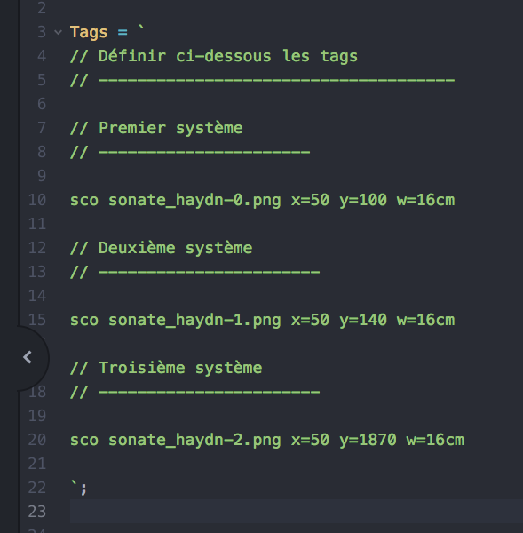
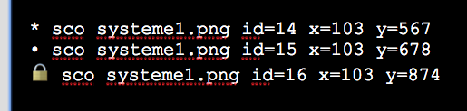

# MuScaT<br>Manuel d'utilisation

<!--
Pour actualiser le PDF, jouer simplement :

  > mus update manuel

OU, plus compliqué
1. Jouer cette commande dans le Terminal

pandoc -s Manuel.md --css="manuel.css" --metadata pagetitle="Manuel" --from=markdown --output=Manuel.html;open Manuel.html;

2. Exporter le fichier en PDF (Safari offre un menu directement dans « Fichier »)
-->

[Github de MuScaT]: https://github.com/PhilippePerret/MuScaT

## Introduction (histoire)

Suite à la diffusion de mon [Initiation à l'analyse musicale](https://www.youtube.com/channel/UCX3XhJw9x1RsVx1s3GNYceA) — et son « succès » que je n'aurais jamais imaginé aussi grand — nombreux ont été les professeurs et autres pédagogues ou musicologues à me solliciter pour me demander le logiciel utilisé pour créer l'animation de cette initiation.

C'est malheureusement une application personnelle un peu trop… personnelle (comprendre : indomptable pour qui ne l'a pas créée), une usine à gaz ne fonctionnant qu'à la ligne de code (son créateur ne sait même pas toujours par quel bout la prendre).

Mais pour répondre à ces marques d'intérêts ainsi qu'à mes propres besoins, j'ai voulu concevoir un outil plus simple et plus pratique qui permettrait de réaliser rapidement des analyses de partitions de qualité.

C'est ainsi qu'est née l'idée de **MuScaT** — dont le nom se compose de « Mu » pour « Musique », « Sc » pour « Score » (« partition » en anglais) et « Ta » à l'envers pour *TAG*, le sens en français, comme les *TAGs* qu'on *tague* sur les murs.

En bref, **MuScaT** permet de **réaliser rapidement, de façon propre et pratique, des analyses de partitions musicales** de qualité, comme on peut le voir dans l'extrait ci-dessous.


Elle est semi-graphique, et permet d'ajuster très finement les *TAGs* — au pixel près — de façon visuelle et agréable.

* [Synopsis général de création d'une analyse](#synopsis_fabrication)
* [Synopsis détaillé](#synopsis_detailled)
  * [Charger de l'application **MuScaT**](#download_muscat)
  * [Créer du dossier de l'analyse](#creation_dossier_analyse)
  * [Mettre l'analyse en analyse courante](#set_analyse_courante)
  * [Découper la partition en « images-systèmes»](#syn_crop_score)
  * [Inscrire les images-systèmes dans l'analyse](#syn_inscription_images_systemes)
  * [Préparer l'impression](#prepare_print)
    * [Ajout du titre, compositeur, etc.](#titre_et_auteur)
  * [Créer les *TAGs* (accords, les chiffrages, les cadences et autres éléments d'analyse)](#syn_def_analysis_elements)
  * [Positionner les éléments graphiques](#syn_ajustement_elements)
    * [Les lignes repères](#ligne_reperes)
    * [Note sur les coordonnées et dimensions](#note_coors_dims)
  * [Récupérer le code final](#syn_recuperation_code_final)
  * [Versions de l'analyse](#versions_de_analyse)
  * [Imprimer en PDF](#syn_print_pdf)
* [L'interface](#user_interface)
  * [La Table d'analyse](#la_table_danalyse)
  * [La boite à outils](#toolbox)
  * [Le champ de code](#code_field)
* [Composition détaillé d'un *TAG*](#composition_dun_tag)
  * [Note sur le contenu du *TAG* (texte)](#note_contenu_tag)
  * [Note sur les couleurs](#note_couleurs)
* [Liste complète de tous les *TAGs*](#complete_list_tags)
  * [Les Images](#les_images)
    * [Définition de la taille d'une image](#defining_image_size)
    * [Séquence d'images](#sequence_images)
  * [Les Accords](#les_accords)
  * [Les Chiffrages (Harmonie)](#les_harmonies)
  * [Les Cadences](#les_cadences)
  * [Les Modulations](#les_modulations)
  * [Autres types de textes](#les_textes)
    * [Les Parties](#les_parties)
    * [Les Mesures](#les_mesures)
    * [Les Degrés](#les_degres)
    * [Les marques musicales diverses](#marques_musicales)
  * [Autres éléments graphiques](#autres_elements_graphiques)
    * [Les Lignes](#les_lignes)
    * [Les Boites](#les_boites)
* [Opérations sur les *TAGs*](#operation_on_tags)
  * [Verrouillage des *TAGs*](#lock_tags)
  * [Grouper et dégrouper des *TAGs*](#grouper_tags)
  * [Ligne de code du *TAG*](#tag_code_line)
* [Animation d'une analyse](#animation_analyse)
* [Les Options](#all_options)
* [Les Utilitaires](#les_utilitaires)
  * [Changement du dossier des captures écran (Mac)](#utils_change_captures_folder)
  * [Renommage des fichiers images (Mac/Unix)](#utils_renommer_fichiers)
  * [Création d'une nouvelle analyse (Mac)](#create_new_analyse)
  * [Activation d'une analyse (Mac)](#activate_analyse)
  * [Pour aller plus loin](#aller_plus_loin)
* [Annexe](#annexes)
  * [Application « Terminal »](#application_terminal)
  * [Raccourcis clavier](#keyboard_shortcuts)


## Remerciements

Mes remerciements vont :

* à Marion MICHEL pour la relecture attentive et patiente de ce manuel, et ces nombreuses corrections.


## Synopsis général de création d'une analyse {#synopsis_fabrication}

Commençons par un aperçu du processus général qui va permettre de produire une analyse musicale à l'aide de **MuScaT**. Noter que chaque item de cette liste est cliquable et permet de rejoindre la partie détaillée correspondante.

* [Chargement de l'application **MuScaT**](#download_muscat)
* [Création du dossier de l'analyse](#creation_dossier_analyse),
* [Mise de l'analyse en analyse courante](#set_analyse_courante),
* [Découpage de la partition en « images-systèmes»](#syn_crop_score),
* [Inscription des images-systèmes sur la table d'analyse](#syn_inscription_images_systemes),
* [Préparation de l'impression](#prepare_print)
  * [Positionnement en fonction de l'aperçu d'impression](#dim_et_pos_against_overview)
  * [Ajout des informations (titre, compositeur…)](#titre_et_auteur)
* [Ajout de tous les éléments d'analyse](#syn_def_analysis_elements),
* [Positionnement les éléments graphiques](#syn_ajustement_elements),
  * [Les lignes repères](#ligne_reperes)
* [Récupération du code final](#syn_recuperation_code_final),
* [Impression en PDF](#syn_print_pdf).

## Synopsis détaillé {#synopsis_detailled}

Après ce bref aperçu des étapes de la fabrication d'une analyse, abordons-en tous les aspects et tous les détails.

### Chargement de l'application **MuScaT** {#download_muscat}

La toute première chose à faire, bien sûr, est de charger **MuScaT**. Pour le moment, on peut le faire par le biais de son [repository Github de **MuScaT**][Github de MuScaT].

Il suffit de cliquer sur le bouton « Clone or download »…


… de choisir « Download ZIP »…


… et d'attendre la fin du téléchargement (l'application fait plusieurs mégaoctets, donc suivant la qualité de votre connexion, l'opération peut être plus ou moins longue).

On se retrouve alors avec le dossier de l'application.


### Créer le dossier de l'analyse {#creation_dossier_analyse}

#### Création en ligne de commande

Si vous êtes à l'aise avec votre [Terminal](#application_terminal) sur Mac, avec votre console sur Unix (`Application -> Accessories -> Terminal`{.path}) ou avec votre console dans Windows (`Start > Run`, puis `cmd`{.str} et `Entrée`{.shortcut}), le plus simple est d'exécuter l'opération en ligne de commande.

Pour cela, vous utilisez le script `/utils/create.rb`{.path}.

> Notez que comme l'extension le suggère, le langage Ruby doit être installé sur votre machine. Il l'est par défaut sur Mac, vous pouvez [l'installer facilement sur Windows](https://editrocket.com/articles/ruby_windows.html).

```bash

  > cd /chemin/vers/dossier/MuScaT
  > ./utils/create.rb "Ma première analyse"

```

> Note : les chemins ci-dessus correspondent aux OS de Mac et Linux. Il faut utiliser des balances arrières (« \\ ») si vous êtes sur Windows.

L'avantage de cette procédure en ligne de commande, c'est notamment qu'elle enregistre la version de **MuScaT** utilisée, ce qui sera très pratique pour les actualisations.

#### Création par le Finder

La procédure est à peine plus compliquée par le Finder, « à la main » :

* dupliquer le dossier `Template`{.path} qui se trouve dans le dossier `MuScaT/_analyses_`{.path} (ce dossier est le dossier qui peut contenir toutes les analyses),

    

* le renommer du nom de l'analyse, par exemple « Analyse-Sonate-Mozart ».

    

    > Note : il est vivement recommandé de ne pas mettre d'espaces vides dans les noms de dossiers ou de fichiers pour une raison qui sera expliquée plus tard. Personnellement, j'aime les remplacer par des traits plats (« Analyse_Sonate_Mozart »).

* Éditer le fichier `analyse.js`{.path} (celui du dossier d'analyse que vous venez de créer) en texte simple, renseigner le nom de l'analyse (`ANALYSE`{.prop}) :

    ```javascript
    const ANALYSE = "Analyse_Sonate_Mozart";
    ```

    … et enregistrer ce fichier toujours en texte simple.

#### Contenu d'un dossier d'analyse

Voyons rapidement le contenu du dossier d'analyse. On trouve :

* le dossier « images » qui comme son nom l'indique va rassembler toutes les images utiles à l'analyse, c'est-à-dire les partitions, les *systèmes*,
* le fichier le plus important, le fichier `_tags_.js`{.path} qui va contenir la définition précise de l'analyse,
* un fichier `analyse.js`{.path} qu'il suffit de glisser — en le dupliquant, donc avec la touche `ALT`{.shortcut} — à la racine du dossier **MuScaT** pour mettre cette analyse en analyse courante.

Dans ce dossier, vous pouvez mettre enfin votre partition en PDF ou en image.


### Mettre l'analyse en analyse courante {#set_analyse_courante}

> Cette partie utilise une procédure inhabituelle, je vous demande donc toute votre attention.

**MuScaT** possède ce que l'on appelle une [table d'analyse](#la_table_danalyse), c'est en fait la fenêtre du navigateur dans laquelle nous allons procéder à l'analyse de la partition. Cette table d'analyse, on l'ouvre en lançant le fichier `MuScaT/_TABLE_ANALYSE_.html`{.path}.

Sur cette [table d'analyse](#la_table_danalyse) est déjà posée une analyse. Pour savoir laquelle sans ouvrir la table, il suffit de lire le fichier `MuScaT/analyse.js`{.path}. C'est donc ce fichier `MuScaT/analyse.js`{.path} qui détermine quelle analyse nous sommes en train de lire, d'imprimer ou de travailler sur la table d'analyse.

Donc, pour que notre nouvelle analyse devienne l'analyse courante, nous devons entrer son nom dans le fichier `MuScaT/analyse.js`{.path} pour qu'il devienne :

```javascript
  // dans le fichier MuScaT/analyse.js
  const ANALYSE = "Analyse_Sonate_Mozart";
```

C'est ici qu'il faut bien comprendre : nous parlons bien du fichier `analyse.js` principal, celui qui se trouve à la racine de l'application, PAS celui qui se trouve dans notre dossier d'analyse.

Pour faire de notre analyse l'analyse courante, nous avons donc la solution d'éditer le fichier `MuScaT/analyse.js` (en texte simple, comme tous les fichiers **MuScaT**) et de changer la valeur d'`ANALYSE`{.code} comme nous venons de le faire.

Voici d'autres façons de procéder :

Avec la commande `mus`{.cmd}
: Si [vous avez installé la commande `mus`{.cmd}](#aller_plus_loin), alors il vous suffit de jouer `mus analyse Analyse_Son`{.cmd} dans une fenêtre de [Terminal](#application_terminal).
: Le nom est volontairement abrégé, **MuScaT** retrouve d'elle-même le nom de l'analyse, si c'est la seule qui commence par « Analyse_Son ». Si elle en trouve plusieurs, elle les affiche pour vous laisser choisir la bonne.

Avec le script `analyse.rb`{.path}
: Dans le [Terminal](#application_terminal) toujours, on peut rejoindre le dossier de **MuScaT** (`cd ...`{.code}) et taper `./utils/analyse.rb "Analyse_Son"`{.path}.

En dupliquant le fichier `analyse.js`{.path} de l'analyse
: Vous pouvez aussi détruire le fichier `MuScaT/analyse.js`{.path} principal et le remplacer par celui qui se trouve dans le dossier de votre analyse (`MuScaT/_analyses_/Analyse_Sonate_Mozart/analyse.js`{.path}).
: Attention, cette procédure ne fonctionne que si vous avez [préparé correctement votre dossier d'analyse](#creation_dossier_analyse).

À vous de choisir la solution qui vous semble la plus pratique.


### Découper la partition en « images-systèmes » {#syn_crop_score}

Très souvent, on part d'un fichier PDF contenant une partition ou les systèmes sont trop rapprochés pour être « tagués » de façon lisible. Même s'il est tout à fait possible d'utiliser un tel fichier PDF avec **MuScaT**, il est infiniment plus pratique de travailler avec de « vraies » images et des systèmes séparés (donc une image par système).

La première opération consiste donc à transformer le fichier PDF en images-systèmes. Pour ce faire, vous pouvez passer par [Gimp](https://www.gimp.org), Photoshop ou tout autre logiciel de traitement de l'image. Je vous renvoie à leur manuel pour la procédure à adopter.

Mais vous avez plus simple, beaucoup plus pratique et extrêmement plus rapide : les fonctions de capture d'écran. Si vous êtes sur Mac, vous pouvez utiliser l'application [Aperçu](https://support.apple.com/fr-fr/guide/preview/welcome/mac). Si vous êtes sur PC/Windows, ce sera plutôt [LightShot](https://app.prntscr.com/en/index.html) par exemple.

Pour une version détaillée et illustrée de la procédure, je vous renvoie à [ma chaine YouTube](https://www.youtube.com/channel/UCX3XhJw9x1RsVx1s3GNYceA) [[TODO: Mettre adresse de la vidéo]]. Je l'explique rapidement seulement ici.

* Sur Mac, vous pouvez modifier le dossier de capture (le dossier où seront automatiquement enregistrées les captures d'écran) en utilisant l'utilitaire `change_folder_captures.rb` de **MuScaT**. Dans le [Terminal](#application_terminal), taper :

    ```

    > cd /chemin/vers/application/MuScaT
    > ./utils/change_folder_captures.rb /dossier/des/captures/

    ```

    > Note : pour ne pas avoir à remplir les chemins à la main, il vous suffit de glisser les éléments (fichier ou dossier) depuis le Finder jusque sur la fenêtre de Terminal. Le chemin de l'élément est aussitôt inscrit ! Donc, ici, par exemple, pour la première ligne, taper seulement `cd `{.cmd} (sans oublier l'espace de fin) puis glisser le dossier **MuScaT** sur la fenêtre de Terminal. Taper ensuite `./utils/chan[TAB] `{.cmd} (sans oublier l'espace de fin) puis faire glisser le dossier où mettre les images sur la fenêtre de Terminal.

* ouvrir le PDF dans Aperçu,
* activer la combinaison de touches `CMD MAJ 4`{.shortcut},
* sélectionner le système (ou la portion de partition à isoler),
* recommencer ces opérations pour chaque système (ou chaque portion de partition).

Pour renommer automatiquement toutes les captures produites — qui possèdent pour le moment des noms quelque peu ésotériques… — vous pouvez utiliser [l'utilitaire `/utils/rename_images.rb`{.path}](#utils_renommer_fichiers). Je vous renvoie à son mode d'utilisation qu'on peut obtenir, par la console (ou le Terimnal), grâce à :

```
./utils/rename_images.rb -h
```

Noter que si vous avez mal découpé certains systèmes, il est extrêmement simple de les affiner dans un second temps :

* ouvrez cette fois l'image dans Aperçu (pas le PDF de la partition, mais bien l'image à retoucher),
* dessiner un rectangle à la souris,
* régler les « poignées » de la sélection dessinée pour obtenir exactement la découpe voulue,
* jouer la combinaison `CMD K`{.shortcut},
* enregistrer l'image.

Quelle que soit la méthode adoptée pour découper la partition en systèmes, on place obligatoirement toutes les images dans le dossier `MuScaT/_analyses_/Analyse_Sonate_Mozart/images/`{.path}.


### Inscrire les images-systèmes {#syn_inscription_images_systemes}

Maintenant que nos images sont prêtes, nous devons les « inscrire » dans l'analyse pour qu'elles apparaissent sur notre table d'analyse.

Pour ce faire, on ouvre le fichier `_tags_.js` de notre analyse (donc celui qui se trouve exactement au chemin `MuScaT/_analyses_/Analyse_Sonate_Mozart/_tags_.js`{.path}). Ce fichier est **le fichier principal de l'analyse**, celui qui va définir tous les éléments, les images, les marques de modulations, les accords, les cadences, les parties, tout ce qui constitue l'analyse et que nous appelons les *TAGs* dans **MuScaT**.



```{.warning}
Attention ici !
```

Quel que soit l'éditeur ou le traitement de texte que vous utilisez pour ouvrir ce fichier, LibreOffice, Word, TextEdit, TextWrangler, Atom, TextMate, etc., il est impératif de conserver son format « Texte simple » (« Simple Text ») lorsque vous l'enregistrez, tout en conservant précieusement l'extension `.js`{.path}. Ne l'enregistrez surtout pas en `.odt`{.path} ou autre `.docx`{.path}.

Dans ce fichier `_tags_.js`{.path} On définit d'abord les images de la partition, en ajoutant des commentaires pour pouvoir s'y retrouver plus tard, lorsque le fichier deviendra volumineux.

Le contenu d'un fichier `_tags_.js`{.path}, au départ, peut ressembler — parfois de loin — à l'illustration ci-dessous. L'important est de trouver le code `option(...)`{.code} et la définition de `Tags`{.code}.

```javascript

  // Dans _tags_.js
  option('code');

  Tags = `
  // Premier système, les mesures de 1 à 10
  partition system-1-mes-1-10.png

  // Deuxième système, les mesures de 11 à 16
  partition system-2-mes-11-16.png

  // Troisième système
  // ... etc.

  `;
```

> Note : l'option 'code', en haut du fichier `_tags_.js`{.path}, permet simplement de voir le code à côté de la table d'analyse.


### Préparer l'impression {#prepare_print}

#### Dimensionner et positionner en fonction de l'aperçu d'impression {#dim_et_pos_against_overview}

Avant de placer quelconque marque d'analyse sur la partition, nous vous invitons vivement à regarder ce que l'agencement des systèmes produit au niveau de l'impression ou de la sortie du PDF. Lorsque tous les *TAGs* seront placés, il sera extrêmement difficile et pénible de devoir les repositionner pour qu'ils soient correctement placés sur la page ou le PDF.

> N'hésitez pas à [ajouter les titre, compositeur, etc.](#titre_et_auteur) avant de procéder à l'opération ci-dessus.

Pour ce faire :

* ouvrir la table d'analyse dans Chrome (le fichier `MuScaT/_TABLE_ANALYSE_.html`{.path}),
* disposer les systèmes en les déplaçant à la souris,
* demander l'impression (`CMD/Ctrl P`{.shortcut}),
* faire les réglages nécessaires (taille du papier, marges, etc. — sur Chrome, l'idéal est d'utiliser le format « Portrait », des marges « minimum », un grossissement de 100 % et pas d'entête ni de pied de page),
* noter les systèmes qui « débordent », qui passent d'une page à l'autre,
* fermer l'aperçu et ajuster la position des systèmes,
* recommencer ces dernières opérations jusqu'à un résultat satisfaisant.

#### Ajout du titre, compositeur, etc. {#titre_et_auteur}

Vous pouvez placer les titre, compositeur, date, opus, etc. aux endroits voulus grâce aux *TAGs* `titre`{.prop}, `compositeur`{.prop}, `analyste`{.prop}, `date_composition`{.prop}, `opus`{.prop}, `date_analyse`{.prop}, etc.

C'est-à-dire que vous pouvez placer, en haut de votre définition de `Tags`{.prop} dans votre fichier `_tags_.js`{.path}, les informations suivantes :

```javascript
  // Dans _tags_.js
  option('code', 'guides');

  Tags=`
  titre Sonate_n°34_en_Mi_mineur
  compositeur Joseph_Haydn
  opus Hob_XVI_34
  analyste Philippe_Perret
  date_analyse 27_janvier_2019
  ...
  `;

```

Notez que pour ces *TAGs* il est inutile de préciser les positions. C'est le thème qui s'en charge (le thème par défaut est le thème « Muscat », évidemment). Mais vous pouvez tout à fait les déplacer pour les ajuster à votre guise ou [choisir un autre thème](#option_theme).


### Créer les *TAGs* (accords, les chiffrages, les cadences et autres éléments d'analyse) {#syn_def_analysis_elements}

L'élément graphique de base de l'application **MuScaT** est le « *TAG* » (comme on en trouve sur les murs des villes). Une analyse avec **MuScaT** consiste à « taguer » une partition (remarquez que les partitions elles-mêmes, ou les images de leurs systèmes, sont elles aussi des *TAGs*). C'est donc tout naturellement que le fichier qui va les définir, pour une analyse donnée, s'appelle `_tags_.js`{.path}. Ce fichier se trouve en haut de votre dossier d'analyse.

Il existe plusieurs moyens de définir ces *TAGs*. À vous de choisir celui qui vous convient le mieux, en sachant qu'on utilise en réalité plusieurs moyens au cours de l'analyse.

#### Dans le fichier `_tags_.js`{.path} lui-même

On peut tout à fait définir/créer les *TAGs* dans le fichier du code lui-même, dans la variable dédiée `Tags` :

```javascript
  Tags = `
  // On peut définir les tags ici.
  `;
```

On pourra, afin d'obtenir les coordonnées de ces *TAGs*, aller cliquer aux endroits voulus sur la table d'analyse — dans le navigateur. Les coordonnées `x`{.prop} et `y`{.prop} sont automatiquement collées dans le presse-papier.

#### Dans le code sur la table d'analyse

Avec l'option `code`{.code} activée (`option('code');` en haut du fichier `_tags_.js`{.path}), le code apparait à côté de la table d'analyse, dans le navigateur.

Plusieurs moyens permettent alors de créer un nouveau *TAG* :

* soit : utiliser le bouton « + »,
* soit : sélectionner une ligne de code et jouer `CMD Entrée`{.shortcut}.

#### En faisant des copies d'éléments existants

Un moyen très rapide — et donc très efficace — de créer de nouveaux éléments est de les copier depuis la table d'analyse.

Cela consiste à déplacer l'élément **en tenant la touche ALT pressée** puis de relâcher l'élément (la copie) à l'endroit voulu.

Une copie est alors créée, qui peut être réglée comme n'importe quel *TAG*.

#### Versions ultérieures

Dans les versions ultérieures, il sera possible de créer le *TAG* de toutes pièces à partir de la [boite à outils](#toolbox).


#### Aperçu de la composition d'un *TAG*

Chaque *TAG* est représenté dans le code (la variable `Tags`{.code} du fichier `_tags_.js`{.path}) par une unique ligne.

Une image de système (`score`{.str}) peut être :

```javascript
Tags = `

score systeme-1.png x=50 y=3098

`;
```

Une modulation peut être inscrite par :

```javascript
Tags = `

mod G_min x=150 y=539

`;

```

#### Pour aller plus loin…

* [Composition détaillé d'un *TAG*](#composition_dun_tag),
* [Liste complète des *TAGs*](#complete_list_tags).

### Positionnement  et dimensionnement des éléments graphiques {#syn_ajustement_elements}

Une fois l'analyse désignée comme analyse courante, on ouvre le fichier `_TABLE_ANALYSE_.html`{.path} dans Chrome (ou un autre navigateur, mais pas Firefox, qui échoue dans beaucoup d'opérations…).


On peut placer les éléments aux bons endroits de plusieurs manières :

* en les déplaçant à la souris,
    
* en utilisant les flèches de son clavier,
* en jouant sur les touches `x`{.prop} et `y`{.prop},
* en modifiant leur coordonnées dans le champ de code.

Pour le détail, cf. [Positionnement des *TAGs*](#modify_position_tag).


On peut modifier les tailles des éléments de plusieurs manières aussi :

* en modifiant leur code,
* en jouant sur les touches `w`{.prop} et `h`{.prop}.

Pour le détail, cf. [Dimensionnement des *TAGs*](#dimensionner_les_tags).

On peut en ajouter de nouveaux en dupliquant les lignes de code.

À tout moment on peut annuler une opération pour revenir en arrière en jouant `CMD Z`{.shortcut} (sur Mac) ou `Ctrl Z`{.shortcut} (sur Windows).

Sans l'option `option('code');`{.code} activée, il faut modifier le code directement dans le fichier `_tags_.js`{.path} puis recharger la page dans Chrome pour voir les changements.

#### Lignes repères {#ligne_reperes}

Pour faciliter l'alignement des *TAGs* — par exemple l'alignement des dernières mesures de fin des systèmes — on peut utiliser des lignes repères. Pour cela, il suffit d'activer l'option `repères`{.str} (ou `reperes`{.str} ou `lines of reference`{.str}).

Cela ajoute deux lignes à l'écran, une verticale et une horizontale, qu'on peut déplacer à loisir à la souris.


Vous pouvez également définir leur emplacement exact avec les options `position repère vertical`{.code} (ou `vertical line offset`{.code}) et `position repère horizontal`{.code} (ou `horizontal line offset`{.code}) :

```javascript
  // Dans le fichier _tags_.js de l'analyse
  option('code');
   // à 120 pixels du haut et 200 de la gauche
  option('vertical line offset', 120, 'horizontal line offset', 200);
```

### Positionnement et dimensionnement des *TAGs* {#note_coors_dims}

Les positions `x`{.prop} (horizontale) et `y`{.prop} (verticale) s'indiquent toujours sans unité, en pixels :

```bash

  x=13 y=200

```

Toutes les autres propriétés de dimension et de position peuvent s'indiquer sans ou avec unité ou pourcentage.

```javascript
  Tags = `
    ... w=200
    ... w=20%
    ... h=23mm
    ... fs=12pt
    `;
```

#### Obtenir des coordonnées

Pour obtenir les x/y d'une position quelconque, il suffit de cliquer à l'endroit de cette position sur la table d'analyse. Cela affiche les coordonnées en bas de l'écran, mais plus encore, ça colle un `y=134 x=145`{.code} correspondant dans le presse-papier, valeur qu'il suffit ensuite de coller dans le code de la ligne du *TAG* (`CMD V`{.shortcut} sur Mac ou `Ctrl V`{.shortcut} avec Windows).

#### Positionnement des *TAGs* {#modify_position_tag}

Pour **modifier la position d'un tag** (image, modulation, texte quelconque, etc.), on a plusieurs solutions :

* soit on la règle de façon explicite dans sa ligne de code, en définissant les valeurs de `x`{.prop} (position horizontale) et/ou `y`{.prop} (position verticale),
* soit on le sélectionne et on joue sur les flèches dans les quatre sens,
* soit on le sélectionne et on presse les touches `x`{.prop} ou `y`{.prop} pour modifier respectivement sa position horizontale et verticale.
    Avec la touche `ALT`{.shortcut} (`ALT x`{.shortcut}, `ALT y`{.shortcut}), on inverse le déplacement. Avec la touche `MAJ`{.shortcut} (`MAJ x`{.shortcut}, `MAJ y`{.shortcut}, `ALT MAJ x`{.shortcut}, `ALT MAJ y`{.shortcut}), on augmente le pas de déplacement, avec la touche `CTRL`{.shortcut}, on peut régler la position pixel par pixel.

#### [Dimensionnement des *TAGs*]{#dimensionner_les_tags}

Pour **modifier les dimensions d'un tag** (comme une ligne, une cadence, une boite, une image), on a plusieurs solutions :

* soit on les règle de façon explicite dans sa ligne de code en définissant les valeurs de `w`{.prop} (largeur) et/ou `h`{.prop} (hauteur),
* soit on sélectionne l'élément et on presse la touche `w`{.prop} pour augmenter la largeur, `ALT w`{.shortcut} pour diminuer la largeur, `h`{.prop} (comme "hauteur") pour augmenter la hauteur, `ALT h`{.shortcut} pour diminuer la hauteur.
    Tout comme pour les `x`{.prop} et `y`{.prop}, avec la touche `ALT`{.shortcut} (`ALT x`{.shortcut}, `ALT y`{.shortcut}), on inverse le déplacement. Avec la touche `MAJ`{.shortcut} (`MAJ x`{.shortcut}, `MAJ y`{.shortcut}, `ALT MAJ x`{.shortcut}, `ALT MAJ y`{.shortcut}), on augmente le pas de déplacement, avec la touche `CTRL`{.shortcut}, on peut régler la position pixel par pixel.


### Récupérer le code final {#syn_recuperation_code_final}

Si l'on a travaillé dans le champ de texte à côté de la table d'analyse (avec l'option `code`{.code} activée), on doit copier le code final dans le fichier `_tags_.js`{.path}, au risque de perdre tous les changements.

> Noter que si vous avez préféré faire les changements directement dans le fichier `_tags_.js`{.path}, il vous faut recharger la table d'analyse à chaque fois dans le navigateur pour voir les modifications.

Pour se faire, on clique sur le bouton « code source -> presse papier » qui se trouve sous le champ de code si l'option `code`{.code} est activée, sinon, dans les outils — en haut à gauche.


On colle ce code dans le fichier `_tags_.js`{.path}, en remplaçant l'intégralité de son contenu.

Par défaut, dans ce code sont ajoutées toujours les options. Si on garde plusieurs versions de l'analyse, ces divers appels aux options risquent de se parasiter. Pour palier ce problème, on peut ajouter [l'option `code sans options`](#option_code_sans_options) pour que seul le code des tags soient placés dans le presse-papier :

```javascript

  options(... 'code sans options');
  Tags = `
  ...
  `;
```

#### Mesure d'urgence (ou de secours) {#recup_code_secours}

Parfois, le code de l'analyse (des *TAGs*) refuse de se copier dans le presse-papier. À la place, on trouve par exemple les coordonnées du dernier point cliqué sur l'analyse.

Il existe une solution de secours qui permet de ne pas perdre tout son code : utiliser le bouton « Code complet (secours) » de la boite à outils, près du bouton d'aide. En cliquant, on ouvre un champ de texte dans lequel se trouve tout le code, sélectionné. Il suffit de le copier (avec `X`{.shortcut} pour s'assurer de bien l'avoir copié) et de le coller dans le fichier `_tags_.js`{.path}.


#### Plusieurs versions de l'analyse {#versions_de_analyse}

Noter que si vous préférez garder plusieurs versions de votre analyse (ce qui peut être prudent), il suffit de copier le code *à la suite du précédent* (c'est-à-dire à la fin du fichier `_tags_.js`{.path}) plutôt qu'en *remplacement* de l'ancien code. Votre fichier contiendra alors :

```javascript
  // Dans _tags_.js
  // Version 1.1
  option('code','lang','en');
  var Tags = `
    //... tags de la première verison
  `;
  // Version 1.2
  option('lang','fr', 'reperes');
  Tags = `
    //... tags de la version suivante
  `;
  // Version 2.0
  option('lang','fr', 'reperes');
  Tags = `
    //... tags de la version suivante
  `;
  // etc.
```

Bien entendu, pensez à supprimer de vieilles versions pour alléger un peu le fichier, s'il devient conséquent.

### Imprimer l'analyse en PDF {#syn_print_pdf}

Enfin, on imprime la page HTML du navigateur en choisissant le format PDF :

* dans Chrome, demander l'impression (`CMD/Ctrl P`{.shortcut}),
* dans la fenêtre qui s'ouvre, choisir, dans le menu en bas à gauche : « Imprimer au format PDF » ou autre indication similaire.

### Et voilà !

Et voilà, c'est fait ! Et vous pourrez retoucher votre analyse à n'importe quel moment en la remettant en analyse courante.

---

## L'interface {#user_interface}

Faisons un tour rapide de l'interface, qui reste volontairement relativement simple, se concentrant sur les éléments essentiels.

* [La Table d'analyse](#la_table_danalyse)
* [La boite à outils](#toolbox)
* [Le champ de code](#code_field)

### La Table d'analyse {#la_table_danalyse}

Cette table, c'est la surface de la page elle-même, la surface principale de la fenêtre de votre navigateur. Elle se présente en blanc sur une surface à peine grisée qui permet de repérer les dimensions de la page d'impression. Le mieux est de jouer sur la largeur des images (paramètre `w`{.prop}, modifiable avec la touche `w`{.prop}) pour toujours se trouver à l'intérieur de cette surface.

**Si vous dépassez la surface délimitée, l'impression en sera affectée de façon très aléatoire (au moins en apparence).**

### La boite à outils {#toolbox}

Sur la gauche en haut de l'écran, on trouve un petit picto qui permet d'ouvrir la boite à outils.


Cette boite à outils contient des outils pour regrouper ou dégrouper des *TAGs*, pour les aligner, pour copier le code, etc.

### Le champ de code {#code_field}

Si [l'option `code`{.code}](#option_line_of_reference) est activée, un champ de code est ouvert à droite de la page, contenant le code défini dans votre fichier `_tags_.js`{.path} (seulement celui dans `Tags`{.prop}, pas le code intégral).

En modifiant ce code, vous pouvez construire votre analyse (n'oubliez pas d'en copier ensuite le code intégral).

> Note : la touche `CMD`{.shortcut}, sur PC/Windows, doit être remplacée par la touche `Ctrl`{.shortcut}.

+-----------------------------+-------------------------------+
| `Action`{.label-table}      | `Description`{.label-table}   |
+-----------------------------+-------------------------------+
| `CMD Entrée`{.shortcut}<br> | Créer une nouvelle ligne/un   |
| ou bouton « + »             | nouveau *TAG*.                  |
+-----------------------------+-------------------------------+
| Bouton « - »                | Suppression du *TAG* courant    |
+-----------------------------+-------------------------------+
| `flèche haut`{.shortcut}    | Passer au *TAG* au-dessus       |
+-----------------------------+-------------------------------+
| `flèche bas`{.shortcut}     | Passer au *TAG* en dessous      |
+-----------------------------+-------------------------------+
| `CMD flèche haut`{.shortcut}| Remonter le *TAG* courant       |
+-----------------------------+-------------------------------+
| `CMD flèche bas`{.shortcut} | Descendre le *TAG* courant      |
+-----------------------------+-------------------------------+
| `Tabulation`{.shortcut}     | Se place dans le code du *TAG*  |
|                             | sélectionné sur la table.     |
+-----------------------------+-------------------------------+

Notez que dès que vous sélectionnez un *TAG* dans le code, le *TAG* est aussitôt sélectionné sur la table d'analyse (la table est « scrollée » pour toujours rendre visible ce *TAG*). L'opération inverse est vraie : toute sélection de *TAG* sur la table d'analyse est aussitôt sélectionné et affiché dans le code.

---


## Composition détaillé d'un *TAG* {#composition_dun_tag}

Le *code* de l'analyse est constitué simplement de *lignes*, les unes au-dessus des autres, qui déterminent les images et les *TAGs*. Chaque ligne est une image ou un *TAG* (exception faite des lignes vides et des lignes de commentaire).

```{.center .exergue}
1 ligne = 1 TAG
```

Chaque ligne de *TAG* est composée d'un nombre de propriétés souvent définies par le signe égal — exception faite des deux premiers « mots » qui déterminent le plus souvent la *nature* et le *contenu* du *TAG*.

Voyons plus en détail comment se compose une ligne du fichier `_tags_.js`{.path}, une ligne définissant un *TAG* ou une partition.

Cette ligne a le format général suivant :

`nature`{.ital}[ `contenu`{.ital}][ `propriétés`{.ital}][ `option/type`{.ital}]

`nature`{.ital}
: C'est la *nature* du *TAG*, ce qui détermine ce qu'il est, cadence, modulation, boite ou image, etc.

`contenu`{.ital}
: C'est le *contenu* du *TAG*, parfois son *type* (pour les lignes par exemple). Pour un *TAG* de texte, c'est le texte, pour une modulation, c'est la tonalité vers laquelle on module.
: Cf. [Note sur le contenu du *TAG*](#note_contenu_tag)

`propriétés`{.ital}
: Les propriétés du *TAG*, à commencer par ses coordonnées `x`{.prop} (position horizontale) et `y`{.prop} (position verticale) ainsi que les dimensions h (hauteur) et w (largeur) du *TAG*.
: Ces coordonnées et ces dimensions se notent simplement en donnant les valeurs à l'aide d'un signe égal (`=`{.code}) **sans espace** : `x=12`{.code}, `y=20`{.code}, `w=12%`{.code}, `h=12mm`{.code}, etc.
: Cf. aussi [Note sur les coordonnées et dimensions](#note_coors_dims)
: On peut également trouver les propriétés de couleur. Cf. [Note sur les couleurs](#note_couleurs)

`option/type`{.ital}
: Des options ou des types en fonction de la nature du *TAG*. Nous y reviendrons.

Noter qu'à part les deux premiers éléments, tous les autres peuvent être donnés dans l'ordre qu'on veut, sans importance.

Voici quelques définitions de *TAGs* :

```javascript
Tags = `

  score ma_partition.jpg y=100 x=10

  // => L'image 'images/ma_partition.jpg' placée à 10 pixels de
  //    la marge gauche et 100 pixels du haut.

  cadence I type=parfaite y=200 x=100 w=100

  // => Une cadence de type parfaite, avec un trait de
  //    100 pixels de large (`w`).

  modulation G_min x=200 y=100

  // => Une modulation vers Sol mineur.

`;
```

> Noter les lignes commençant par `//`{.code} qui permettent de laisser un commentaire. C'est très utile lorsque l'on veut s'y retrouver lorsque l'analyse devient conséquente.

Noter qu'une *nature* de *TAG* (le premier mot), peut toujours être exprimée par ses trois premières lettres (exception faite du terme « partition » qui rentrerait en conflit avec « partie »). Ainsi, on peut écrire le code ci-dessous :

```javascript
Tags = `

  sco ma_partition.jpg y=100 x=10

  // sco => score (partition)

  cad V_I type=parfaite y=200 x=100

  // cad => cadence

  mod G_min x=200 y=100

  // mod => modulation

`;
```

L'intégralité des *natures* de *TAG* (et leur diminutif) [est détaillée ici](#complete_list_tags).

### Forme raccourcie d'écriture

Pour la première définition du *TAG*, on peut utiliser une version raccourcie de définition qui la rend très simple et très rapide. Elle consiste à utiliser :

```javascript
Tags = `
<nature>[ <contenu>] <valeur y seule> <valeur x seule>
`;
```

Par exemple, pour une *modulation* vers la tonalité de SOL mineur (G min.) qui doit se situer à 200 pixels du haut et 450 pixels de la gauche, on pourra écrire simplement :

```javascript
  mod G_min 200 450
```

Il suffit de se souvenir que le premier nombre concerne la *hauteur*.

### Note sur le contenu du *TAG* (texte) {#note_contenu_tag}

Le *contenu* du *TAG*, c'est-à-dire son deuxième *mot*, peut être de type très différent. Mais en règle générale, il s'agit d'un texte, d'un accord ou d'un chiffrage.

Il est important de noter immédiatement ce point :

`Aucune espace ne doit se trouver dans ce contenu.`{.center .exergue}

On doit obligatoirement remplacer les espaces par des traits plats (MAJ tiret sur Mac).

Ainsi, si l'on veut écrire « Second couplet », on doit écrire :

```javascript
  partie Second_couplet x=123 y=456
```

Si l'on veut écrire la tonalité « Sol mineur », on doit impérativement écrire :

```javascript
  modulation Sol_mineur x=23 y=344
```

En revanche, tous les autres caractères sont possibles, à l'exception des balances (`/`{.prop}) dans les modulations, car elles indiquent le texte qui devra apparaitre sous le trait biaisé :

```javascript
  // Une modulation vers la sous-dominante
  mod Sol_min/(sous-dom.) x=23 y=344
```


### Note sur les couleurs {#note_couleurs}

Tous les *TAGs* à part les images peuvent avoir une couleur d'écriture et une couleur de fond.

Ces couleurs sont définies par les propriétés suivantes au choix, suivant votre convenance. La première (`c` pour la *couleur* et `bgc` pour la *couleur de fond* sont les moins difficiles pour *MuScaT* puisque ce sont celles qu'il utilise dans sa langue naturelle) :

+---------------------------+---------------------------+
|                           |                           |
+---------------------------+---------------------------+
| `couleur`{.ital}          | `c`{.prop}                |
+---------------------------+---------------------------+
|                           | `couleur`{.prop}          |
+---------------------------+---------------------------+
|                           | `color`{.prop}            |
+---------------------------+---------------------------+
| `couleur de fond`{.ital}  | `bgc`{.prop}              |
+---------------------------+---------------------------+
|                           | `fond`{.prop}             |
+---------------------------+---------------------------+
|                           | `cf`{.prop}               |
+---------------------------+---------------------------+
|                           | `background-color`{.prop} |
+---------------------------+---------------------------+

Pour la valeur, on peut utiliser soit la forme littérale en anglais (`red`{.code}, `yellowgreen`{.code}, etc.) soit la forme hexadécimale (`12FF67`{.code}, `#12FF67`{.code}) soit la forme RVB (`rgb(100,23,45)`{.code}).

`Dans la forme RVB/RGB, attention de ne laisser aucune espace !`{.warning}

---

## Liste complète de tous les *TAGs* {#complete_list_tags}

Trouvez ci-dessous la liste complète de tous les *TAGs*.


+-----------------+---------------------------------------------------+
| *TAG*           | *Description*                                     |
+-----------------+---------------------------------------------------+
| partition<br>   | Écriture d'une image, à commencer par celle de la |
| score<br>       | partition ou du système à analyser.               |
| sco<br>         |                                                   |
| image           | ```{.usage}                                       |
|                 | image <source> x=... y=... z=...                  |
|                 | ```                                               |
|                 |                                                   |
|                 | Exemple                                           |
|                 | : ```{.exemple}                                   |
|                 |sco sonate_haydn-2.png x=24 y=200 w=12.5cm         |
|                 |```                                                |
|                 |                                                   |
|                 |                 |
|                 |                                                   |
|                 | Note                                              |
|                 | : L'image doit se trouver dans le dossier         |
|                 | "images" du dossier de l'analyse.                 |
|                 |                                                   |
|                 | Détail                                            |
|                 | : [Les Images](#les_images)                       |
+-----------------+---------------------------------------------------+
| accord<br>      | Écriture d'un accord au-dessus de la partition.   |
| chord<br>       |                                                   |
| acc             | ```{.usage} |
|                 | accord <nom> x=... y=...|
|                 | ``` |
|                 | Exemple |
|                 | : ```{.exemple} |
|                 | acc E_min x=100 y=200 |
|                 | ``` |
|                 |                                                   |
|                 |               |
| | |
|                 | Détail |
|                 | : [Les Accords](#les_accords) |
+-----------------+---------------------------------------------------+
| harmonie<br>    | Écriture d'un chiffrage sous la partition. C'est  |
| harmony<br>     | en général un chiffre romain indiquant le         |
| chiffrage<br>   | renversement de l'accord.                         |
| har             |                                                   |
|                 |  ```{.usage} |
|                 | har[mony] <chiffrage> x=... y=... |
|                 | ``` |
|                 | Exemple |
|                 | : ```{.exemple} |
|                 | har VII*** x=540 y=325 |
|                 | ``` |
|                 |                                                   |
|                 |            |
| | |
|                 | Détail |
|                 | : [Les Harmonies](#les_harmonies) |
+-----------------+---------------------------------------------------+
| modulation<br>  | Marque de modulation à placer en haut de la       |
| mod             | partition.                                        |
|                 |                                                   |
|                 |  ```{.usage} |
|                 | mod[ulation] <tonalité> x=... y=... |
|                 | ``` |
|                 | Exemple |
|                 | : ```{.exemple} |
|                 | mod G_Maj/Relatif_maj. x=83 y=77 h=70px |
|                 | ``` |
|                 |                                                   |
|                 |      |
| | |
|                 | Détail |
|                 | : [Les Modulations](#les_modulations) |
+-----------------+---------------------------------------------------+
| cadence<br>     | Marque de cadence à placer sous la partition.     |
| cad             |                                                   |
|                 |  ```{.usage} |
|                 | cad[ence] <acc> type=<type cad> x=. y=. w=... |
|                 | ``` |
|                 | Exemple |
|                 | : ```{.exemple} |
|                 | cad V type=demi x=23 y=3456 w=80 |
|                 | ``` |
|                 |                                                   |
|                 |      |
|                 |                                                   |
|                 | Note |
|                 | : Noter ci-dessus l'emploi 1) d'un *type* (type de |
|                 | la cadence) et 2) d'une largeur *w* (longueur du  |
|                 | trait).                                           |
| | |
|                 | Détail |
|                 | : [Les Cadences](#les_cadences) |
| | |
+-----------------+---------------------------------------------------+
| mesure<br>      | Marque de mesure à placer à l'endroit voulu.      |
| measure<br>     |                                                   |
| mes             |  ```{.usage} |
|                 | mes[ure] <numéro> x=... y=... |
|                 | ``` |
|                 | Exemple |
|                 | : ```{.exemple} |
|                 | measure 15 x=434 y=171 |
|                 | ``` |
|                 |                                                   |
|                 |      |
| | |
|                 | Note|
|                 | : Noter que le style dépend du thème choisi. |
| | |
|                 | Détail |
|                 | : [Les Mesures](#les_mesures) |
+-----------------+---------------------------------------------------+
| degree<br>      | Marque du degré de la note dans la gamme, à placer|
| degre<br>       | à l'endroit voulu.                                |
| deg             |                                                   |
|                 |  ```{.usage} |
|                 | degre <degré> x=... y=... |
|                 | ``` |
|                 | Exemple |
|                 | : ```{.exemple} |
|                 | degre 4# x=23 y=1200 |
|                 | ``` |
|                 |                                                   |
|                 |                                                   |
|                 |      |
| | |
|                 | Détail |
|                 | : [Les Degrés](#les_degres) |
+-----------------+---------------------------------------------------+
| ligne<br>       | Marque une ligne, par exemple pour indiquer la   |
| line<br>        | poursuite d'un chiffrage sur plusieurs temps.     |
| lig<br>         |                                                   |
| lin             |  ```{.usage} |
|                 | ligne <type> x=... y=... w=... |
|                 | ``` |
|                 | Exemple |
|                 | : ```{.exemple} |
|                 | line |___| x=242 y=323 h=15 w=110 |
|                 | ``` |
+-----------------+---------------------------------------------------+
|                 |      |
+-----------------+---------------------------------------------------+
|                 | Détail |
|                 | : [Les Lignes](#les_lignes) |
+-----------------+---------------------------------------------------+
| box<br>         | Dessine une boite à l'écran. Ces boites permettent|
| boite<br>       | de masquer des éléments de la partition. Bien que |
| boi             | ces boites apparaissent en gris sur la table      |
|                 | d'analyse, elles seront invisibles dans le        |
|                 | document PDF final ou à l'impression.               |
| | |
|                 |  ```{.usage} |
|                 | box x=... y=... w=<largeur> h=<hauteur> |
|                 | ``` |
|                 | Exemple |
|                 | : ```{.exemple} |
|                 | boite x=45 y=152 h=180 w=295 |
|                 | ``` |
+-----------------+---------------------------------------------------+
|                 |      |
+-----------------+---------------------------------------------------+
|                 | Note |
|                 | : La hauteur (`h`{.prop}) et la largeur (`w`{.prop}) sont ici très |
|                 | importantes. Noter également que cette boite est visible  |
|                 | sur la table d'analyse, mais elle sera invisible dans     |
|                 | le document imprimé.                                      |
| | |
|                 | Détail |
|                 | : [Les Boites](#les_boites) |
+-----------------+---------------------------------------------------+
| texte<br>       | Pour marquer un texte quelconque à l'écran.       |
| text<br>        |                                                   |
| tex             |  ```{.usage} |
|                 | tex[te] <le_texte> x=... y=...[ type=<type>] |
|                 | ``` |
|                 | Exemple |
|                 | : ```{.exemple} |
|                 | tex Opposition_marquée x=296 y=138 w=73 |
|                 | ``` |
+-----------------+---------------------------------------------------+
|                 |      |
+-----------------+---------------------------------------------------+
|                 | Notes |
+-----------------+---------------------------------------------------+
|                 | * Mettre des traits plats à la place des espaces  |
|                 | dans le code. Ils seront remplacés par de vraies  |
|                 | espaces lors de l'inscription du texte sur la     |
|                 | table d'analyse.                                  |
| | |
|                 | * Grâce à la définition de la largeur (w), on met le |
|                 | texte sur deux lignes.                            |
| | |
|                 | Détail |
|                 | : [Les Textes](#les_textes) |
+-----------------+---------------------------------------------------+


## Les Images {#les_images}

Il existe trois mots clés pour indiquer la nature d'une image, mais ils produisent en réalité la même sorte de *TAG* : `image`{.str}, `score`{.str} ou `partition`{.str}. C'est le premier mot à trouver sur la ligne d'une image. Juste après, on doit trouver le nom de cette image, ou son chemin relatif depuis le dossier `images`{.path} du dossier de l'analyse.

```
  partition premier_mouvement/image-12.png [...]

```

Ci-dessus, l'image `image-12.png`{.path} doit donc se trouver dans le dossier `_analyses_/monAnalyse/images/premier_mouvement/`{.path}.

### Définition de la taille d'une image {#defining_image_size}

On peut définir la taille d'une image à l'aide du paramètre `w`{.prop} (ou `width`{.prop}, « largeur », en anglais). Sa valeur peut être explicite avec une unité, explicite sans unité ou en pourcentage. Par exemple :

```javascript

  // Dans _tags_.js
  Tags = `
  sco image-0.png
  sco image-1.png w=200
  sco image-2.png w=10cm
  sco image-3.png w=50%
  `;

```

Avec le code ci-dessus, l'image 0 aura sa taille normale, `image-1.png`{.path} fera 200 pixels de large, `image-2.png`{.path} fera 10 centimètres de large et `image-3.png`{.path} sera mise à 50 % de sa largeur.

Pour voir en détail toutes les façons de modifier la taille ou la position d'une image, cf. [Dimensionnement des *TAGs*](#dimensionner_les_tags) et [Positionnement des *TAGs*](#modify_position_tag).

### Séquence d'images {#sequence_images}

Bien souvent, une analyse n'est pas constituée d'une seule image pour toute la partition. Il y a trop peu d'espace entre les systèmes. On conseille donc fortement de découper les partitions en autant de systèmes qu'elles en comportent (vous trouverez des indications sur la [procédure de découpage de la partition](#procedure_crop_partition) ci-dessous).

Mais il serait fastidieux d'entrer la ligne de chaque image de système dans notre fichier `_tags_.js`{.path}. Une partition même courte peut très vite comporter de 20 à 30 systèmes et ce serait autant de lignes de partition qu'il faudrait introduire dans le code…

Au lieu de ça, si les images des systèmes ont été nommées en respectant une règle simple (avec des suites de nombres), une seule ligne suffira pour entrer tous les systèmes de la partition. Par exemple :

```

  score mouvement_1/image-[1-35].png

```

Le texte ci-dessus indique qu'il y a 35 images de système dans ce mouvement. Le code qui en résultera sera :

```

  score mouvement_1/image-1.png
  score mouvement_1/image-2.png
  score mouvement_1/image-3.png
  score mouvement_1/image-4.png
  ...
  ...
  score mouvement_1/image-35.png

```

Si vous indiquez une taille — ce qui est mieux pour être sûr de tenir dans la page — cette taille sera appliquée à toutes les images.

```javascript
  Tags=`
  score mouvement_1/image-[1-35].png w=17.5cm
  `;
```

Nous vous invitons vivement à commencer par cette opération — l'inscription des systèmes par séquence — avant l'insertion de toute autre marque sur la partition. Comme [nous l'expliquons plus haut déjà](#dim_et_pos_against_overview), il est recommandé, pour s'éviter ensuite un travail fastidieux de repositionnement, de placer en tout premier lieu les systèmes correctement sur chaque feuille, de façon définitive, en se servant de l'aperçu d'impression.

Noter que lorsque **MuScaT** place les images sur la table d'analyse, il les répartit pour obtenir l'aspect original de la partition. On peut modifier ce comportement en définissant explicitement un espace (vertical) entre chaque système ou chaque image, grâce à l'option `espacement images`{.code} :

```javascript

  // Code intégrale du fichier _tags_.js
  option('code');option('espacement images', 50);

  Tags=`
  sco haydn/mouvement_1-[1-35].png
  `;

```

> Noter la version raccourcie de la nature du *TAG* : `sco`{.str} pour `score`{.str}.

> Noter également l'usage de l'option `code`{.code} qui permet d'afficher le code à côté de la table de l'analyse, pour pouvoir le modifier dans le navigateur lui-même.

Grâce à l'option `espacement images`{.code} définie ci-dessus, chaque image (chaque système) sera séparée de 50 pixels.

Une fois ce code établi, vous pouvez déplacer les images dans la page pour les ajuster à vos besoins. Cela créera automatiquement les `x`{.prop} et les `y`{.prop} des coordonnées spatiales de chaque système au bout des lignes de score.

Astuce : si votre écran et assez grand et que vous adoptez [l'option `code beside`{.str} (ou `code à côté`{.str})](#option_code_beside), vous pourrez voir en direct votre code s'actualiser.


### Les Accords {#les_accords}

Les accords, placés en général au-dessus de la portée, se définissent par les natures `accord`{.str}, `chord`{.str} ou `acc`{.str} en version raccourcie.

On peut les indiquer en version anglosaxonne (`A`{.str}, `B`{.str}, …) ou en version italienne (`Do`{.str}, `Ré`{.str}, …), peu importe. L'important est de comprendre que comme tout texte **MuScaT** impose de remplacer les espaces par des traits plats. Ainsi, pour indiquer un accord de Si bémol 7e diminuée, on pourra utiliser dans les deux systèmes de langue :

```javascript
  Tags=`
  chord SIb_min_7edim
  acc Bb_min_7edim
  `;
```

Le code ci-dessus produira :


La taille du texte peut se régler de façon générale avec l'option `chord size`{.code} ou, pour un accord particulier, avec la propriété `fs`{.prop}.

Cf. [Options de taille pour les textes](#options_size_for_texts), pour des renseignements complets sur les options de tailles.

### Les Chiffrages (Harmonie) {#les_harmonies}

On indique un chiffrage d'accord, sous la partition, à l'aide de la *nature* `harmonie`{.str}, `harmony`{.str}, `chiffrage`{.str} ou `har`{.str}.

Les recommandations sont les mêmes que pour les accords : aucune espace.

La taille du texte peut se régler de façon générale avec l'option `harmony size`{.code} ou, pour un chiffrage particulier, avec la propriété `fs`{.prop}.

Cf. [Options de taille pour les textes](#options_size_for_texts), pour des renseignements complets sur les options de tailles.


#### Les Cadences {#les_cadences}

On indique une cadence, sous la partition, à l'aide de la *nature* `cadence`{.str} ou `cad`{.str}.

```javascript
Tags=`
  cadence I type=parfaite x=100 y=200 w=150
`;
```

> Remarquer que deux nouvelles propriétés apparaissent ici : le `type`{.code}, qui définit comme son nom l’indique le type de cadence (cf. la liste ci-dessous) et `w`{.prop}, la largeur, qui détermine ici la longueur du trait.

On peut faire varier la longueur du trait en jouant sur la touche `w`{.prop} (pour augmenter la longueur du trait) et `ALT w`{.shortcut} (pour la diminuer). Les touches `MAJ`{.shortcut} et `CTRL`{.shortcut} servent respectivement à augmenter le pas ou à le diminuer (action plus précise).

La taille du texte peut se régler de façon générale avec l'option `cadence size`{.code} ou, pour une cadence particulière, avec la propriété `fs`{.prop}.

Cf. [Options de taille pour les textes](#options_size_for_texts), pour des renseignements complets sur les options de tailles.


##### Types de cadence {#les_types_de_cadences}

Les types de cadence qu'on peut utiliser comme argument de la propriété `type`{.prop} sont :

* parfaite
* imparfaite
* demi
* italienne
* rompue
* plagale
* faureenne (pour la cadence Fauréenne)
* baroque

Exemple :

```javascript

Tags=`
  har I x=110 y=264
  har IV x=155 y=262
  cad V* type=demi x=77 y=263 w=147px
`;

```


#### Les modulations {#les_modulations}

On peut mettre un texte au-dessus de la barre inclinée (en général la tonalité vers laquelle on module) et un texte en dessous (en général la fonction de cette tonalité).

Pour séparer les deux textes, on utilise tout simplement la barre inclinée, appelée « balance ». Ainsi, pour obtenir :


… on utilisera simplement :

```
modulation Sol_min/(sous-dom.) x=200 y=300

ou

mod Sol_min/(sous-dom.) 200 300

```

On peut modifier la hauteur du trait vertical qui rejoint la partition en modifiant la propriété `h`{.prop}. On peut donc la modifier en pressant la touche `h`{.prop} (augmente la longueur du trait) ou les touches `ALT h`{.shortcut} (diminue la longueur du trait).

La taille du texte peut se régler de façon générale avec l'option `modulation size`{.code} ou, pour une modulation particulière, avec la propriété `fs`{.prop}.

Cf. [Options de taille pour les textes](#options_size_for_texts), pour des renseignements complets sur les options de tailles.

### Les autres types de textes {#les_textes}

Ce que l'on appelle spécifiquement les « textes », ici, ce sont tous les textes hors des accords, modulations, chiffrages, etc. Ce sont vraiment des textes qu'on peut placer n'importe où. À commencer par la définition des grandes parties de la pièce (« Introduction », « Coda », etc.).

Dans un texte, il est impératif de remplacer toutes les espaces par des traits plats (on les obtient, sur mac, à l'aide de Maj+tiret).

Par exemple, pour écrire sur la partition :

```

      Premier couplet

```

Il faut impérativement définir la ligne :

```

    texte Premier_couplet y= 50 x=200

```

En dehors des textes « normaux » ou simples, on peut utiliser :

* [Les parties](#les_parties)
* [Les mesures](#type_texte_mesure)
* [Les degrés](#les_degres)

#### Les parties {#les_parties}

Les marques de partie s'indiquent avec le *TAG* `partie`{.str} (ou `par`{.str} ou `part`{.str}). Ce sont des textes dans des boites inclinées qui ont cet aspect :


La taille du texte peut se régler de façon générale avec l'option `part size`{.code} ou, pour une partie en particulier, avec la propriété `fs`{.prop}.

Cf. [Options de taille pour les textes](#options_size_for_texts), pour des renseignements complets sur les options de tailles.

#### Les mesures {#les_mesures}

Les numéros de mesure, s'ils ne sont pas indiqués sur la partition elle-même, peuvent être ajoutés à l'aide du *TAG* `mesure`{.str} (ou `measure`{.str}, ou `mes`{.str}), suivi du numéro de mesure puis des coordonnées.


La taille du texte peut se régler de façon générale avec l'option `mesure size`{.code} ou, pour un numéro de mesure en particulier, avec la propriété `fs`{.prop}.

Cf. [Options de taille pour les textes](#options_size_for_texts), pour des renseignements complets sur les options de tailles.

#### Les degrés {#les_degres}

Parfois il est intéressant de marquer les degrés des notes dans la gamme. On peut le faire grâce à la *nature* `degre`{.str}, `degree`{.str} ou le diminutif `deg`{.str}.

```javascript
Tag=`

degree 4# x=123 y=678

`;
```


La taille du texte peut se régler de façon générale avec l'option `degre size`{.code} ou, pour un degré en particulier, avec la propriété `fs`{.prop}.

Cf. [Options de taille pour les textes](#options_size_for_texts), pour des renseignements complets sur les options de tailles.

#### Les marques musicales diverses {#marques_musicales}

TODO: Version suivante.

---

### Autres éléments graphiques {#autres_elements_graphiques}

#### Les Lignes {#les_lignes}

Les lignes se définissent par `line`{.str} ou `ligne`{.str}.

Le premier élément définit le `type`{.prop} de la ligne. Bien noter que le `type`{.prop} dont on parle ici ne se définit pas avec la propriété `type`{.prop} — comme c'est le cas avec [les cadences](#les_cadences) par exemple —, mais simplement en second mot. Dans le code suivant :

```javascript
Tags = `
  line |___| x=100 y=120 w=230
`;
```

… `|___|`{.str} est le *type* de la ligne.

Les *types* sont les suivants :


+-----+-------+-------------------------------------------------+
|     |       | Description
+-----+-------+-------------------------------------------------+
| U   | |___| | Ligne inférieure, trait vertical avant et après |
+-----+-------+-------------------------------------------------+
| N   | |---| | Ligne supérieure, trait vertical avant et après |
+-----+-------+-------------------------------------------------+
| L   | |___  | Ligne inférieure, trait vertical avant          |
+-----+-------+-------------------------------------------------+
| K   | |---  | Ligne supérieure, trait vertical avant          |
+-----+-------+-------------------------------------------------+
| V   | ___|  | Ligne inférieure, trait vertical après          |
+-----+-------+-------------------------------------------------+
| ^   | ---|  | Ligne supérieure, trait vertical après          |
+-----+-------+-------------------------------------------------+

On peut ensuite définir sa taille et sa position avec les lettres habituelles `x`{.prop} (position horizontale), `y`{.prop} (position verticale) et `w`{.prop} (largeur en pixels).

#### Les Boites {#les_boites}

Les boites permettent aussi bien d'entourer un élément que de le masquer. Elles se définissent avec les propriétés `x`{.prop}, `y`{.prop}, `w`{.prop} pour la largeur, `h`{.prop} pour la hauteur et `bgc`{.prop} pour la couleur de fond (cf. [Note sur les couleurs](#note_couleurs)).

Noter qu'une boite sans couleur, sur la table d'analyse, apparaitra toujours grisée — pour être visible et manipulable —, mais qu'elle sera invisible à l'impression ou dans le PDF.

Noter également qu'on peut utiliser de la transparence pour les boites. Il suffit pour cela de leur donner une valeur de `bgc` (background-color) à l'aide de `rgba` (où « a » final signifie « alpha », la transparence). Par exemple :

```javascript
  Tags=`
  // ...
  box x=100 y=233 w=50 h=400 bgc=rgba(0,255,0,0.3)
  // ...
  `;
```


> Rappelez-vous bien qu'il ne doit y avoir aucune espace dans la définition de `bgc` (comme dans la définition de toute valeur).


---

## Opérations sur les *TAGs* {#operation_on_tags}

* [Verrouiller les *TAGs*](#lock_tags)
* [Grouper et dégrouper des *TAGs*](#grouper_tags)
* [Ligne de code du *TAG*](#tag_code_line)

### Verrouillage des *TAGs* {#lock_tags}

On peut « verrouiller » un *TAG*, c'est-à-dire empêcher totalement ses modifications, aussi bien sa position que son contenu, en ajoutant une astérisque, un rond (`ALT #`{.shortcut}) ou même un  au tout début de sa ligne (suivi ou non par une espace).

Les trois lignes suivantes verrouillent leur *TAG* :



**MuScaT** ajoutera un vrai cadenas () qui rendra ce verrouillage très visuel.

Une fois verrouillé, le *TAG* ne peut plus être déplacé à la souris. En revanche, il peut tout à fait être modifié dans le code (sa position, son contenu, etc.) pour un ajustement très précis.

Pour déverrouiller un *TAG* et le rendre à nouveau mobile, il suffit tout simplement de retirer cette marque de verrouillage dans le code.

### Grouper et dégrouper des *TAGs* {#grouper_tags}

« Grouper » des *TAGs* permet de les considérer comme un seul élément. On peut de cette manière les déplacer ensemble ou les supprimer tous ensemble.

Pour grouper :

* sélectionner les *TAGs* les uns après les autres en maintenant la touche MAJ appuyée,
* activer le bouton « Grouper » dans [la boite à outils](#toolbox) ou jouer la combinaison clavier `CMD G`{.shortcut} (`Ctrl G`{.shortcut} sur Windows).

Pour dégrouper :

* sélectionner un groupe en sélectionnant l'un de ses éléments,
* activer le bouton « Dégrouper les *TAGs* » dans [la boite à outils](#toolbox) ou jouer la combinaison clavier `CMD G`{.shortcut} (`Ctrl G`{.shortcut} sur Windows).

---

## Procédure de découpage de la partition {#procedure_crop_partition}

Voyons quelques méthodes de découpage de la partition en « images-systèmes ». Je les présente ici de la meilleure à la moins bonne. Cette qualité a été définie en fonction des deux critères suivants :

* rapidité d'exécution,
* précision du découpage.

### Avec capture sélection dans Aperçu (Mac)

Méthode la plus rapide, mais également la moins précise. Ce manque de précision oblige parfois à reprendre des systèmes pour mieux les découper. Cependant, elle est tellement plus rapide que les autres que je la privilégie sans problème, d'autant que le redécoupage est aussi simple.

* Ouvrir la partition PDF dans l'application Aperçu,
* jouer `CMD Maj 4`{.shortcut} pour activer la sélection par souris,
* sélectionner la zone de la partition à capturer — un système — (ne pas avoir peur de « prendre large », il est facile d'affiner ensuite),
* recommencer l'opération pour tous les systèmes,
* récupérer les captures sur le bureau — sauf si l'astuce ci-dessous (1) a été utilisée — et les mettre dans le dossier `images`{.path} de votre analyse,
* modifier les noms des fichiers — sauf si vous avez utilisé l'astuce ci-dessous (1) — en les indiçant de 1 (ou 0) à N pour les insérer plus facilement dans l'analyse.

Pour affiner le découpage :

* ouvrir l'image dans Aperçu,
* choisir si nécessaire la sélection rectangle (p.e. Outils > Sélection rectangulaire),
* sélectionner la partie à conserver,
* affiner à l'aide des poignées,
* jouer `CMD K`{.shortcut} pour « cropper » l'image,
* l'enregistrer.

(1) Astuce : pour aller encore plus vite, vous pouvez :

* utiliser l'[utilitaire Muscat `change_folder_captures`{.path}](#utils_change_captures_folder) pour définir le dossier des captures écran ou consulter la [procédure décrite ici](https://www.laptopmag.com/articles/change-macs-default-screenshot-directory). Vos captures iront directement dans ce dossier,
* effectuer les captures,
* utiliser l'[utilitaire Muscat `rename_images`{.path}](#utils_renommer_fichiers) pour renommer instantanément vos fichiers.

Note : vous pouvez voir ou revoir la procédure dans les tutoriels consacrés sur [ma chaine YouTube]().

### Avec sélection rectangulaire dans Aperçu (Mac)

La méthode suivante ressemble à la précédente mais permet d'être plus précis. Mais cette précision se fait au détriment du temps, notamment pour l'enregistrement des fichiers images.

* Ouvrir la partition PDF dans Aperçu,
* choisir la sélection rectangle (p.e. Outils > Sélection rectangulaire),
* sélectionner le système grossièrement,
* ajuster parfaitement la sélection à l'aide des poignées,
* copier la sélection (`CMD C`{.shortcut}),
* activer la combinaison `CMD N`{.shortcut} pour créer une nouvelle image à partir du presse-papier,
* enregistrer l'image (`CMD S`{.shortcut}) avec le nom voulu, dans le dossier voulu, en choisissant le format voulu.

### Avec Aperçu, sélection souris et rectangle (Mac)

On peut bien entendu imaginer une méthode intermédiaire qui reprendrait les deux méthodes précédentes. Lorsque la découpe est facile, on utilise la première, lorsque la découpe demande plus de précision, on privilégie la seconde.

### Avec **MuScaT** et `convert`{.code}

C'est une méthode qui souffre parfois d'un manque de qualité de rendu.

On tire déjà les images du PDF à l'aide de la commande à jouer dans le Terminal (adapter la qualité du traitement en fonction du résultat) :

```{.normal}
  # Se trouver dans le dossier contenant la partition (cd ...)
  convert[ options] partition.pdf partition.jpg # ou .png
```

Autant d'images que de pages sont produites.

On insert la première dans le code du fichier `_tags_.js`{.path}, avec l'option `crop image`{.code} :

```

    # Dans _tags_.js
    option('crop image')
    Tags=`
    partition partition-0.jpg
    `;

```

On ouvre le fichier `TABLE_ANALYSE.html`{.path} dans Chrome.

Maintenant, il suffit de sélectionner, à la souris, la zone de l'image à prendre puis de coller le code du presse-papier dans la console du Terminal. Puis de jouer ce code.

Répéter l'opération avec chaque système, puis avec chaque page de la partition.

### Avec Gimp/Photoshop (ou autre logiciel de traitement de l'image)

Si un logiciel de traitement d'images présente une précision de découpage inégalable, il offre en revanche la méthode la plus chronophage, même avec l'habitude du logiciel.

* Ouvrir le PDF dans Gimp,
* sélectionner chaque système en le découpant,
* le placer en haut,
* « cropper » l'image à la taille du plus haut système,
* exporter chaque image-système (avec le bon nom).

Ce mode d'emploi n'étant pas destiné à maitriser Gimp, Photoshop ou autre, je vous renvoie au manuel d'utilisation de ces applications.

### Ligne de code du *TAG* {#tag_code_line}

On peut obtenir la ligne de code d'un *TAG* ou même de plusieurs *TAGs* de cette manière :

* sélectionner sur la table d'analyse le ou les *TAGs* dont on veut les codes,
* jouer la combinaison `ALT C`{.shortcut},
* coller le code mis dans le presse-papier.

---

## Animation d'une analyse {#animation_analyse}

* [Démarrage de l'animaton](#starting_animation)
* [Boutons de l'animation](#boutons_animation)
* [Réglage de l'animation](#set_animation)

Serait-ce la cerise sur le gâteau de **MuScaT** ?… L'application ne permet pas seulement de faire une analyse statique, elle permet aussi de créer une animation qu'on peut utiliser pour YouTube ou pour donner un cours physique à la manière d'un power-point.

Les fonctionnalités de l'animation sont limitées cependant, puisqu'on ne peut que faire apparaitre les éléments les uns après les autres. On ne peut pas (ou pas encore) les déplacer, les coloriser, etc. Avec un peu d'imagination et en exploitant toutes les possibilités de **MuScaT**, on peut cependant parvenir à des choses assez complexes.

Vous pouvez en trouver des illustrations sur les vidéos de ma chaine : https://www.youtube.com/channel/UCX3XhJw9x1RsVx1s3GNYceA.

### Démarrage de l'animation {#starting_animation}

Pour lancer une animation, il n'y a rien de plus simple à faire que d'ajouter le commentaire `// START`{.code} à l'endroit où l'on veut qu'elle démarre.

À partir de ce `START`{.code}, tous les groupes de *TAGs* non espacés seront affichés ensemble et l'animation fera une pause lorsqu'elle rencontrera une ligne vide.

Tout ce qui précède ce commentaire `// START`{.code} sera affiché d'un seul coup.

Ensuite, chaque « groupe de *TAGs* » est affiché en laissant une pause entre chacun d'eux. Un « groupe de TAGs » est une suite de *TAGs* qui ne sont séparés d'aucune ligne vide. Par exemple, ci-dessous, on trouve deux groupes de *TAGs*, qui s'afficheront donc en deux temps lors de l'animation :

```javascript
  // dans _tags_.js
  Tags = `
  // ...

  // START

  // Premier groupe de TAGs
  acc C x=100 y=23
  cad I x=100 y=233
  sco mon-systeme-d.png x=3 y=200

  // Second groupe de TAGs
  mod G/(sous-dom) x=34 y=340
  sco mon-systeme-e.jpg x=5 y=400

  // ... suite...
  `;
```

On peut [régler la vitesse générale de l'animation](#set_animation_speed) en option mais on peut également définir des temps plus ou moins longs entre l'affichage des différents *TAGs*, par exemple pour aménager un temps plus long d'explication entre deux *TAGs*. Pour ce faire, on joue simplement sur le nombre de lignes vides entre ces *TAGs*.

Par exemple, ci-dessous, il y aura deux fois plus de temps entre la ligne `acc D x=100 y=200`{.code} et la ligne `acc E x=120 y=200`{.code} qu'entre la ligne `acc E x=120 y=200`{.code} et la ligne `acc F x=140 y=200`{.code}.

```javascript
  // Dans le fichier _tags_.js
  Tags= `
 1| // ...
 2|
 3| // START
 4|
 5| acc D x=100 y=200
 6|
 7|
 8|
 9| acc E x=120 y=200
10|
11| acc F x=140 y=200
12|
  `;
```

### Boutons de l'animation {#boutons_animation}

Des boutons permettent d'interagir sur l'animation pour la mettre en pause, remonter les pas ou l'arrêter et la reprendre grâce à des boutons « Retour en arrière », « Stop » et « Jouer/Pause ».


Comme vous pouvez le voir sur l'image ci-dessus, si le code de l'animation est activé, les boutons se trouve en dessous du code.

### Réglage de l'animation {#set_animation}

Plusieurs options permettent de régler les paramètres de l'animation.

* [Réglage de la vitesse](#set_animation_speed)

#### Réglage de la vitesse de l'animation {#set_animation_speed}

On peut régler la vitesse de l'animation à l'aide de l'option `vitesse animation`{.code} ou `animation speed`{.code}. C'est un nombre de 1 à 100. Plus il est élevé et plus l'animation est rapide (i.e. plus les pauses sont courtes). Par exemple :

```javascript
  // Dans le fichier _tags_.js
  option('vitesse animation', 80);
  Tags = `
  // Premiers tags à afficher d'un coup

  // START

  // Tags qui s'afficheront progressivement.
  `;

```
---

## Options {#all_options}

* [Options de la langue](#choix_langue)
* [Option « code à côté »](#option_code_beside)
* [Option « code sans options »](#option_code_sans_options)
* [Option « lignes de repère »](#option_line_of_reference)
  * [Position des lignes repères](#position_lignes_reperes)
* [Option « Rectangle de sélection »](#option_rectangle_selection)
* [Options de taille pour les textes](#options_size_for_texts)
* [Option « espacement images »](#option_space_between_scores)
* [Option « marge haut »](#option_top_first_score)
* [Option « marge gauche »](#option_left_margin)
* [Thème](#option_theme)
* [Option « découpe image »](#option_crop_image)
* [Vitesse de l'animation](#vitesse_animation)
* [Option « Viseur de position »](#position_visor)

Comme les *TAGs* et les partitions, les options se règlent dans le fichier `_tags_.js`{.path}. On utilise tout naturellement la fonction `option`{.code} (ou `options`{.code}) avec en argument les options à activer.

Ci-dessous, par exemple, on active l'option `guide`{.code} qui affiche deux lignes repère déplaçables pour aligner des éléments à la souris (ou par magnétisation).

```javascript

  // Dans _tags_.js
  option('guide');
  Tags=`
    ...
  `;  

```

Dans la méthode `option`{.code}, on peut passer toutes les options les unes à la suite des autres, ou utiliser plusieurs fois la méthode `option`{.code}. Les trois formulations suivantes sont équivalentes :

```javascript

  // Dans _tags_.js
  option('guide', 'code', 'marge haut', 100);

```

… équivaut à :

```javascript

  // Dans _tags_.js
  option('guide');option('code');option('marge haut', 100);

```

… qui équivaut à :

```javascript

  // Dans _tags_.js
  option('guide');
  option('code');
  option('marge haut', 100);

```

> Note : les points-virgules sont optionnels.

Vous noterez qu'il existe deux types d'options. Les options dites « booléenne » qu'on active simplement en indiquant leur nom en argument (par exemple `guide`{.code} ou `code`{.code}) et il y a les options non booléennes qui attendent une valeur précise (par exemple `marge haut`{.code} attend la valeur de cette marge haut).

Dans les arguments de la méthode `option`{.code}, la valeur des options non booléennes doit suivre immédiatement le nombre de l'option :

```javascript

  // Dans _tags_.js
  option('marge haut', 100);

```

Ci-dessus, la valeur `100`{.num} sera appliquée à l'option `marge haut`{.code}.

### Option « langue » {#choix_langue}

+---------------------+---------------------------------------------+
|                     |                                             |
+---------------------+---------------------------------------------+
| Option              | `lang`{.code}, `langue`{.code}              |
+---------------------+---------------------------------------------+
| Type                | les deux lettres de la langue, par exemple  |
|                     | `fr`{.str} (français) ou `en`{.str}         |
|                     | (anglais).                                  |
+---------------------+---------------------------------------------+


Pour définir la langue parlée par l'application. Pour le moment, l'application ne sait que parler français et anglais, mais nous espérons rapidement voir d'autres langues se développer. Avis aux amateurs traducteurs même inexpérimentés !

### Option « code à côté » {#option_code_beside}

+---------------------+---------------------------------------------+
|                     |                                             |
+---------------------+---------------------------------------------+
| Option              | `code beside`{.code}, `code à côté`{.code}  |
+---------------------+---------------------------------------------+
| Type                | booléen                                     |
+---------------------+---------------------------------------------+

L'option « code à côté » permet d'avoir le fichier contenant le code juste à côté de la partition, ce qui est très pratique pour le modifier sans avoir à changer d'application. On le voit ci-dessous dans la boite noire.


### Option « découpe image » {#option_crop_image}

+---------------------+---------------------------------------------+
|                     |                                             |
+---------------------+---------------------------------------------+
| Option              | `crop image`{.code}, `découpe image`{.code} |
+---------------------+---------------------------------------------+
| Type                | booléen                                     |
+---------------------+---------------------------------------------+

Cette option fait passer dans un mode d'utilisation qui va permettre de découper l'image de façon aisée (par simple copié-collé).

### Option « code sans options » {#option_code_sans_options}

+---------------------+---------------------------------------------+
|                     |                                             |
+---------------------+---------------------------------------------+
| Option              | `code sans option`{.code}, `code sans options`{.code}, |
|                     | `code no option`{.code}                     |
+---------------------+---------------------------------------------+
| Type                | booléen                                     |
+---------------------+---------------------------------------------+

Par défaut, le code de l'analyse copiée dans le presse-papier contient l'intégralité de ce que doit contenir le fichier `_tags_.js`{.path}, c'est-à-dire la définition des options et la valeur de la variable `Tags`{.code}.

Mais lorsque l'on veut garder plusieurs versions de son code, en les mettant au bout les unes des autres plutôt qu'en les remplaçant, des définitions d'options peuvent se contredire.

Avec l'option `code sans option`{.code} activée, seule la définition de la variable `Tags`{.code} est copiée dans le presse-papier, ce qui permet de ne garder que la ligne en haut du fichier pour définir les options. Impossible dans ce cas de s'y perdre :

```javascript
  // Dans _tags_.js
  option('code', 'code sans options', 'reperes');

  // Version 1
  Tags = `
  // ... tags de la version 1
  `;

  // Version 2
  Tags = `
  // ... tags de la version 2
  `;

  // Version 3
  Tags = `
  // ... tags de la version 3
  `;

  // etc.
```

### Option « lignes de repère » {#option_line_of_reference}

+---------------------+---------------------------------------------+
|                     |                                             |
+---------------------+---------------------------------------------+
| Option              | `repères`{.code}, `reperes`{.code},         |
|                     | `lines of reference`{.code}, `guides`{.code}|
+---------------------+---------------------------------------------+
| Type                | booléen                                     |
+---------------------+---------------------------------------------+

Ajoute une ligne horizontale et une ligne verticale qu'on peut déplacer et qui peuvent servir de guide, de repère, pour placer les *TAGs*.

### Position des lignes repères {#position_lignes_reperes}

Pour la position de la ligne verticale :

+---------------------+---------------------------------------------+
|                     |                                             |
+---------------------+---------------------------------------------+
| Option              | `position repère vertical`{.code},          |
|                     | `vertical line offset`{.code}               |
+---------------------+---------------------------------------------+
| Type                | nombre de pixels                            |
+---------------------+---------------------------------------------+

Pour la position de la ligne horizontale :

+---------------------+---------------------------------------------+
|                     |                                             |
+---------------------+---------------------------------------------+
| Option              | `position repère horizontal`{.code},        |
|                     | `horizontal line offset`{.code}             |
+---------------------+---------------------------------------------+
| Type                | nombre de pixels                            |
+---------------------+---------------------------------------------+

Exemple :

```javascript

  // Dans le fichier _tags_.js de l'analyse
   // à 120 pixels du haut et 200 de la gauche
  option('vertical line offset', 120, 'horizontal line offset', 200);

```

### Option « Rectangle de sélection » {#option_rectangle_selection}


+---------------------+---------------------------------------------+
|                     |                                             |
+---------------------+---------------------------------------------+
| Option              | `rectangle selection`{.code},               |
+---------------------+---------------------------------------------+
| Type                | booléenne                                   |
+---------------------+---------------------------------------------+

Le « rectangle de sélection » permet de sélectionner plusieurs éléments à la fois en les incluant dans un rectangle dessiné à la souris.

Mais si cette fonctionnalité est tout à fait opérante dans la plupart des applications que nous connaissons, elle est très loin d'être pleinement satisfaisante dans les navigateurs (pour ceux qui connaissent : même avec `DragSelect`).

Aussi a-t-elle été mise en option dans **MuScaT**.

Si vous l'utilisez, pensez également que vous devez attendre une seconde avec la souris pressée avant qu'elle se mette en route.

> Astuce : si le rectangle vert de sélection reste actif après avoir relâché la souris, il vous suffit de cliquer n'importe où sauf sur lui pour le faire disparaitre.

### Options de taille pour les textes {#options_size_for_texts}

Grâce aux options, on peut définir la taille par défaut de tous les types de texte de l'analyse (accords, cadences, etc.).

```javascript
// Dans _tags_.js
option('<type> size', '<valeur>');
```

Par exemple :

```javascript
// Dans _tags_.js
option('harmony size', '11pt');
```

Voici la table de toutes les options et ce qu'elles affectent.

+---------------------------+-----------------------+
| L'option…                 | affecte…              |
+---------------------------+-----------------------+
| `chord size`{.code}       | Les accords           |
+---------------------------+-----------------------+
| `harmony size`{.code}     | Les chiffrages        |
+---------------------------+-----------------------+
| `harmonie size`{.code}    | idem                  |
+---------------------------+-----------------------+
| `cadence size`{.code}     | Les cadences          |
+---------------------------+-----------------------+
| `modulation size`{.code}  | Les modulations       |
+---------------------------+-----------------------+
| `measure size`{.code}     | Les numéros de mesures|
+---------------------------+-----------------------+
| `mesure size`{.code}      | idem                  |
+---------------------------+-----------------------+
| `degre size`{.code}       | Les degrés de gamme   |
+---------------------------+-----------------------+
| `degree size`{.code}      | idem                  |
+---------------------------+-----------------------+
| `part size`{.code}        | Les noms de parties   |
+---------------------------+-----------------------+
| `text size`{.code}        | Tous les autres       |
|                           | textes                |
+---------------------------+-----------------------+

Noter que même si une taille est définie par les options, on peut fixer individuellement la taille des *TAGs* à l'aide de la propriété `fs`{.prop} (ou `font-size`{.prop}) dans la ligne de code du *TAG*.

### Option « Espacement entre images » {#option_space_between_scores}

+---------------------+---------------------------------------------+
|                     |                                             |
+---------------------+---------------------------------------------+
| Option              | `espacement images`{.code},                 |
|                     | `space between scores`{.code}               |
+---------------------+---------------------------------------------+
| Type                | nombre de pixels                            |
+---------------------+---------------------------------------------+

Permet de régler l'espacement en pixels entre deux images lorsque l'[écriture séquentielle des images](#sequence_images) a été adoptée.

```javascript

  // Dans _tags_.js
  option('espacement images', 100);
  Tags=`
    ...
  `;  

```

Avec le code ci-dessus, l'espace entre les différents systèmes sera de 100 pixels.

### Option « marge haut » {#option_top_first_score}

+---------------------+---------------------------------------------------+
|                     |                                                   |
+---------------------+---------------------------------------------------+
| Option              | `marge haut`{.code}, `top first score`{.code}     |
+---------------------+---------------------------------------------------+
| Type                | nombre de pixels                                  |
+---------------------+---------------------------------------------------+

Lors de l'[écriture séquentielle des images](#sequence_images), cette valeur permet de déterminer à quelle hauteur doit être placée la première image (le premier système ou la partition).

```javascript

  // Dans _tags_.js
  option('marge haut', 200);
  Tags=`
    ...
  `;  

```

Avec le code ci-dessus, la première image de partition sera placée à 200 pixels du haut.

> Penser à laisser de la place pour le titre.

### Option « marge gauche » {#option_left_margin}

+---------------------+---------------------------------------------------+
|                     |                                                   |
+---------------------+---------------------------------------------------+
| Option              | `marge gauche`{.code}, `left margin`{.code}       |
+---------------------+---------------------------------------------------+
| Type                | nombre de pixels                                  |
+---------------------+---------------------------------------------------+

Lors de l'[écriture séquentielle des images](#sequence_images), cette valeur détermine la marge gauche où placer l'image (son `x`{.prop}).

```javascript

  // Dans _tags_.js
  option('marge gauche', 50);
  Tags=`
    ...
  `;  

```

Avec le code ci-dessus, toutes les images de la séquence seront placées à 50 pixels de la gauche.

### Thème {#option_theme}

L'option `theme`{.code} permet de choisir le thème, c'est-à-dire l'apparence générale de la partition. Pour choisir ce thème, utilisez, en haut de votre fichier `_tags_.js`{.path} :

```javascript
option('theme', '<nom du thème>');
//...
```

Le thème par défaut est le thème `MuScaT`{.str}. On peut trouver les autres thèmes dans le dossier `/xlib/css/themes/`{.path}. Il suffit de retirer `.css`{.path} à leur nom pour obtenir le nom du thème.

```
muscat.css => thème 'muscat'
```

#### Liste des thèmes

Voici une liste complète des thèmes, mais ceux-ci devraient rapidement s'étoffer :

* muscat
* fantasy
* serioso

### Vitesse de l'animation {#vitesse_animation}

+---------------------+---------------------------------------------------+
|                     |                                                   |
+---------------------+---------------------------------------------------+
| Option              | `vitesse animation`{.code}, `animation speed`{.code} |
+---------------------+---------------------------------------------------+
| Type                | nombre de `1` (très lent) à `100` (très rapide)       |
+---------------------+---------------------------------------------------+

Pour le détail, cf. [animation d'une analyse](#animation_analyse).


### Option « Viseur de position » {#position_visor}

C'est plutôt un outil de développement (pour implémenter l'application), qui affiche un rectangle orange à l'endroit du clic (un peu plus en haut et à gauche).

Mais il peut être utile parfois pour signaler un problème : lorsque vous cliquez à un endroit de la table d'analyse et que ce « viseur » se positionne trop loin de la position cliquée, c'est qu'il y a un problème de positionnement. Si le problème persiste, vous pouvez soumettre une « issue » (un problème, une erreur) sur le [Github de MuScaT][].

---

## Utilitaires {#les_utilitaires}

L'application **MuScaT**, comme tout bon vin, est fournie avec quelques utilitaires pour se faciliter la vie, en tout cas sur Mac. En voici la liste avec leur mode d'utilisation.

### Renommage des fichiers images (Mac/Unix) {#utils_renommer_fichiers}

Ce script, qui se trouve comme tous les scripts dans le dossier `utils`{.path} de l'application, permet de renommer les images d'un dossier de façon cohérente et indexée.

Pour utiliser ce script :

* ouvrir [l'application Terminal](#application_terminal),
* rejoindre le dossier de l'application **MuScaT** (commande `cd `{.path}),
* taper `./utils/rename_images.rb -h`{.path} et la touche Entrée pour tout savoir du script.

    > Noter que l'option `-h`{.code} ou `--help`{.code} permet toujours d'obtenir l'aide de la commande jouée.

### Changement du dossier des captures écran (Mac) {#utils_change_captures_folder}

Par défaut, sur un Mac, les captures d'écran sont enregistrées sur le bureau. Ça n'est pas gênant en soit, il suffit de les glisser ensuite dans le dossier `images`{.path} de l'analyse. Mais si on veut encore gagner du temps, ce script permet de changer le dossier de destination.

Voici la procédure :

* ouvrir [l'application Terminal](#application_terminal),
* rejoindre le dossier de l'application **MuScaT** (commande `cd `{.code}),
* taper `./utils/change_folder_captures.rb -h`{.cmd} et la touche Entrée pour tout savoir du script.

Pour remettre la valeur par défaut (le bureau), jouer simplement `./utils/change_folder_captures.rb`{.path} sans aucun autre argument.


### Création d'une nouvelle analyse (Mac) {#create_new_analyse}

Le script `create.rb`{.path} permet de créer une nouvelle analyse dans le dossier `_analyses_`{.path} de **MuScaT**.

* Ouvrir [l'application Terminal](#application_terminal),
* rejoindre le dossier de l'application **MuScaT** (commande `cd `{.code}),
* puis, au choix :
  * taper `./utils/create.rb -h`{.cmd} et la touche Entrée pour tout savoir du script,
  * taper `./utils/create.rb "Ma nouvelle analyses" -o`{.cmd} pour créer l'analyse et l'ouvrir dans le finder.

Notez que pour l'activer, il faut l'ouvrir dans le navigateur avec le script `./utils/analyse.rb`{.path}.

### Activation d'une analyse (Mac) {#activate_analyse}

Le script `analyse.rb`{.path} permet d'activer une analyse se trouvant dans le dossier `_analyses_`{.path} de **MuScaT**.

* Ouvrir [l'application Terminal](#application_terminal),
* rejoindre le dossier de l'application **MuScaT** (commande `cd `{.cmd}),
* puis, au choix :
  * taper `./utils/analyse.rb -h`{.cmd} et la touche Entrée pour tout savoir du script.
  * taper `./utils/analyse.rb`{.cmd} pour obtenir la liste des analyses et en choisir une,
  * taper `./utils/analyse.rb "Mon_analyse"`{.cmd} pour ouvrir l'analyse qui commence par ce titre.


### Pour aller plus loin {#aller_plus_loin}

Pour aller plus loin, si vous êtes sur Mac et que vous vous sentez à l'aise avec le Terminal, vous pouvez créer un alias dans votre `profil bash`{.cmd} pour ne pas avoir à rejoindre chaque fois le dossier de l'application et même utiliser les commandes plus simplement.

Grâce à cet alias, vous pouvez jouer tous les scripts ci-dessus sans autre forme de procès. Par exemple, si vous utilisez l'alias `mus`{.cmd}, alors il suffit d'ouvrir une nouvelle fenêtre de Terminal et de taper :

```bash

> mus analyse "Ma_Dernière_analyse"

```

… pour ouvrir cette analyse.

Il suffit de taper :

```bash
> mus rename_images "MonAnalyse" "systeme"

```

… pour renommer toutes les images du dossier `images`{.path} de « MonAnalyse ».

L'autre avantage de l'utilisation de cet alias, c'est qu'on peut utiliser les termes de différentes langues. Voir les [correspondances linguistiques](#corresp_linguistiques).

#### Création de l'alias {#creation_alias_mus}

Pour créer cet alias, il suffit d'éditer le fichier de profil bash et d'ajouter la ligne `alias mus="/path/to/dossier/MuScat/utils"`{.code} en remplaçant "mus" par le mot que vous voudrez et "/path/to/dossier" par le chemin d'accès réel à votre dossier MuScaT.

Chez moi, cela revient à faire :

```
  vim ~/.bash_profile

```

… pour éditer mon profil bash avec [Vim](https://fr.wikipedia.org/wiki/Vim).

Dans ce fichier `.bash_profile`{.path}, j'ajoute la ligne :

```bash

alias mus="/Users/philippeperret/Programmation/MuScaT/utils/run.rb"

```

> Note : pour obtenir facilement la ligne ci-dessus sans aucune erreur, il suffit par exemple de glisser le fichier ou le dossier dans une fenêtre de Terminal. Le chemin d'accès s'y inscrit aussitôt. On peut également utiliser les fonctions puissantes d'autocomplétion.

J'enregistre le fichier avec la combinaison traditionnelle `:wq`{.code} et j'ouvre une nouvelle fenêtre de Terminal (ouvrir une nouvelle fenêtre de Terminal est indispensable pour prendre en compte les changements du profil bash).

Et maintenant, je peux, sans me trouver dans le dossier **MuScaT**, taper :

```{.code}
mus analyse "Analyse Sonate Haydn"

```

… pour ouvrir l'analyse « Analyse Sonate Haydn » qui se trouve dans le dossier `_analyses_/Analyse_Sonate_Haydn`{.path} (noter que les espaces sont automatiquement remplacées).

#### Correspondances linguistiques {#corresp_linguistiques}

Quand on utilise l'alias ci-dessus, on peut utiliser ces termes :

+------------------------+-------------------------+
| Anglais                | Français                |
+------------------------+-------------------------+
| create                 | créer                   |
+------------------------+-------------------------+
| open                   | ouvrir                  |
+------------------------+-------------------------+
| rename_images          | renommer_images         |
+------------------------+-------------------------+
| change_folder_captures | change_dossier_captures |
+------------------------+-------------------------+

+---------------+--------------+----------------+
| Espagnol      | Allemand     | Mandarin       |
+---------------+--------------+----------------+
| à venir…      | à venir…     | à venir…       |
+---------------+--------------+----------------+

## Annexe {#annexe}

### Application « Terminal » {#application_terminal}

Le Terminal est une application des plus puissantes, sur Mac, qui permet de travailler directement avec le noyau unix du Mac. En d'autres termes, elle permet de tout faire — attention : le pire comme le meilleur.

Cette application se trouve dans le dossier `/Applications/Utilitaires`{.path} mais vous pouvez l'utiliser plus facilement en passant par Spotlight. Jouer `CMD ESPACE`{.shortcut}, puis taper les premières lettres « Term ».

### Raccourcis clavier {#keyboard_shortcuts}


+-----------------------+-----------------------------------------+
| Général               |                                         |
+-----------------------+-----------------------------------------+
| ![TAB][K_tab]         | Passer de la table d'analyse au champ   |
|                       | de code s'il est ouvert.                |
+-----------------------+-----------------------------------------+
| #### Sur la sélection |                                         |
+-----------------------+-----------------------------------------+
| ![->][K_Fd]           | Déplacement à droite, à gauche, vers le |
| ![<-][K_Fg]           | bas, vers le haut                       |
| ![v][K_Fb]            |                                         |
| ![haut][K_Fh]         |                                         |
+-----------------------+-----------------------------------------+
|            \+ MAJ     |         \+ fortement    |
+-----------------------+-----------------------------------------+
|            \+ ALT     |         \+ finement     |
+-----------------------+-----------------------------------------+
| w                     | Augmente la largeur     |
+-----------------------+-----------------------------------------+
|            \+ MAJ     |         \+ fortement    |
+-----------------------+-----------------------------------------+
|            \+ CTRL    |         \+ finement     |
+-----------------------+-----------------------------------------+
| ALT w                 | Diminue la taille       |
+-----------------------+-----------------------------------------+
|            \+ MAJ     |         \+ fortement    |
+-----------------------+-----------------------------------------+
|            \+ CTRL    |         \+ finement     |
+-----------------------+-----------------------------------------+
| h                     | Augmente la hauteur     |
+-----------------------+-----------------------------------------+
|            \+ MAJ     |         \+ fortement    |
+-----------------------+-----------------------------------------+
|            \+ CTRL    |         \+ finement     |
+-----------------------+-----------------------------------------+
| ALT h                 | Diminue la hauteur      |
+-----------------------+-----------------------------------------+
|            \+ MAJ     |         \+ fortement    |
+-----------------------+-----------------------------------------+
|            \+ CTRL    |         \+ finement     |
+-----------------------+-----------------------------------------+
| x                     | Augmente la position H  |
+-----------------------+-----------------------------------------+
|            \+ MAJ     |         \+ fortement    |
+-----------------------+-----------------------------------------+
|            \+ CTRL    |         \+ finement     |
+-----------------------+-----------------------------------------+
| ALT x                 | Diminue la position H   |
+-----------------------+-----------------------------------------+
|            \+ MAJ     |         \+ fortement    |
+-----------------------+-----------------------------------------+
|            \+ CTRL    |         \+ finement     |
+-----------------------+-----------------------------------------+
| y                     | Augmente la position V  |
+-----------------------+-----------------------------------------+
|            \+ MAJ     |         \+ fortement    |
+-----------------------+-----------------------------------------+
|            \+ CTRL    |         \+ finement     |
+-----------------------+-----------------------------------------+
| ALT y                 | Diminue la position V   |
+-----------------------+-----------------------------------------+
|            \+ MAJ     |         \+ fortement    |
+-----------------------+-----------------------------------------+
|            \+ CTRL    |         \+ finement     |
+-----------------------+-----------------------------------------+

`Document rédigé par Phil (Philippe Perret <philippe.perret@yahoo.fr>)
et corrigé par Marion MICHEL.`{.footer .copyright}

[K_Fb]: img/clavier/K_FlecheB.png
[K_Fd]: img/clavier/K_FlecheD.png
[K_Fg]: img/clavier/K_FlecheG.png
[K_Fh]: img/clavier/K_FlecheH.png
[K_tab]: img/clavier/K_Tab.png
